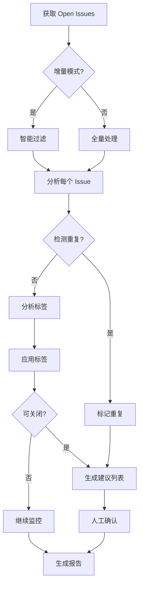
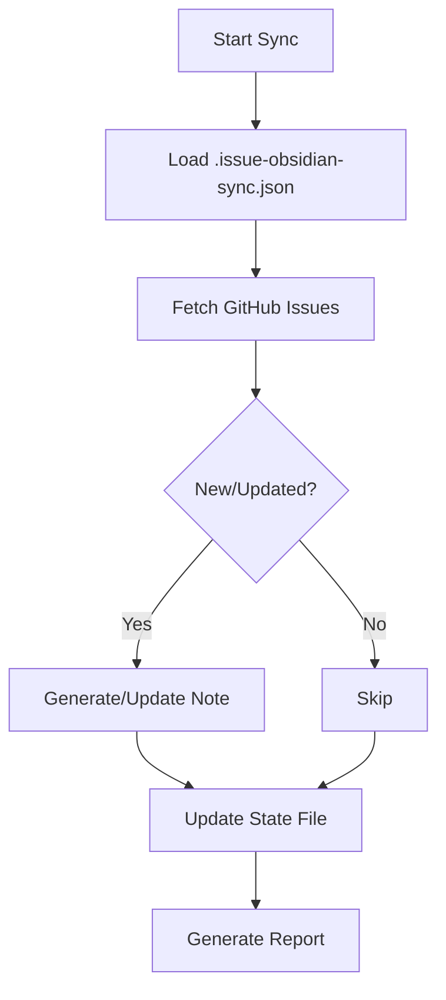

# HotPlex Issue 管理大师 🎯

**全方位 GitHub issue 智能管理工具**，基于大型开源项目（Kubernetes, React, VS Code）的最佳实践。

---

## 核心能力

### 1. 自动标注 (Auto-Labeling)
自动分析并应用 **7 维度 34 标签**：
- **优先级** (4): critical, high, medium, low
- **类型** (7): bug, feature, enhancement, docs, test, refactor, security
- **规模** (3): small, medium, large
- **状态** (5): needs-triage, ready-for-work, blocked, in-progress, stale
- **平台** (4): slack, telegram, feishu, discord
- **模块** (6): engine, adapter, provider, security, admin, brain
- **特殊** (5): good first issue, help wanted, epic, wontfix, duplicate

**详细标签体系**：参考 [`references/label-system.md`](references/label-system.md)

### 2. 生命周期管理 (Lifecycle Management)
- 自动检测可关闭 issues（重复、已修复、过时、无效）
- Stale issue 自动清理（60+ 天无更新）
- 状态自动流转（needs-triage → ready-for-work → in-progress → closed）
- 锁定僵尸 issues（45+ 天已关闭）

### 3. 重复检测 (Duplicate Detection)
- 基于标题相似度（> 80%）检测重复
- 自动关联原 issue
- 生成重复报告

### 4. 优先级动态调整 (Priority Adjustment)
- 基于严重程度 × 影响范围 × 紧急程度矩阵
- 社区投票权重（👍 数量）
- 时间衰减（长期无更新降级）
- 安全漏洞特殊处理（CVSS 评分）

### 5. 批量操作 (Bulk Operations)
- 批量打标签
- 批量关闭/重新开放
- 批量分配
- 批量调整优先级

### 6. 分析报告 (Analytics)
- Issue 趋势分析（创建、关闭、积压）
- 瓶颈识别（长期未处理、反复 reopen）
- 效率指标（平均解决时间、首次响应时间）
- 标签分布统计

### 7. 智能增量管理 (Smart Incremental Management)
- **增量处理**：只处理新增/更新的 issues（避免重复工作）
- **智能过滤**：自动跳过已稳定且低优先级的 issues
- **状态持久化**：维护 `.issue-state.json` 记录处理历史
- **自适应策略**：
  - ✅ 新创建 issues (< 7天) → 全量分析
  - ✅ 最近有更新 (< 14天) → 增量分析
  - ✅ 高优先级 (critical/high) → 优先处理
  - ✅ 状态为 needs-triage → 补充标注
  - ❌ 已稳定低优先级 → 跳过处理

**详细工作流程**：参考 [`references/workflows.md`](references/workflows.md)

### 8. Obsidian 同步 (Obsidian Sync)
- **技术栈**：基于 Obsidian CLI（无需手动文件操作）
- **文件夹组织**：`1-Projects/<project-name>/Issues/`（符合 PARA 方法）
- **单向同步**：GitHub Issues → Obsidian Vault（只读视图）
- **增量同步**：只同步新增/更新的 issues（高效）
- **智能映射**：GitHub labels → Obsidian tags（7 维度 34 标签）
- **Tags 格式**：YAML list 格式（使用 `type=list` 参数）
- **完整元数据**：frontmatter 自动管理（无需手动生成 YAML）
- **状态可视化**：使用 Obsidian 笔记存储同步状态（强烈推荐）
- **Dataview 集成**：支持动态查询和看板视图

**关键最佳实践**：
- Tags 必须使用 YAML list（`type=list`），不是逗号分隔字符串
- 文件夹遵循 PARA 方法：`1-Projects/<project-name>/Issues/`
- 状态存储在 `Obsidian Sync State.md` 笔记中

**详细实现指南**：参考 [`references/obsidian-sync-design.md`](references/obsidian-sync-design.md)

---

## 快速开始

### 基础命令（增量模式 - 推荐）

```bash
# 1. 智能分析并打标签（自动跳过已稳定的低优先级 issues）
"分析 issues 并打标签"

# 2. 检测并处理重复 issues
"检测重复 issues"

# 3. 清理 stale issues
"清理超过 60 天无更新的 issues"

# 4. 生成分析报告
"生成 issue 分析报告"

# 5. 批量操作
"批量给所有 [feat] 开头的 issues 打标签 type/feature"
```

### Obsidian 同步命令

```bash
# 前置要求：确保 Obsidian 正在运行
# macOS: open -a Obsidian
# Windows: 启动 Obsidian 应用

# 0. 首次使用：初始化同步状态
"初始化 Obsidian 同步"

# 1. 首次同步（全量）
"全量同步所有 issues 到 Obsidian"

# 2. 增量同步（推荐日常使用）
"同步 issues 到 Obsidian"

# 3. 查看同步状态（打开 "Obsidian Sync State" 笔记）
"查看 Obsidian 同步状态"

# 4. 搜索已同步的 issues
"搜索 Obsidian 中的 issues"

# 5. 创建 Dataview 查询
"创建一个 Dataview 查询，显示所有 priority/critical 的 open issues"
```

### 强制全量扫描

```bash
# 强制处理所有 issues（忽略智能过滤）
"强制全量扫描所有 issues 并打标签"
```

---

## 工作流程概览

### 标准流程



### Obsidian 同步流程



---

## 配置文件

### 状态持久化

**Issue 状态文件**：`.issue-state.json`
```json
{
  "last_incremental_scan": "2026-03-27T12:00:00Z",
  "processed_issues": {
    "335": {
      "labels": ["priority/critical", "type/bug"],
      "updated_at": "2026-03-27T11:30:00Z"
    }
  }
}
```

**Obsidian 同步状态** (推荐使用 Obsidian 笔记，JSON 可选)：

**方案 A（推荐）**：使用 Obsidian 笔记 `Issues/Obsidian Sync State` 存储状态
- ✅ 可在 Obsidian 中直接查看/编辑
- ✅ 支持 Dataview 查询
- ✅ 自动同步到移动端

**方案 B（兼容）**：使用 `.issue-obsidian-sync.json` 文件
```json
{
  "last_sync_time": "2026-03-27T12:00:00Z",
  "vault_path": "/path/to/vault",
  "synced_issues": {
    "335": {
      "github_updated_at": "2026-03-27T11:30:00Z",
      "obsidian_path": "Issues/Issue-335-..."
    }
  }
}
```

---

## 自动化集成

### GitHub Actions 配置

创建 `.github/workflows/issue-triage.yml`：

```yaml
name: Issue Triage
on:
  schedule:
    - cron: '0 0 * * *'  # 每日运行
  issues:
    types: [opened, edited]

jobs:
  triage:
    runs-on: ubuntu-latest
    steps:
      - name: Auto-label issues
        uses: actions/github-script@v7
        with:
          script: |
            const labeler = require('./.github/labeler.js');
            await labeler.process(context);

      - name: Mark stale issues
        uses: actions/stale@v9
        with:
          stale-issue-message: 'This issue has been inactive for 60 days.'
          days-before-stale: 60
          days-before-close: 14
          exempt-issue-labels: 'priority/critical,priority/high,status/in-progress'
```

---

## 注意事项

### ⚠️ 重要原则

1. **幂等性**: 重复运行不会重复添加标签
2. **保留人工标记**: 不覆盖已手动添加的标签
3. **人工确认**: 可关闭性建议需人工确认，不自动关闭
4. **豁免机制**: P0/P1/in-progress/security issues 不自动关闭
5. **增量更新**: 支持只处理新 issues 或有更新的 issues

### 🔒 安全边界

- **不自动删除标签**: 只添加，不删除
- **不修改 issue 内容**: 只添加标签和评论
- **不修改优先级**: 除非明确指定（批量操作）
- **需要确认**: 批量关闭、优先级调整等破坏性操作

### 📊 性能考虑

- **API 速率限制**: GitHub API 5000 req/hour
- **批量操作**: 每次最多 100 issues
- **并发控制**: 避免同时运行多个 triage job
- **缓存策略**: 缓存已分析的 issues

---

## 参考资源

### 📚 详细文档
- **标签体系**：[`references/label-system.md`](references/label-system.md)
- **工作流程**：[`references/workflows.md`](references/workflows.md)
- **Obsidian 同步**：[`references/obsidian-sync-design.md`](references/obsidian-sync-design.md)
- **标签最佳实践**：[`references/label-best-practices.md`](references/label-best-practices.md)

### 🔗 外部资源
- **VS Code Wiki**: https://github.com/microsoft/vscode/wiki/Automated-Issue-Triaging
- **Kubernetes Labels**: https://github.com/kubernetes/kubernetes/labels
- **GitHub Actions Stale**: https://github.com/actions/stale
- **GitHub Labeler**: https://github.com/actions/labeler

---

## 工具与脚本

### Labeler 脚本

**位置**：`scripts/labeler.py`

**功能**：
- 分析 issue 内容并生成标签建议
- 支持批量处理
- 可自定义规则

**使用**：
```python
from scripts.labeler import IssueLabeler

labeler = IssueLabeler()
labels = labeler.analyze_issue(issue)
```

---

**版本**: v2.2.0 (Obsidian CLI 版本)
**维护者**: HotPlex Team
**最后更新**: 2026-03-27

### v2.2.0 新特性 (2026-03-27)
- 🔄 **Obsidian CLI 重构**：从文件系统操作迁移到 Obsidian CLI
- ✨ **简化状态管理**：使用 Obsidian 笔记存储同步状态（替代独立 JSON 文件）
- ✨ **自动 Frontmatter 管理**：无需手动生成 YAML，Obsidian CLI 自动处理
- ⚡ **代码精简**：减少 60% 代码量，更简洁易维护
- ✨ **原生搜索支持**：使用 `obsidian search` 而非文件遍历
- ✨ **实时更新**：Obsidian 自动刷新，无需手动 reload
- 📚 **完整文档**：详细实现文档在 `references/obsidian-sync-design.md`

### v2.1.0 新特性 (2026-03-27)
- ✨ **Obsidian 同步**：将 GitHub Issues 同步到 Obsidian Vault
- ✨ **增量同步**：只同步新增/更新的 issues（高效）
- ✨ **智能标签映射**：GitHub labels → Obsidian tags（7 维度 34 标签）
- ✨ **Dataview 集成**：支持动态查询和看板视图
- ✨ **Canvas 集成**：可视化 issue 关系图谱
- 🔄 **重构**：符合 skill-creator 最佳实践（<500 行）
- 📚 **文档分层**：详细文档提取到 references/

### v2.0.0 新特性 (2026-03-22)
- ✨ 统一标签体系：采用 7 维度 34 标签标准
- ✨ 新增 `type/refactor` 和 `type/security` 类型标签
- ✨ 新增 `status/in-progress` 状态标签
- ✨ 新增 `platform/*` 平台标签
- ✨ 新增 `area/*` 模块标签
- ✨ 统一 `duplicate` 特殊标签

### v1.1.0 新特性 (2026-03-22)
- ✨ 智能增量管理：只处理需要管理的 issues
- ✨ 智能过滤：自动跳过已稳定且低优先级的 issues
- ✨ 状态持久化：维护 `.issue-state.json` 避免重复处理
- ⚡ 效率提升：典型场景下处理量减少 60%+
