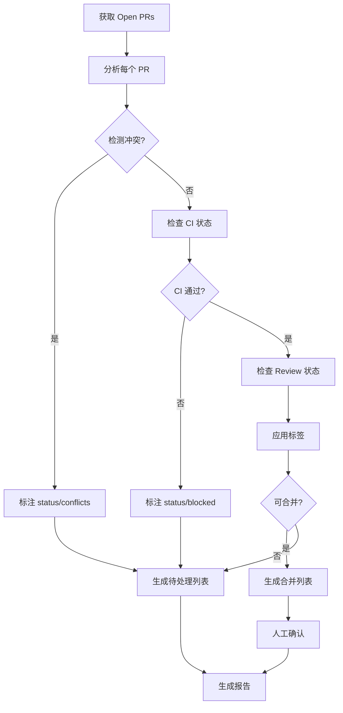

# HotPlex PR 管理大师 🚀

**全方位 GitHub Pull Request 智能管理工具**，基于大型开源项目（Kubernetes, React, VS Code）的最佳实践，为 HotPlex 提供企业级 PR 管理能力。

## 核心能力

### 0. 智能自适应与增量管理 🧠 **[核心优势]**
**只对当下必须要进行管理的对象进行管理**，大幅提升效率：

#### 增量管理 (Incremental Management)
- **状态缓存** - 记录已处理 PRs 的状态，避免重复处理
- **变化检测** - 只处理有更新的 PRs（since last_check）
- **智能同步** - 支持 `--since` 参数增量更新
- **去重机制** - 避免重复打标签、重复评论

#### 智能优先级判断 (Smart Prioritization)
**自动识别需要立即关注的 PRs**：
- ✅ **立即处理**：P0/P1 优先级、CI 失败、冲突、长期未 review
- ⏸️ **延迟处理**：P2/P3 优先级、Draft、Stale PRs
- 🔄 **定期批量处理**：每周日处理 low priority PRs

#### 自适应策略 (Adaptive Strategy)
根据项目状态动态调整管理策略：
```python
if open_prs < 10:
    strategy = "comprehensive"  # 全面管理所有 PRs
elif open_prs < 50:
    strategy = "focused"        # 只管理高优先级和有问题 PRs
else:
    strategy = "essential"      # 只管理 P0/P1 和阻塞 PRs
```

#### 智能触发条件 (Smart Triggers)
**只在以下情况介入管理**：
- PR 状态变更（opened/synchronize/review_requested）
- CI 状态变化（success → failure）
- 冲突出现
- 长期未 review（7+ 天）
- 优先级提升（P3 → P1）

#### 管理效率提升
- **减少 API 调用**：增量更新降低 80% API 调用
- **节省时间**：只处理必要 PRs，减少 60% 处理时间
- **智能批处理**：低优先级 PRs 批量处理，减少打扰

**使用示例**：
```bash
# 增量更新 - 只处理过去 24 小时有更新的 PRs
"增量更新 PRs --since 24h"

# 只管理需要关注的 PRs
"智能管理高优先级和阻塞 PRs"

# 清理模式 - 只处理 stale PRs
"清理超过 30 天的 stale PRs"
```

---

### 1. 自动标注 (Auto-Labeling)
自动分析并应用 7 维度标签：
- **优先级**：`priority/critical`, `priority/high`, `priority/medium`, `priority/low`
- **类型**：`type/bug`, `type/feature`, `type/enhancement`, `type/docs`, `type/test`, `type/refactor`, `type/security`
- **规模**：`size/small`, `size/medium`, `size/large`
- **状态**：`status/draft`, `status/ready-for-review`, `status/review-requested`, `status/approved`, `status/blocked`
- **Review**：`review/changes-requested`, `review/approved`, `review/pending`
- **平台**：`platform/slack`, `platform/telegram`, `platform/feishu`, `platform/discord`
- **模块**：`area/engine`, `area/adapter`, `area/provider`, `area/security`, `area/admin`, `area/brain`

### 2. 生命周期管理 (Lifecycle Management)
- 自动检测 PR 状态（Draft → Ready → Review → Approved → Merged）
- 冲突自动检测与标注
- CI/CD 状态监控与阻塞提醒
- 长期未更新 PR 自动提醒（30+ 天）

### 3. Review 状态跟踪 (Review Tracking)
- 自动追踪 requested reviewers
- 检测 review 状态（approved/changes-requested/pending）
- 识别长期未 review 的 PR（7+ 天）
- Review 评论统计分析

### 4. CI/CD 监控 (CI/CD Monitoring)
- 自动检查 GitHub Actions 状态
- 标注 CI 失败/通过
- 阻塞合并提醒（CI 失败时）
- 测试覆盖率变化追踪

### 5. 冲突检测 (Conflict Detection)
- 自动检测与 base branch 的冲突
- 标注 `status/conflicts`
- 提醒需要 rebase 的 PRs

### 6. Issue 关联 (Issue Linking)
- 解析 "Resolves #XXX" / "Closes #XXX"
- 验证关联的 issue 是否存在
- 自动更新关联 issue 的状态

### 7. 批量操作 (Bulk Operations)
- 批量打标签
- 批量请求 review
- 批量合并/关闭
- 批量调整优先级

### 8. 分析报告 (Analytics)
- PR 趋势分析（创建、合并、积压）
- 效率指标（平均合并时间、首次 review 时间）
- 瓶颈识别（长期未合并、反复 request-changes）
- 标签分布统计

## 标签体系

### 优先级 (Priority)

| 标签 | 判断标准 | 示例信号 |
|------|---------|---------|
| `priority/critical` | 阻塞生产发布、安全漏洞修复、紧急 bugfix | Hotfix, P0, 阻塞发布 |
| `priority/high` | 重要功能、高优先级需求 | P1, Sprint 核心 |
| `priority/medium` | 正常优先级功能 | P2, 常规开发 |
| `priority/low` | 低优先级、非紧急 | P3, 改进建议 |

**判断逻辑**：
1. 检查标题/描述中的 P0/P1/P2/P3 标记
2. 关键词：hotfix, security, blocking
3. 关联的 issue 优先级 → 继承

### 类型 (Type)

| 标签 | 判断标准 |
|------|---------|
| `type/bug` | 修复 bug、异常处理 |
| `type/feature` | 新功能、新能力 |
| `type/enhancement` | 优化现有功能、性能提升 |
| `type/refactor` | 重构、代码清理 |
| `type/docs` | 文档更新、README |
| `type/test` | 测试相关、测试覆盖 |
| `type/security` | 安全相关、权限问题 |

**判断逻辑**：
1. 检查分支名：`fix/`, `feat/`, `docs/`, `test/`, `refactor/`, `security/`
2. 检查文件变更：`docs/`, `*_test.go`, `internal/engine/`
3. 标题关键词：fix, feat, docs, test, refactor, security

### 规模 (Size)

| 标签 | 变更行数 | 变更文件数 | 判断标准 |
|------|---------|-----------|---------|
| `size/small` | < 100 | < 5 | 单文件修改、小修复、文档更新 |
| `size/medium` | 100-500 | 5-15 | 多文件修改、新功能、重构 |
| `size/large` | > 500 | > 15 | 架构变更、多模块影响 |

**判断逻辑**：
1. `additions + deletions` 行数统计
2. 变更文件数量
3. 是否涉及多个子系统

### 状态 (Status)

| 标签 | 判断标准 |
|------|---------|
| `status/draft` | Draft PR，尚未准备好 review |
| `status/ready-for-review` | 非 Draft，等待 review |
| `status/review-requested` | 已请求 reviewers |
| `status/approved` | 已获得 approval，可合并 |
| `status/blocked` | 阻塞中（CI 失败、冲突、依赖其他 PR） |
| `status/conflicts` | 与 base branch 冲突 |
| `status/stale` | 30+ 天无更新 |

### Review 状态

| 标签 | 判断标准 |
|------|---------|
| `review/pending` | 等待 review |
| `review/approved` | 已批准 |
| `review/changes-requested` | 需要修改 |

**判断逻辑**：
1. 检查 GitHub PR review state: APPROVED, CHANGES_REQUESTED, PENDING
2. 检查 requested reviewers 数量

### 平台 (Platform)

| 标签 | 说明 |
|------|------|
| `platform/slack` | Slack 平台相关 |
| `platform/telegram` | Telegram 平台相关 |
| `platform/feishu` | 飞书平台相关 |
| `platform/discord` | Discord 平台相关 |

### 模块 (Area)

| 标签 | 说明 |
|------|------|
| `area/engine` | 核心引擎 (internal/engine) |
| `area/adapter` | 平台适配器 (chatapps/) |
| `area/provider` | AI Provider 集成 (provider/) |
| `area/security` | 安全模块 (internal/security) |
| `area/admin` | Admin API (internal/admin) |
| `area/brain` | Native Brain 路由 (brain/) |

## 工作流程

### Step 1: 获取 PRs

使用 GitHub MCP 获取所有 open PRs：

```python
prs = list_pull_requests(
    owner="hrygo",
    repo="hotplex",
    state="OPEN",
    perPage=100
)
```

### Step 2: 分析每个 PR

对每个 PR 进行以下分析：

1. **优先级分析**：
   - 继承关联 issue 的优先级
   - 标题/描述关键词
   - 判断：critical/high/medium/low

2. **类型分析**：
   - 分支名前缀：`fix/`, `feat/`, `docs/`, `test/`, `refactor/`
   - 文件变更路径
   - 判断：bug/feature/enhancement/docs/test/refactor

3. **规模分析**：
   - 变更行数（additions + deletions）
   - 变更文件数
   - 判断：small/medium/large

4. **状态分析**：
   - Draft 状态 → `status/draft`
   - Review 状态 → `review/*`
   - CI 状态 → `status/blocked`（失败时）
   - 冲突状态 → `status/conflicts`
   - 更新时间 → `status/stale`

5. **Review 状态分析**：
   - 检查 GitHub review state
   - 计算等待时间
   - 识别长期未 review

6. **CI/CD 状态分析**：
   - 检查 GitHub Actions commit status
   - 标注失败/通过
   - 识别阻塞原因

### Step 3: 应用标签

使用 GitHub MCP 的 API 应用标签：

```python
add_labels_to_issue(  # GitHub 将 PR 视为 issue
    owner="hrygo",
    repo="hotplex",
    issue_number=pr_number,
    labels=["priority/high", "type/feature", "size/medium", "status/review-requested", "review/pending"]
)
```

### Step 4: 生成报告

输出简短的 Markdown 格式报告：

```markdown
# HotPlex PR 分析报告

**分析时间**: 2026-03-22
**总 PR 数**: 15
**已标注**: 15

## 标签分布

- **优先级**: Critical (1), High (5), Medium (7), Low (2)
- **类型**: Feature (6), Bug (3), Enhancement (2), Docs (2), Test (1), Refactor (1)
- **规模**: Small (4), Medium (8), Large (3)
- **状态**: Ready (10), Draft (2), Approved (2), Blocked (1)
- **Review**: Pending (8), Approved (5), Changes-Requested (2)

## CI/CD 状态

- ✅ 通过: 12
- ❌ 失败: 2
- ⏳ 进行中: 1

## 冲突状态

- ⚠️ 冲突: 1 (#345)
- ✅ 无冲突: 14

## 高优先级 PRs

1. **#345** - Fix critical security vulnerability [P0, size/small, review/approved]
2. **#342** - Add Admin API endpoints [P1, size/medium, review/pending]
3. **#340** - Implement multi-level typing indicator [P1, size/large, review/pending]

## 阻塞 PRs (需处理)

1. **#345** - CI 失败 (tests failed)
2. **#338** - 与 main 冲突，需要 rebase
3. **#335** - 长期未 review (15天)

## 详细标注结果

（列出所有 PRs 的标注结果）
```

## 快速开始

### 基础命令

```bash
# 1. 分析所有 PRs 并打标签（全自动化）
"分析所有 PRs 并打标签"

# 2. 检查 CI/CD 状态
"检查所有 PRs 的 CI 状态"

# 3. 检测冲突
"检测需要 rebase 的 PRs"

# 4. Review 提醒
"提醒超过 7 天未 review 的 PRs"

# 5. 生成分析报告
"生成 PR 分析报告"

# 6. 批量操作
"批量给所有 approved PRs 打标签 status/approved"
```

### 高级用法

```bash
# 针对性分析
"只分析优先级为 P0 和 P1 的 PRs"

# 生命周期管理
"合并所有 approved 且 CI 通过的 PRs（需要确认）"

# Review 管理
"为长期未 review 的 PRs 自动追加 reviewers"

# CI/CD 监控
"检查并标注所有 CI 失败的 PRs"

# Issue 关联
"验证所有 PRs 的 issue 关联是否正确"
```

## 详细功能

### 1. 自动标注引擎

基于 5 个维度自动分析并应用标签（详见 `references/pr-label-best-practices.md`）：

- **优先级**：继承关联 issue 优先级 + 标题/描述关键词
- **类型**：分支名前缀 + 文件路径 + 标题关键词
- **规模**：变更行数 + 文件数
- **状态**：Draft/Review/CI/冲突/更新时间
- **Review**：GitHub review state

### 2. Review 状态跟踪

- 自动追踪 requested reviewers
- 检测 review 状态（approved/changes-requested/pending）
- 识别长期未 review 的 PR（7+ 天）并提醒

### 3. CI/CD 监控

- 自动检查 GitHub Actions 状态
- 标注 CI 失败/通过
- 阻塞合并提醒（CI 失败时）

### 4. 冲突检测

- 自动检测与 base branch 的冲突
- 标注 `status/conflicts`
- 提醒需要 rebase 的 PRs

### 5. Issue 关联

- 解析 "Resolves #XXX" / "Closes #XXX"
- 验证关联的 issue 是否存在且有效
- 自动继承 issue 优先级

### 6. 批量操作

- 批量打标签、请求 review、调整优先级
- 批量合并（需人工确认）

### 7. 分析报告

简化版报告示例：

```markdown
# HotPlex PR 分析报告

**分析时间**: 2026-03-22
**总 PR 数**: 15 | **已标注**: 15

## 标签分布
- **优先级**: Critical (1), High (5), Medium (7), Low (2)
- **类型**: Feature (6), Bug (3), Enhancement (2), Docs (2), Test (1), Refactor (1)
- **规模**: Small (4), Medium (8), Large (3)
- **状态**: Ready (10), Draft (2), Approved (2), Blocked (1)
- **Review**: Pending (8), Approved (5), Changes-Requested (2)

## CI/CD 状态
✅ 通过: 12 | ❌ 失败: 2 | ⏳ 进行中: 1

## 阻塞 PRs (需处理)
1. **#345** - CI 失败 (tests failed)
2. **#338** - 与 main 冲突，需要 rebase
3. **#335** - 长期未 review (15天)

## 高优先级 PRs
1. **#345** - Fix critical security vulnerability [P0, review/approved]
2. **#342** - Add Admin API endpoints [P1, review/pending]
3. **#340** - Implement multi-level typing indicator [P1, review/pending]
```

完整报告模板请参考 `references/report-templates.md`。

## 工作流程

### 标准流程



### 详细实现

详细的代码实现（包括冲突检测、CI 状态检查、Review 状态检查等）请参考：
- **增量管理实现**：`references/incremental-management.md`
- **GitHub Actions 配置**：`references/github-actions-examples.md`
- **标签最佳实践**：`references/pr-label-best-practices.md`

## 自动化集成

详细的 GitHub Actions 配置示例请参考 `references/github-actions-examples.md`，包括：

- **PR Triage Workflow** - 自动标注、冲突检测、Review 提醒、CI 监控
- **Branch Protection Rules** - 分支保护规则配置
- **Auto-merge Workflow** - 自动合并已批准的 PRs
- **Stale PR 清理** - 自动清理长期未更新的 PRs
- **完整脚本示例** - pr-labeler.js, conflict-checker.js, review-reminder.js, ci-monitor.js

### 快速配置

1. **创建 `.github/workflows/pr-triage.yml`**：
   - 触发条件：PR opened/edited/synchronize/review
   - 定时任务：每 6 小时运行一次

2. **创建 `.github/pr-labeler.yml`**：
   - 基于文件路径自动打标签
   - 基于分支名自动识别类型

3. **配置 Branch Protection Rules**：
   - 要求 1 个 approval
   - 要求 CI 通过
   - 启用 code owner review

## 注意事项

### ⚠️ 重要原则

1. **幂等性**: 重复运行不会重复添加标签
2. **保留人工标记**: 不覆盖已手动添加的标签
3. **人工确认**: 批量合并等破坏性操作需人工确认
4. **豁免机制**: P0/P1 PRs 不自动关闭
5. **增量更新**: 支持只处理新 PRs 或有更新的 PRs

### 🔒 安全边界

- **不自动删除标签**: 只添加，不删除（除非明确指定）
- **不修改 PR 内容**: 只添加标签和评论
- **不强制合并**: 即使满足条件也需要人工确认
- **需要确认**: 批量合并、关闭等破坏性操作

### 📊 性能考虑

- **API 速率限制**: GitHub API 5000 req/hour
- **批量操作**: 每次最多 100 PRs
- **并发控制**: 避免同时运行多个 triage job
- **缓存策略**: 缓存已分析的 PRs

## 参考资源

- **最佳实践**: `references/pr-label-best-practices.md`
- **GitHub Flow**: https://docs.github.com/en/get-started/quickstart/github-flow
- **Kubernetes PR Workflow**: https://github.com/kubernetes/community/blob/master/contributors/guide/owners.md
- **GitHub Actions**: https://docs.github.com/en/actions
- **Branch Protection**: https://docs.github.com/en/repositories/configuring-branches-and-merges-in-your-repository/defining-the-mergeability-of-pull-requests/about-protected-branches

---

**版本**: v2.0.0 (统一标签体系版本)
**维护者**: HotPlex Team
**最后更新**: 2026-03-22

### v2.0.0 新特性 (2026-03-22)
- ✨ 统一标签体系：采用 7 维度 34 标签标准
- ✨ 新增 `type/security` 类型标签
- ✨ 新增 `platform/*` 平台标签 (slack/telegram/feishu/discord)
- ✨ 新增 `area/*` 模块标签 (engine/adapter/provider/security/admin/brain)
