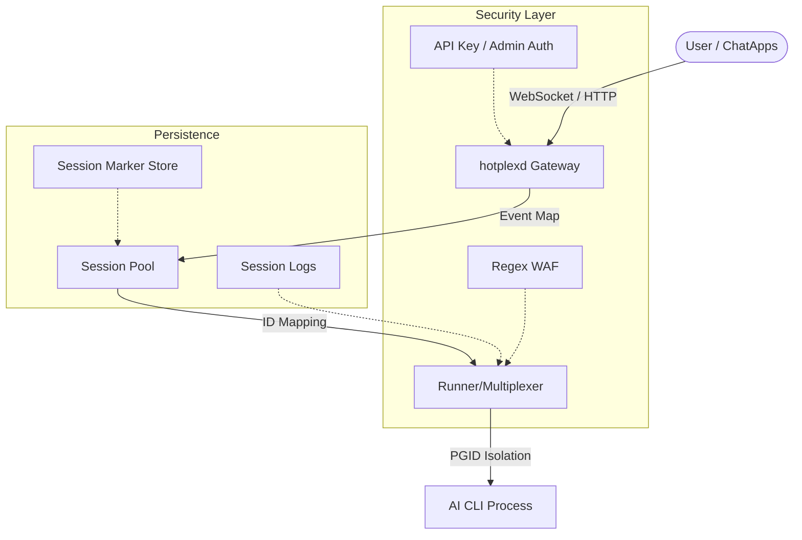
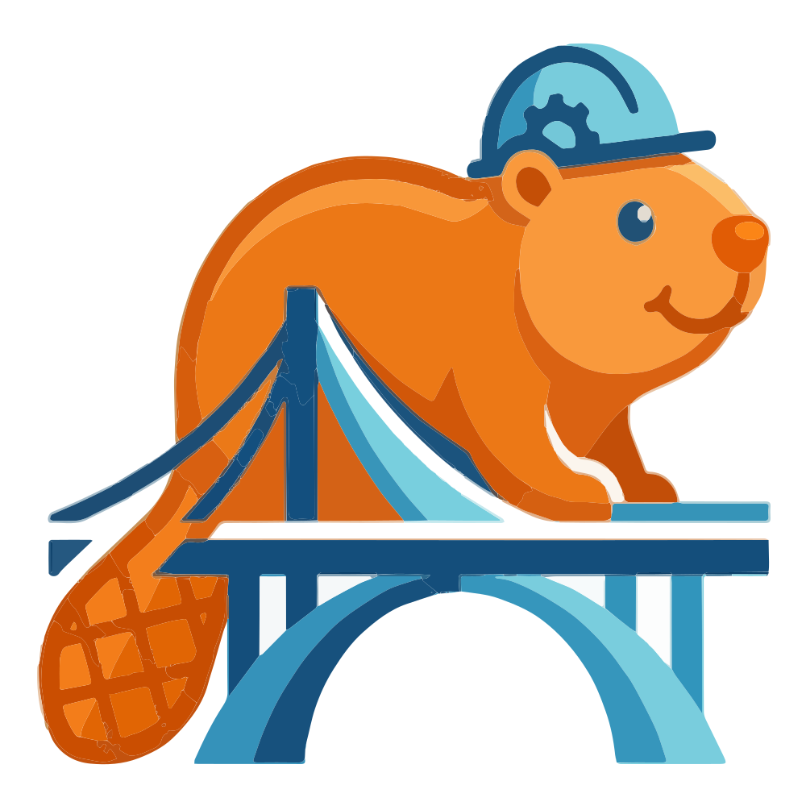

<div align="center">
  

  # HotPlex

  **High-Performance AI Agent Runtime**

  HotPlex transforms terminal AI tools (Claude Code, OpenCode) into production services. Built with Go using the Cli-as-a-Service paradigm, it eliminates CLI startup latency through persistent process pooling and ensures execution safety via PGID isolation and Regex WAF. The system supports WebSocket/HTTP/SSE communication with Python and TypeScript SDKs. At the application layer, HotPlex integrates with Slack and Feishu, supporting streaming output, interactive cards, and multi-bot protocols.

  <p>
    <a href="https://github.com/hrygo/hotplex/releases/latest">
      
    </a>
    <a href="https://pkg.go.dev/github.com/hrygo/hotplex">
      
    </a>
    <a href="https://github.com/hrygo/hotplex/actions/workflows/ci.yml">
      
    </a>
    <a href="LICENSE">
      
    </a>
    <a href="https://github.com/hrygo/hotplex/stargazers">
      
    </a>
  </p>

  <p>
    <a href="docs/quick-start.md">Quick Start</a> ·
    <a href="https://hrygo.github.io/hotplex/guide/features">Features</a> ·
    <a href="docs/architecture.md">Architecture</a> ·
    <a href="https://hrygo.github.io/hotplex/">Docs</a> ·
    <a href="https://github.com/hrygo/hotplex/discussions">Discussions</a> ·
    <a href="README_zh.md">简体中文</a>
  </p>
</div>

---

## Table of Contents

- [Quick Start](#-quick-start)
- [Core Concepts](#-core-concepts)
- [Project Structure](#-project-structure)
- [Features](#-features)
- [Architecture](#-architecture)
- [Usage Examples](#-usage-examples)
- [Development Guide](#-development-guide)
- [Documentation](#-documentation)
- [Contributing](#-contributing)

---

## ⚡ Quick Start

```bash
# One-line installation
curl -sL https://raw.githubusercontent.com/hrygo/hotplex/main/install.sh | bash

# Or build from source
make build

# Start the daemon
./hotplexd start -config configs/server.yaml

# Start with custom environment file
./hotplexd start -config configs/server.yaml -env-file .env.local
```

### Requirements

| Component | Version | Notes |
| :-------- | :------ | :-----|
| Go | 1.25+ | Runtime & SDK |
| AI CLI | [Claude Code](https://github.com/anthropics/claude-code) or [OpenCode](https://github.com/hrygo/opencode) | Execution target |
| Docker | 24.0+ | Optional, for container deployment |

### First Run Checklist

```bash
# 1. Clone and build
git clone https://github.com/hrygo/hotplex.git
cd hotplex
make build

# 2. Copy environment template
cp .env.example .env

# 3. Configure your AI CLI
# Ensure Claude Code or OpenCode is in PATH

# 4. Run the daemon
./hotplexd start -config configs/server.yaml
```

---

## 🧠 Core Concepts

Understanding these concepts is essential for effective HotPlex development.

### Session Pooling

HotPlex maintains **long-lived CLI processes** instead of spawning fresh instances per request. This eliminates:
- Cold start latency (typically 2-5 seconds per invocation)
- Context loss between requests
- Resource waste from repeated initialization

```
Request 1 → CLI Process 1 (spawned, persistent)
Request 2 → CLI Process 1 (reused, instant)
Request 3 → CLI Process 1 (reused, instant)
```

### I/O Multiplexing

The `Runner` component handles bidirectional communication between:
- **Upstream**: User requests (WebSocket/HTTP/ChatApp events)
- **Downstream**: CLI stdin/stdout/stderr streams

```go
// Each session has dedicated I/O channels
type Session struct {
    Stdin  io.Writer
    Stdout io.Reader
    Stderr io.Reader
    Events chan *Event  // Internal event bus
}
```

### PGID Isolation

Process Group ID (PGID) isolation ensures **clean termination**:
- CLI processes are spawned with `Setpgid: true`
- Termination sends signal to entire process group (`kill -PGID`)
- No orphaned or zombie processes

### Regex WAF

Web Application Firewall layer intercepts dangerous commands before they reach the CLI:
- Block patterns: `rm -rf /`, `mkfs`, `dd`, `:(){:|:&};:`
- Configurable via `security.danger_waf` in config
- Works alongside CLI's native tool restrictions (`AllowedTools`)

### ChatApps Abstraction

Unified interface for multi-platform bot integration:

```go
type ChatAdapter interface {
    // Platform-specific event handling
    HandleEvent(event Event) error
    // Unified message format
    SendMessage(msg *ChatMessage) error
}
```

### MessageOperations (Optional)

Advanced platforms implement streaming and message management:

```go
type MessageOperations interface {
    StartStream(ctx, channelID, threadTS) (messageTS, error)
    AppendStream(ctx, channelID, messageTS, content) error
    StopStream(ctx, channelID, messageTS) error
    UpdateMessage(ctx, channelID, messageTS, msg) error
    DeleteMessage(ctx, channelID, messageTS) error
}
```

---

## Module Analysis

### 1. Engine & Session Pool (internal/engine)
The engine layer is the brain of HotPlex, coordinating all AI interactions.
- **Deterministic ID Mapping**: Generates UUID v5 using platform metadata, ensuring that the corresponding Claude CLI process can be retrieved even after `hotplexd` restarts.
- **Health Detection**: 500ms frequency `waitForReady` polling combined with `process.Signal(0)` detection ensures that sessions assigned to users are 100% available.
- **Cleanup Mechanism**: Dynamically adjusts the cleanup interval (Timeout/4), balancing resource utilization and response speed.

### 2. Security & Protection (internal/security)
HotPlex acts as a WAF for the local system.
- **Multi-level Filtering**: Pre-configured with over 50 dangerous command patterns, ranging from simple `rm` to complex `sudo bash` reverse shells.
- **Evasion Defense**: Specifically designed for LLM-generated content, it includes automatic markdown code block stripping and real-time detection of malicious control characters (e.g., null bytes).

### 3. Communication Server (internal/server)
- **Protocol Translation**: The core `ExecutionController` serializes complex CLI events into standard streaming JSON for consumption by upstream platforms.
- **Admin API**: Provides complete session audit logs (Audit Events) and export interfaces.

### 4. Native Brain (brain & internal/brain)
- **"System 1" Abstraction**: Providing lightweight intent recognition and safety pre-audit interfaces, supporting multiple LLM model routing.
- **Resiliency**: Built-in circuit breakers and automatic failover logic to ensure core capabilities remain available even if the primary model is down.

### 5. Telemetry & Monitoring (internal/telemetry)
- **OpenTelemetry**: Deeply integrated OTEL, not only tracking request latency but also tracing every "Permission Decision" made by the AI.
- **Monitoring Metrics**: Exports Prometheus-compatible metrics covering session success rates, token costs, and security interception frequency.
- **Deep Token & Context Telemetry**: Real-time tracking of input/output tokens, prompt caching efficiency, and context window utilization (supporting 200K to 1M+ windows).

### 6. Management Tools (Management CLI)
`hotplexd` is not just a daemon; it is also a full-featured management tool:
- **`status`**: View engine load, active session count, and memory usage in real-time.
- **`session`**: Provides fine-grained session control including `list` (list), `kill` (kill), and `logs` (view logs).
- **`doctor`**: Automatically diagnoses the local environment, checking `claude` CLI connectivity, permission settings, and Docker status.
- **`config`**: Validates and renders the current merged configuration tree, supporting both local and remote validation.
- **`cron`**: Schedule and manage background AI tasks with standard cron syntax and history tracking.
- **`relay`**: Configure cross-platform bot-to-bot relaying and binding.

---

## 📂 Project Structure

```
hotplex/
├── [cmd/](./cmd)                  # CLI & Daemon entrypoints
│   └── [hotplexd/](./cmd/hotplexd)  # Main daemon implementation
├── internal/               # Core implementation (private)
│   ├── engine/             # Session pool & runner
│   ├── server/             # WebSocket & HTTP gateway
│   ├── security/           # WAF & isolation
│   ├── config/             # Configuration loading
│   ├── sys/                # OS signals
│   ├── telemetry/          # OpenTelemetry
│   └── ...
├── brain/                  # Native Brain orchestration
├── cache/                  # Caching layer
├── [provider/](./provider)        # AI provider adapters
│   ├── [claude_provider.go](./provider/claude_provider.go)      # Claude Code protocol
│   ├── [opencode_provider.go](./provider/opencode_provider.go)  # OpenCode protocol
│   └── ...
├── [chatapps/](./chatapps)        # Platform adapters
│   ├── slack/              # Slack Bot
│   ├── feishu/             # Feishu Bot
│   └── base/               # Common interfaces
├── types/                  # Public type definitions
├── event/                  # Event system
├── plugins/                # Extension points
│   └── storage/            # Message persistence
├── sdks/                   # Language bindings
│   ├── go/                 # Go SDK (embedded)
│   ├── python/             # Python SDK
│   └── typescript/         # TypeScript SDK
├── docker/                 # Container definitions
├── configs/                # Configuration examples
└── docs/                  # Architecture docs
```

### Key Directories

| Directory | Purpose | Public API |
|-----------|---------|-----------|
| `types/` | Core types & interfaces | ✅ Yes |
| `event/` | Event definitions | ✅ Yes |
| `hotplex.go` | SDK entry point | ✅ Yes |
| `internal/engine/` | Session management | ❌ Internal |
| `internal/server/` | Network protocols | ❌ Internal |
| `provider/` | CLI adapters | ⚠️ Provider interface |

---

## ✨ Features

| Feature | Description | Use Case |
|------|-------------|----------|
| 🔄 **Deterministic Sessions** | Precise mapping based on UUID v5 (SHA1) to ensure cross-platform context consistency | High-frequency AI collaboration |
| 🛡️ **Secure Isolation** | Unix PGID and Windows Job Objects isolation to completely eliminate zombie processes | Production-grade security |
| 🛡️ **Regex WAF** | 6-level risk assessment system to prevent command injection, privilege escalation, and reverse shells | System hardening |
| 🌊 **Streaming Delivery** | 1MB-level I/O buffer + full-duplex Pipe for sub-second Token response | Real-time interactive UI |
| 💬 **Multi-platform Adaptation** | Native support for Slack and Feishu with $O(1)$ session lookup via secondary indexing | Enterprise-level communication |
| 🛡️ **Cross-platform Relay** | Secure bot-to-bot message routing between different chat platforms | Multi-agent collaboration |
| ⏰ **Background Cron** | Native scheduling for periodic AI tasks with failure recovery and webhooks | Automation & Monitoring |
| Packaged **Go SDK** | Zero-overhead embedded engine for direct integration into Go business logic | Custom Agents |
| 🔌 **Protocol Compatibility** | Full OpenCode HTTP/SSE protocol support for seamless frontend integration | Cross-language frontend |
| 📊 **Deep Telemetry** | Built-in OpenTelemetry tracing and **Real-time Context Window/Token Tracking** | Production monitoring & Cost Control |
| 🐳 **BaaS Architecture** | Docker 1+n containerization scheme with pre-installed major language environments | Rapid deployment |

---

## 🏛 Technical Architecture

HotPlex employs a decoupled layered architecture to ensure high reliability from chat platforms to the execution engine.

### 1. Engine & Session Pool
- **Deterministic ID Mapping**: Uses `UUID v5 (SHA1)` to map `Namespace + Platform + UserID + ChannelID` to a persistent `providerSessionID`. This ensures that as long as the user metadata remains the same, the session can be accurately recovered after a daemon restart.
- **Cold/Warm Start Logic**: Features a 500ms polling `waitForReady` mechanism combined with Job Markers for state recovery and stale session detection.

### 2. Isolation & Security
- **Process Group Isolation**: Utilizes **PGID (Process Group ID)**. Upon session termination, a signal is sent to the negative PID, forcing the removal of the entire process tree and eradicating orphan processes.
- **Dual-Layer WAF**: Performs a 6-level risk assessment before commands reach the CLI. Includes evasion protection (blocking null bytes/control chars) and automatic markdown stripping (reducing false positives).

### 3. Communication & Flow Control
- **OpenCode Compatibility**: Real-time mapping of internal events to `reasoning`, `text`, and `tool` parts.
- **I/O Multiplexing**: Full-duplex pipes with 1MB dynamic buffers to prevent accidental blocking during large concurrent read/write operations.
- **Management Plane**: Provides both direct local CLI access and a remote Admin API (port 9080) for session management, diagnostics, and metrics.

### 4. Module Structure
- **Provider System**: Plug-in architecture supporting Claude Code's `~/.claude/projects/` directory management and permission synchronization.
- **ChatApp Adapter**: Built-in secondary indexing for $O(1)$ session lookup based on `user + channel`.



---

## 📖 Usage Examples

### Go SDK (Embeddable)

```go
import (
    "context"
    "fmt"
    "time"

    "github.com/hrygo/hotplex"
    "github.com/hrygo/hotplex/types"
)

func main() {
    // Initialize engine
    engine, err := hotplex.NewEngine(hotplex.EngineOptions{
        Timeout:     5 * time.Minute,
        IdleTimeout: 30 * time.Minute,
    })
    if err != nil {
        panic(err)
    }
    defer engine.Close()

    // Execute prompt
    cfg := &types.Config{
        WorkDir:   "/path/to/project",
        SessionID: "user-session-123",
    }

    engine.Execute(context.Background(), cfg, "Explain this function", func(eventType string, data any) error {
        switch eventType {
        case "message":
            if msg, ok := data.(*types.StreamMessage); ok {
                fmt.Print(msg.Content)  // Streaming output
            }
        case "error":
            if errMsg, ok := data.(string); ok {
                fmt.Printf("Error: %s\n", errMsg)
            }
        case "usage":
            if stats, ok := data.(*types.UsageStats); ok {
                fmt.Printf("Tokens: %d input, %d output\n", stats.InputTokens, stats.OutputTokens)
            }
        }
        return nil
    })
}
```

### Slack Bot Configuration

```yaml
# configs/base/slack.yaml
platform: slack
mode: socket

provider:
  type: claude-code
  default_model: sonnet
  allowed_tools:
    - Read
    - Edit
    - Glob
    - Grep
    - Bash

engine:
  work_dir: ~/projects/hotplex
  timeout: 30m
  idle_timeout: 1h

security:
  owner:
    primary: ${HOTPLEX_SLACK_PRIMARY_OWNER}
    policy: trusted

assistant:
  bot_user_id: ${HOTPLEX_SLACK_BOT_USER_ID}
  dm_policy: allow
  group_policy: multibot
```

### WebSocket API

```javascript
// Connect
const ws = new WebSocket('ws://localhost:8080/ws/v1/agent');

// Listen for messages
ws.onmessage = (event) => {
  const data = JSON.parse(event.data);
  switch (data.type) {
    case 'message':
      console.log(data.content);
      break;
    case 'error':
      console.error(data.error);
      break;
    case 'done':
      console.log('Execution complete');
      break;
  }
};

// Execute prompt
ws.send(JSON.stringify({
  type: 'execute',
  session_id: 'optional-session-id',
  prompt: 'List files in current directory'
}));
```

### OpenCode Compatible API (HTTP/SSE)

```bash
# 1. Create session
curl -X POST http://localhost:8080/session

# 2. Send prompt (async)
curl -X POST http://localhost:8080/session/{session_id}/message \
  -H "Content-Type: application/json" \
  -d '{"prompt": "Hello, AI!"}'

# 3. Listen for events (SSE)
curl -N http://localhost:8080/global/event
```

---

## 💻 Development Guide

### Common Tasks

```bash
# Run tests
make test

# Run with race detector
make test-race

# Build binary
make build

# Run linter
make lint

# Build Docker images
make docker-build

# Start Docker stack
make docker-up
```

> [!TIP]
> The version information displayed by `hotplexd version` is injected via `LDFLAGS` during build. If you run `go run` or `go build` directly without LDFLAGS, it will show the default `v0.0.0-dev`. Using `make build` is recommended for compilation.

### Adding a New ChatApp Platform

1. **Implement the adapter interface** in `chatapps/<platform>/`:

```go
type Adapter struct {
    client *platform.Client
    engine *engine.Engine
}

// Implement base.ChatAdapter interface
var _ base.ChatAdapter = (*Adapter)(nil)

func (a *Adapter) HandleEvent(event base.Event) error {
    // Platform-specific event parsing
}

func (a *Adapter) SendMessage(msg *base.ChatMessage) error {
    // Platform-specific message sending
}
```

2. **Register in** `chatapps/setup.go`:

```go
func init() {
    registry.Register("platform-name", NewAdapter)
}
```

3. **Add configuration** in `configs/base/`:

```yaml
platform: platform-name
mode: socket  # or http
# ... platform-specific config
```

### Adding a New Provider

1. **Implement the Provider interface** in `provider/`:

```go
// provider/custom_provider.go
type CustomProvider struct{}

func (p *CustomProvider) Execute(ctx context.Context, cfg *types.Config, prompt string, callback event.Callback) error {
    // Implement provider-specific logic
}
```

2. **Register the new type** in `provider/factory.go`.

---

## 📚 Documentation

| Guide | Description |
| :---- | :---------- |
| [🚀 Deployment](https://hrygo.github.io/hotplex/guide/deployment) | Docker, production setup |
| [💬 ChatApps](chatapps/README.md) | Slack & Feishu integration |
| [🛠 Go SDK](https://hrygo.github.io/hotplex/sdks/go-sdk) | SDK reference |
| [🔒 Security](https://hrygo.github.io/hotplex/guide/security) | WAF, isolation |
| [📊 Observability](https://hrygo.github.io/hotplex/guide/observability) | Metrics, tracing |
| [⚙️ Configuration](docs/configuration.md) | Full config reference |

---

## 🤝 Contributing

We welcome contributions! Please follow these steps:

```bash
# 1. Fork and clone
git clone https://github.com/hrygo/hotplex.git

# 2. Create a feature branch
git checkout -b feat/your-feature

# 3. Make changes and test
make test
make lint

# 4. Commit with conventional format
git commit -m "feat(engine): add session priority support"

# 5. Submit PR
gh pr create --fill
```

### Commit Message Format

```
<type>(<scope>): <description>

Types: feat, fix, refactor, docs, test, chore
Scope: engine, server, chatapps, provider, etc.
```

### Code Standards

- Follow [Uber Go Style Guide](.agent/rules/uber-go-style-guide.md)
- All interfaces require compile-time verification
- Run `make test-race` before submitting

---

## 📄 License

MIT License © 2024-present [HotPlex Contributors](https://github.com/hrygo/hotplex/graphs/contributors)

---

<div align="center">
  
  <br/>
  <sub>Built for the AI Engineering community</sub>
</div>
