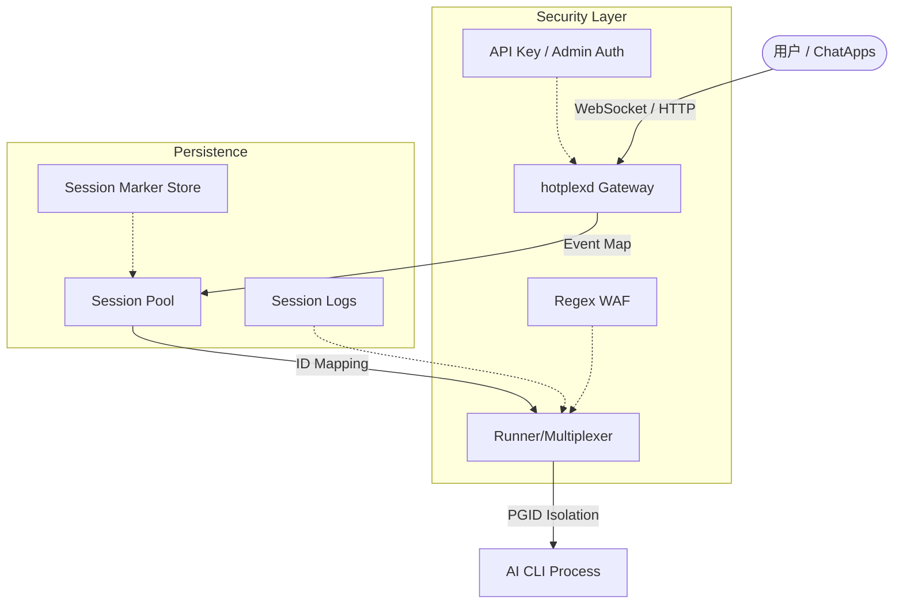

<div align="center">
  

  # HotPlex

  **高性能 AI Agent 执行运行时**

  HotPlex 将终端 AI 工具（Claude Code、OpenCode）转化为生产级服务。核心基于 Go 语言开发，采用 Cli-as-a-Service 理念，通过持久化进程池消除 CLI 启动延迟，并利用 PGID 隔离与 Regex WAF 确保执行安全。系统支持 WebSocket/HTTP/SSE 通信，提供 Python 和 TypeScript SDK。在应用层，HotPlex 适配了 Slack 与飞书，支持流式输出、交互式卡片及多机器人协议。

  <p>
    <a href="https://github.com/hrygo/hotplex/releases/latest">
      
    </a>
    <a href="https://pkg.go.dev/github.com/hrygo/hotplex">
      
    </a>
    <a href="https://goreportcard.com/report/github.com/hrygo/hotplex">
      
    </a>
    <a href="https://codecov.io/gh/hrygo/hotplex">
      
    </a>
    <a href="LICENSE">
      
    </a>
    <a href="https://github.com/hrygo/hotplex/stargazers">
      
    </a>
  </p>

  <p>
    <a href="README.md">English</a> ·
    <b>简体中文</b> ·
    <a href="docs/quick-start_zh.md">快速开始</a> ·
    <a href="https://hrygo.github.io/hotplex/zh/guide/features">特性</a> ·
    <a href="docs/architecture_zh.md">架构</a> ·
    <a href="https://hrygo.github.io/hotplex/">文档</a> ·
    <a href="https://github.com/hrygo/hotplex/discussions">讨论</a>
  </p>
</div>

---

## 目录

- [快速开始](#-快速开始)
- [核心概念](#-核心概念)
- [项目结构](#-项目结构)
- [特性](#-特性)
- [架构](#-架构)
- [使用示例](#-使用示例)
- [开发指南](#-开发指南)
- [文档](#-文档)
- [贡献指南](#-贡献指南)

---

## ⚡ 快速开始

```bash
# 一键安装
curl -sL https://raw.githubusercontent.com/hrygo/hotplex/main/install.sh | bash

# 或源码构建
make build

# 启动守护进程
./hotplexd start -config configs/server.yaml

# 使用自定义环境文件启动
./hotplexd start -config configs/server.yaml -env-file .env.local
```

### 前置要求

| 组件 | 版本 | 说明 |
| :--- | :--- | :--- |
| Go | 1.25+ | 运行时与 SDK |
| AI CLI | [Claude Code](https://github.com/anthropics/claude-code) 或 [OpenCode](https://github.com/hrygo/opencode) | 执行目标 |
| Docker | 24.0+ | 可选，用于容器部署 |

### 首次运行清单

```bash
# 1. 克隆并构建
git clone https://github.com/hrygo/hotplex.git
cd hotplex
make build

# 2. 复制环境模板
cp .env.example .env

# 3. 配置 AI CLI
# 确保 Claude Code 或 OpenCode 在 PATH 中

# 4. 运行守护进程
./hotplexd start -config configs/server.yaml
```

---

## 🧠 核心概念

理解这些概念对于高效使用 HotPlex 至关重要。

### 会话池化

HotPlex 维护**长生命周期 CLI 进程**，而非每次请求都创建新实例。这消除了：
- 冷启动延迟（通常每次调用 2-5 秒）
- 请求间的上下文丢失
- 重复初始化的资源浪费

```
请求 1 → CLI 进程 1 (创建，持久化)
请求 2 → CLI 进程 1 (复用，即时)
请求 3 → CLI 进程 1 (复用，即时)
```

### I/O 复用

`Runner` 组件处理双向通信：
- **上游**：用户请求（WebSocket/HTTP/ChatApp 事件）
- **下游**：CLI stdin/stdout/stderr 流

```go
// 每个会话有专属的 I/O 通道
type Session struct {
    Stdin  io.Writer
    Stdout io.Reader
    Stderr io.Reader
    Events chan *Event  // 内部事件总线
}
```

### PGID 隔离

进程组 ID (PGID) 隔离确保**干净终止**：
- CLI 进程以 `Setpgid: true` 启动
- 终止时发送信号到整个进程组 (`kill -PGID`)
- 无孤儿或僵尸进程

### 正则 WAF

Web 应用防火墙层在危险命令到达 CLI 之前进行拦截：
- 拦截模式：`rm -rf /`、`mkfs`、`dd`、`:(){:|:&};:`
- 通过配置 `security.danger_waf` 自定义
- 与 CLI 原生工具限制 (`AllowedTools`) 配合使用

### ChatApps 抽象

多平台机器人集成的统一接口：

```go
type ChatAdapter interface {
    // 平台特定事件处理
    HandleEvent(event Event) error
    // 统一消息格式
    SendMessage(msg *ChatMessage) error
}
```

### MessageOperations (可选)

高级平台实现流式和消息管理：

```go
type MessageOperations interface {
    StartStream(ctx, channelID, threadTS) (messageTS, error)
    AppendStream(ctx, channelID, messageTS, content) error
    StopStream(ctx, channelID, messageTS) error
    UpdateMessage(ctx, channelID, messageTS, msg) error
    DeleteMessage(ctx, channelID, messageTS) error
}
```

---

## 模块分析 (Module Analysis)

### 1. 引擎与会话池 (internal/engine)
引擎层是 HotPlex 的大脑，负责协调所有的 AI 交互。
- **确定性 ID 映射**: 使用平台元数据生成 UUID v5，确保 `hotplexd` 重启后仍能找回对应的 Claude CLI 进程。
- **健康检测**: 500ms 频率的 `waitForReady` 轮询，结合 `process.Signal(0)` 探测，确保分配给用户的会话百分之百可用。
- **清理机制**: 动态调整清理间隔 (Timeout/4)，在资源利用率与响应速度间取得平衡。

### 2. 安全与防护 (internal/security)
HotPlex 充当了本地系统的 WAF。
- **多级过滤**: 预置了超过 50 种危险命令模式，涵盖从简单的 `rm` 到复杂的 `sudo bash` 反弹 Shell。
- **绕过防御**: 专门针对 LLM 生成内容的特性，设计了 Markdown 代码块自动剥离和恶意控制字符 (如空字节) 的实时检测。

### 3. 通讯服务器 (internal/server)
- **协议转换**: 核心控制器 `ExecutionController` 将复杂的 CLI 事件序列化为标准的流式 JSON，供上游平台消费。
- **Admin API**: 提供完整的会话审计记录 (Audit Events) 和导出接口。

### 4. 智能大脑 (brain & internal/brain)
- **"System 1" 抽象**: 提供轻量级的意图识别与安全预审接口，支持多种 LLM 模型路由。
- **Resiliency**: 内置断路器 (Circuit Breaker) 与自动降级逻辑，确保在主模型不可用时系统依然能够提供基础响应。

### 5. 遥测与监控 (internal/telemetry)
- **OpenTelemetry**: 深度集成 OTEL，不仅记录请求延迟，更追踪了 AI 权力的每一次“出笼” (Permission Decisions)。
- **监控指标**: 导出 Prometheus 兼容指标，涵盖会话成功率、Token 成本及安全拦截频次。

### 6. 管理工具 (Management CLI)
`hotplexd` 不仅仅是一个守护进程，它也是一个功能完善的管理工具：
- **`status`**: 实时查看引擎运行负荷、活跃会话数及内存占用。
- **`session`**: 提供 `list` (列出)、`kill` (强制终止)、`logs` (查看流日志) 等细粒度会话控制。
- **`doctor`**: 自动诊断本地环境，检查 `claude` CLI 连通性、权限设置及 Docker 状态。
- **`config`**: 验证并渲染当前合并后的配置树，支持本地校验与远程 API 校验。
- **`cron`**: 使用标准 Cron 语法调度和管理后台 AI 任务，并提供执行历史追踪。
- **`relay`**: 配置跨平台的机器人到机器人 (Bot-to-Bot) 消息中继与绑定。

---

## 📂 项目结构

```
hotplex/
├── [cmd/](./cmd)                  # CLI 与守护进程入口
│   └── [hotplexd/](./cmd/hotplexd)  # 守护进程核心实现
├── internal/               # 核心实现（私有）
│   ├── engine/             # 会话池与运行器
│   ├── server/             # WebSocket 与 HTTP 网关
│   ├── security/           # WAF 与隔离
│   ├── config/             # 配置加载
│   ├── sys/                # 系统信号
│   ├── telemetry/          # OpenTelemetry
│   └── ...
├── brain/                  # Native Brain 编排
├── cache/                  # 缓存层
├── [provider/](./provider)        # AI 提供商适配器
│   ├── [claude_provider.go](./provider/claude_provider.go)      # Claude Code 协议
│   ├── [opencode_provider.go](./provider/opencode_provider.go)  # OpenCode 协议
│   └── ...
├── [chatapps/](./chatapps)        # 平台适配器
│   ├── slack/              # Slack 机器人
│   ├── feishu/             # 飞书机器人
│   └── base/               # 公共接口
├── types/                  # 公共类型定义
├── event/                  # 事件系统
├── plugins/                # 扩展点
│   └── storage/            # 消息持久化
├── sdks/                   # 多语言绑定
│   ├── go/                 # Go SDK (内嵌)
│   ├── python/             # Python SDK
│   └── typescript/         # TypeScript SDK
├── docker/                 # 容器定义
├── configs/                # 配置示例
└── docs/                  # 架构文档
```

### 关键目录

| 目录 | 用途 | 公共 API |
|------|------|----------|
| `types/` | 核心类型与接口 | ✅ 是 |
| `event/` | 事件定义 | ✅ 是 |
| `hotplex.go` | SDK 入口 | ✅ 是 |
| `internal/engine/` | 会话管理 | ❌ 内部 |
| `internal/server/` | 网络协议 | ❌ 内部 |
| `provider/` | CLI 适配器 | ⚠️ Provider 接口 |

---

## ✨ 特性

| 特性 | 描述 | 使用场景 |
|------|------|----------|
| 🔄 **确定性会话** | 基于 UUID v5 (SHA1) 的精确映射，确保跨平台上下文一致性 | 高频 AI 协作 |
| 🛡️ **安全隔离** | Unix PGID 与 Windows Job Objects 隔离，彻底杜绝僵尸进程 | 生产级安全 |
| 🛡️ **正则 WAF** | 6 级风险评估体系，防御命令注入、特权提升及反弹 Shell | 系统加固 |
| 🌊 **流式投递** | 1MB 级 I/O 缓冲区 + 全双工 Pipe，亚秒级 Token 响应 | 实时交互 UI |
| 💬 **多平台适配** | Slack、飞书原生支持，带二级索引的 $O(1)$ 会话查找 | 企业级通讯 |
| 🛡️ **跨平台中继** | 安全的 Bot-to-Bot 消息路由，支持不同聊天平台间的交互 | 多智能体协作 |
| ⏰ **后台 Cron** | 原生支持 AI 任务定时调度，具备失败恢复与 Webhook 回调 | 自动化与监控 |
| Packaged **Go SDK** | 零开销嵌入式引擎，直接集成到 Go 业务逻辑 | 自定义 Agent |
| 🔌 **协议兼容** | 完整 OpenCode HTTP/SSE 协议支持，无缝对接主流前端 | 跨语言前端 |
| 📊 **深度遥测** | 内置 OpenTelemetry 链路追踪，详解工具执行与权限决策 | 生产监控 |
| 🐳 **BaaS 架构** | Docker 1+n 容器化方案，预装主流语言开发环境 | 快速部署 |

---

## 🏛 核心架构 (Technical Architecture)

HotPlex 采用了分层解耦的架构，确保从 Chat 平台到执行引擎的高可靠性。

### 1. 引擎层 (Engine & Session Pool)
- **确定性 ID 映射**: 采用 `UUID v5 (SHA1)` 将 `Namespace + Platform + UserID + ChannelID` 映射为持久化的 `providerSessionID`。这确保了只要用户元数据不变，进程重启后仍能精准恢复。
- **冷/热启动逻辑**: 具备 500ms 轮询的 `waitForReady` 机制，配合 Job Marker 标记位，实现会话的状态恢复与残留检测。

### 2. 隔离与安全 (Isolation & Security)
- **进程组隔离**: 使用 **PGID (Process Group ID)**。当会话结束时，发送负 PID 信号强制移除整个进程树，彻底根除孤儿进程。
- **双向 WAF**: 在命令到达 CLI 前进行 6 级风险评估。具备 WAF 规避保护（拦截空字节/控制字符）及代码块自动剥离（减少 Markdown 误报）。

### 3. 通讯与流控 (Protocol & Data Flow)
- **OpenCode 兼容**: 将内部 Event 实时映射为 `reasoning` (思考)、`text` (回答) 和 `tool` (工具链)。
- **I/O 多路复用**: 全双工管道配合 1MB 动态缓冲区，防止在大规模并发写入/读取时导致的 Block 现象。
- **管理平面**: 提供直接的本地 CLI 访问及远程 Admin API (9080 端口)，用于会话管理、诊断和指标采集。

### 4. 模块结构
- **Provider 系统**: 插件化架构，支持 Claude Code 的 `~/.claude/projects/` 路径自动管理与权限同步。
- **ChatApp 适配器**: 内置二级索引，实现基于 `user + channel` 的 $O(1)$ 级别会话定位。



---

## 📖 使用示例

### Go SDK（可嵌入）

```go
import (
    "context"
    "fmt"
    "time"

    "github.com/hrygo/hotplex"
    "github.com/hrygo/hotplex/types"
)

func main() {
    // 初始化引擎
    engine, err := hotplex.NewEngine(hotplex.EngineOptions{
        Timeout:     5 * time.Minute,
        IdleTimeout: 30 * time.Minute,
    })
    if err != nil {
        panic(err)
    }
    defer engine.Close()

    // 执行提示词
    cfg := &types.Config{
        WorkDir:   "/path/to/project",
        SessionID: "user-session-123",
    }

    engine.Execute(context.Background(), cfg, "解释这个函数", func(eventType string, data any) error {
        switch eventType {
        case "message":
            if msg, ok := data.(*types.StreamMessage); ok {
                fmt.Print(msg.Content)  // 流式输出
            }
        case "error":
            if errMsg, ok := data.(string); ok {
                fmt.Printf("错误: %s\n", errMsg)
            }
        case "usage":
            if stats, ok := data.(*types.UsageStats); ok {
                fmt.Printf("Token: 输入 %d, 输出 %d\n", stats.InputTokens, stats.OutputTokens)
            }
        }
        return nil
    })
}
```

### Slack 机器人配置

```yaml
# configs/base/slack.yaml
platform: slack
mode: socket

provider:
  type: claude-code
  default_model: sonnet
  allowed_tools:
    - Read
    - Edit
    - Glob
    - Grep
    - Bash

engine:
  work_dir: ~/projects/hotplex
  timeout: 30m
  idle_timeout: 1h

security:
  owner:
    primary: ${HOTPLEX_SLACK_PRIMARY_OWNER}
    policy: trusted

assistant:
  bot_user_id: ${HOTPLEX_SLACK_BOT_USER_ID}
  dm_policy: allow
  group_policy: multibot
```

### WebSocket API

```javascript
// 连接
const ws = new WebSocket('ws://localhost:8080/ws/v1/agent');

// 监听消息
ws.onmessage = (event) => {
  const data = JSON.parse(event.data);
  switch (data.type) {
    case 'message':
      console.log(data.content);
      break;
    case 'error':
      console.error(data.error);
      break;
    case 'done':
      console.log('执行完成');
      break;
  }
};

// 执行提示词
ws.send(JSON.stringify({
  type: 'execute',
  session_id: '可选的会话ID',
  prompt: '列出当前目录文件'
}));
```

### OpenCode 兼容 API (HTTP/SSE)

```bash
# 1. 创建会话
curl -X POST http://localhost:8080/session

# 2. 发送提示词 (异步)
curl -X POST http://localhost:8080/session/{session_id}/message \
  -H "Content-Type: application/json" \
  -d '{"prompt": "你好，AI！"}'

# 3. 监听事件 (SSE)
curl -N http://localhost:8080/global/event
```

---

## 💻 开发指南

### 常见任务

```bash
# 运行测试
make test

# 运行竞态检测
make test-race

# 构建二进制
make build

# 运行检查器
make lint

# 构建 Docker 镜像
make docker-build

# 启动 Docker 栈
make docker-up
```

> [!TIP]
> `hotplexd version` 显示的版本信息是在构建时通过 `LDFLAGS` 注入的。如果直接运行 `go run` 或 `go build` 而不带 LDFLAGS，将显示默认的 `v0.0.0-dev`。建议通过 `make build` 进行编译。

### 添加新的 ChatApp 平台

1. 在 `chatapps/<platform>/` 实现适配器接口：

```go
type Adapter struct {
    client *platform.Client
    engine *engine.Engine
}

// 实现 base.ChatAdapter 接口
var _ base.ChatAdapter = (*Adapter)(nil)

func (a *Adapter) HandleEvent(event base.Event) error {
    // 平台特定事件解析
}

func (a *Adapter) SendMessage(msg *base.ChatMessage) error {
    // 平台特定消息发送
}
```

2. 在 `chatapps/setup.go` 注册：

```go
func init() {
    registry.Register("platform-name", NewAdapter)
}
```

3. 在 `configs/base/` 添加配置：

```yaml
platform: platform-name
mode: socket  # 或 http
# ... 平台特定配置
```

### 添加新的 Provider

1. 在 `provider/` 实现新的 Provider：

```go
// provider/custom_provider.go
type CustomProvider struct{}

func (p *CustomProvider) Execute(ctx context.Context, cfg *types.Config, prompt string, callback event.Callback) error {
    // 实现 Provider 特定逻辑
}
```

2. 在 `provider/factory.go` 注册新类型。

---

## 📚 文档

| 指南 | 说明 |
|------|------|
| [🚀 部署指南](https://hrygo.github.io/hotplex/guide/deployment) | Docker、生产环境配置 |
| [💬 ChatApps](chatapps/README.md) | Slack、飞书集成 |
| [🛠 Go SDK](https://hrygo.github.io/hotplex/sdks/go-sdk) | SDK 参考 |
| [🔒 安全指南](https://hrygo.github.io/hotplex/guide/security) | WAF、隔离 |
| [📊 可观测性](https://hrygo.github.io/hotplex/guide/observability) | 指标、追踪 |
| [⚙️ 配置参考](docs/configuration.md) | 完整配置说明 |

---

## 🤝 贡献指南

欢迎贡献代码！请按以下步骤操作：

```bash
# 1. Fork 并克隆
git clone https://github.com/hrygo/hotplex.git

# 2. 创建功能分支
git checkout -b feat/your-feature

# 3. 修改并测试
make test
make lint

# 4. 使用约定格式提交
git commit -m "feat(engine): add session priority support"

# 5. 提交 PR
gh pr create --fill
```

### 提交信息格式

```
<类型>(<范围>): <描述>

类型: feat, fix, refactor, docs, test, chore
范围: engine, server, chatapps, provider 等
```

### 代码规范

- 遵循 [Uber Go 编码规范](.agent/rules/uber-go-style-guide.md)
- 所有接口需要编译时验证
- 提交前运行 `make test-race`

---

## 📄 许可证

MIT License © 2024-present [HotPlex 贡献者](https://github.com/hrygo/hotplex/graphs/contributors)

---

<div align="center">
  
  <br/>
  <sub>为 AI 工程化社区倾力构建</sub>
</div>
