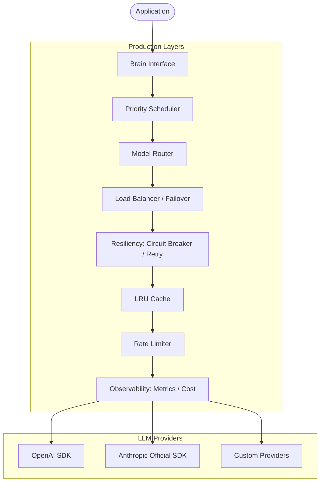

# Native Brain: Production-Grade LLM Intelligence

The `brain` package is the core intelligence engine of HotPlex. It provides a highly reliable, observable, and cost-effective interface for Large Language Model (LLM) reasoning.

## 🏛 Architecture Overview

The system is designed with a layered "Enhanced Brain" architecture. It decorates a base LLM client with multiple production-readiness middleware layers.



---

## 🧠 Native Brain Core Components (v0.22.0)

### 1. IntentRouter

Classifies incoming messages to determine the optimal processing path.

```
┌─────────────┐     ┌──────────────┐
│ User Message │────▶│ IntentRouter │
└─────────────┘     └──────┬───────┘
                           │
            ┌──────────────┼──────────────┐
            ▼              ▼              ▼
        [chat]        [command]       [task]
      Brain handles   Brain handles   Engine handles
      casual chat     status/config   code, debugging
```

**Intent Types**:
| Intent | Description | Handler |
|--------|-------------|---------|
| `chat` | Casual conversation, greetings | Brain generates response |
| `command` | Status queries, config commands | Brain generates response |
| `task` | Code operations, debugging | Forward to Engine Provider |
| `unknown` | Ambiguous intent | Default to Engine for safety |

**Fast-Path Optimization**: Obvious cases are handled without Brain API calls:
- Greetings ("hi", "hello") → `chat`
- Status commands ("ping", "status") → `command`
- Code keywords ("function", "debug") → `task`

```go
router := brain.NewIntentRouter(brainClient)
result, err := router.Classify(ctx, "Write a Python function")
// result.Type == IntentTypeTask
```

### 2. ContextCompressor

Manages conversation context to prevent context window overflow while preserving important information.

```
┌────────────────────────────────────────────────────────┐
│ Session History (before: 8000+ tokens)                 │
│ ┌─────┐ ┌─────┐ ┌─────┐ ┌─────┐ ┌─────┐ ┌─────┐       │
│ │Turn1│ │Turn2│ │ ... │ │Turn8│ │Turn9│ │Turn10│       │
│ └─────┘ └─────┘ └─────┘ └─────┘ └─────┘ └─────┘       │
└────────────────────────────────────────────────────────┘
                         │
                         ▼ Compression (threshold reached)
┌────────────────────────────────────────────────────────┐
│ Compressed Session (after: ~2000 tokens)               │
│ ┌─────────────────┐ ┌─────┐ ┌─────┐ ┌─────┐           │
│ │ Summary of 1-7  │ │Turn8│ │Turn9│ │Turn10│           │
│ │ (~500 tokens)   │ └─────┘ └─────┘ └─────┘           │
│ └─────────────────┘                                   │
└────────────────────────────────────────────────────────┘
```

**Compression Algorithm**:
1. Wait until token count exceeds `TokenThreshold` (default: 8000)
2. Keep last `PreserveTurns` (default: 5) turns intact
3. Summarize older turns using Brain AI
4. Replace old turns with summary, update total token count

```go
compressor := brain.NewContextCompressor(brainClient, brain.CompressionConfig{
    Enabled:        true,
    TokenThreshold: 8000,
    PreserveTurns:  5,
    MaxSummaryTokens: 500,
})
compressed := compressor.Compress(ctx, sessionHistory)
```

### 3. SafetyGuard

Multi-layer security for input validation and output sanitization.

```
SafetyGuard
├── CheckInput()     → Pattern scan → Brain analysis → allow/block
├── CheckOutput()    → Pattern match → sanitize → allow
└── ParseConfigIntent() → Brain NLU → ExecuteConfigIntent()
```

**Threat Detection Flow**:
1. **Fast path**: Regex patterns catch obvious attacks (prompt injection, jailbreak)
2. **Deep analysis**: Brain AI classifies subtle threats with confidence scores
3. **Action**: `allow` (safe), `block` (threat), or `sanitize` (redact sensitive data)

**Default Blocked Patterns**:
- Prompt injection (`ignore previous instructions`)
- Jailbreak attempts (`DAN mode`, `developer mode`)
- System override attempts (`you are now admin`)

```go
guard := brain.NewSafetyGuard(brainClient, brain.DefaultGuardConfig())

// Input validation
result := guard.CheckInput(ctx, userInput)
if result.Action == brain.GuardActionBlock {
    return errors.New("blocked: " + result.Reason)
}

// Output sanitization
sanitized := guard.CheckOutput(ctx, llmResponse)
```

---

### Core Components (Continued)

- **Brain Interface**: Unified API for high-level reasoning (`Chat`, `Analyze`) and streaming (`ChatStream`).
- **Resiliency Engine**: Implements exponential backoff retries and the Circuit Breaker pattern to handle transient failures and provider outages.
- **Dynamic Router**: Automatically selects the optimal model based on the scenario (e.g., Code vs. Chat) and configured strategies (Cost vs. Latency vs. Quality).
- **High Availability**: Multi-provider failover with automatic recovery (failback).
- **Resource Control**: Distributed rate limiting and token bucket management per model.
- **Budget Guardrails**: Multi-level token budget tracking (Daily/Weekly/Session) with hard and soft limits.

---

## 🛠 Developer Guide

### Interface Definitions

The package exports several interfaces to allow for granular usage of brain capabilities:

```go
// Base reasoning
type Brain interface {
    Chat(ctx context.Context, prompt string) (string, error)
    Analyze(ctx context.Context, prompt string, target any) error
}

// Specialized capabilities
type StreamingBrain interface { ChatStream(...) }
type RoutableBrain interface { ChatWithModel(...) }
type ObservableBrain interface { GetMetrics(...) }
type ResilientBrain interface { GetCircuitBreaker(...); GetFailoverManager(...) }
```

### Advanced Usage Scenarios & Patterns

#### 1. 🎬 Real-time Streaming (Live UI)
Best for large language outputs where low perceived latency is critical.

```go
func StreamAnswer(ctx context.Context, question string) {
    if sb, ok := brain.Global().(brain.StreamingBrain); ok {
        stream, err := sb.ChatStream(ctx, question)
        if err != nil {
            log.Fatal(err)
        }
        
        for token := range stream {
            fmt.Print(token) // Progressive rendering
        }
    }
}
```

#### 2. 🚦 Explicit Multi-Model Selection
Forces a specific model for specialized tasks (e.g., GPT-4o for complex reasoning).

```go
func SpecializedTask(ctx context.Context) {
    if rb, ok := brain.Global().(brain.RoutableBrain); ok {
        // High quality model override
        ans, _ := rb.ChatWithModel(ctx, "gpt-4o", "Deep technical analysis...")
        fmt.Println(ans)
    }
}
```

#### 3. 🎯 Intelligent Scenario Routing
Automatically detects task type (Code, Chat, or Analysis) and routes to the most cost-effective model configured in your strategies.

```go
func AutoRouteAction(ctx context.Context, userPrompt string) {
    // router selected based on StrategyBalanced/StrategyCostPriority
    // System automatically detects 'Write a Python script' as ScenarioCode
    resp, err := brain.Global().Chat(ctx, userPrompt)
    if err != nil {
        log.Printf("Routing error: %v", err)
    }
}
```

#### 4. 🏥 Resilience Management
Observing provider health and manually controlling the circuit state.

```go
func MonitorResilience() {
    if rb, ok := brain.Global().(brain.ResilientBrain); ok {
        cb := rb.GetCircuitBreaker()
        fm := rb.GetFailoverManager()
        
        fmt.Printf("Circuit State: %s | Failure Count: %d\n", 
            cb.GetState(), cb.GetStats().FailRequests)
            
        // Manual failover if we detect high latency on primary
        if fm.GetCurrentProvider().Name == "openai" {
            _ = fm.ManualFailover("dashscope") 
        }
    }
}
```

#### 5. 💰 Session Budget Guardrails
Tracking and enforcing financial limits for specific chat sessions.

```go
func ControlledSession(sessionID string) {
    if bb, ok := brain.Global().(brain.BudgetControlledBrain); ok {
        tracker := bb.GetBudgetTracker(sessionID)
        
        // Estimated cost check before heavy processing
        if allowed, _, _ := tracker.CheckBudget(0.05); !allowed {
            fmt.Println("Session budget exceeded. Stopping.")
            return
        }
    }
}
```

---

## 🔧 Client Builder Pattern (Issue #217)

The `llm` subpackage provides a fluent Builder API for composing middleware layers.

### Wrapping Order (Innermost to Outermost)

```
Metrics → Circuit → RateLimit → Retry → Cache → OpenAI
```

| Layer | Purpose |
|-------|---------|
| Cache | LRU response caching |
| Retry | Exponential backoff retries |
| Rate Limit | Token bucket rate limiting |
| Circuit Breaker | Fail-fast on repeated errors |
| Metrics | Observability and cost tracking |

### Preset Configurations

```go
// Production: all capabilities
client, _ := llm.ProductionClient(apiKey, "gpt-4")

// Development: minimal overhead
client, _ := llm.DevelopmentClient(apiKey, "gpt-4")

// High throughput: aggressive caching
client, _ := llm.HighThroughputClient(apiKey, "gpt-4")

// Maximum reliability: aggressive retries
client, _ := llm.ReliableClient(apiKey, "gpt-4")
```

### Custom Configuration

```go
client, _ := llm.NewClientBuilder().
    WithAPIKey(apiKey).
    WithEndpoint("https://api.deepseek.com/v1").
    WithModel("deepseek-chat").
    WithCache(5000).
    WithRetry(5).
    WithCircuitBreaker(llm.CircuitBreakerConfig{...}).
    WithRateLimit(100).
    WithMetrics().
    Build()
```

### Independent Features (Non-Builder)

Budget tracking and priority scheduling are standalone:

```go
// Budget Control
client, _ := llm.NewBudgetManagedClient(apiKey, "gpt-4", 10.0) // $10/day

// Priority Scheduling
scheduler, client := llm.PrioritySchedulerWithClient(5*time.Minute, nil)
client.Submit(ctx, "req-1", llm.PriorityHigh, func() error { ... })
```

### ObservableClient

Extract runtime statistics:

```go
obs := llm.AsObservable(client)
health := obs.GetClientHealth(ctx)
// health.CircuitState, health.CacheHitRate, health.TotalRequests
```

---

## 📊 Observability & Metrics

The system tracks enterprise-level metrics using OpenTelemetry:

- **Latency**: Detailed histogram of request durations.
- **Token Usage**: Granular tracking of input/output tokens.
- **Financials**: Real-time USD cost calculation based on model-specific pricing.
- **Reliability**: Error rates and circuit breaker state transitions.

| Metric                 | Type      | Description                 |
| :--------------------- | :-------- | :-------------------------- |
| `llm_request_duration` | Histogram | Latency per model/operation |
| `llm_tokens_total`     | Counter   | Total tokens consumed       |
| `llm_cost_usd`         | Gauge     | Cumulative cost in USD      |
| `llm_error_rate`       | Gauge     | Failure percentage          |

---

## ⚙️ Configuration Reference
| Variable                                | Description                               | Default  |
| :-------------------------------------- | :---------------------------------------- | :------- |
| `HOTPLEX_BRAIN_PROVIDER`                | Primary provider (openai/anthropic/etc)   | `openai` |
| `HOTPLEX_BRAIN_PROTOCOL`                | Protocol (openai/anthropic)               | `openai` |
| `HOTPLEX_BRAIN_API_KEY`                 | Explicit API Key (Level 1 Priority)       | `unset`  |
| `HOTPLEX_PROVIDER_TYPE`                 | CLI Discovery type (Level 2 Priority)     | `unset`  |
| `HOTPLEX_BRAIN_TIMEOUT_S`               | Request timeout in seconds                | `30`     |
| `HOTPLEX_BRAIN_CIRCUIT_BREAKER_ENABLED` | Enable circuit breaker protection         | `false`  |
| `HOTPLEX_BRAIN_ROUTER_ENABLED`          | Enable scenario-based model routing       | `false`  |
| `HOTPLEX_BRAIN_FAILOVER_ENABLED`        | Enable automatic multi-provider switching | `false`  |
| `HOTPLEX_BRAIN_BUDGET_LIMIT`            | Hard USD limit for the period             | `10.0`   |

---

### 🚦 Configuration Priority (Three-Tier System)

The system resolves credentials and endpoints using a tiered priority model:

1.  **Level 1: Explicit Overrides** (`HOTPLEX_BRAIN_*`): Direct control via environment variables.
2.  **Level 2: CLI Discovery**: Automatically extracts config from local developer tools:
    - **Claude Code CLI**: Parses `~/.claude/settings.json`, supports `PROXY_MANAGED` status with automatic dummy key generation.
3.  **Level 3: System Environment**: Fallback to standard provider vars (`ANTHROPIC_API_KEY`, `OPENAI_API_KEY`, etc.).

---

## 🧪 Testing

The package includes high-coverage unit tests and integration tests for providers.

```bash
go test -v ./brain/...
```

- **Unit tests**: Fast, mocks provider calls.
- **Integration tests**: Requires API keys, tests real connectivity.
- **Scenario tests**: Validates routing and budget logic under load.

---

**Package Status**: Production Ready (Phase 3)  
**Maintainer**: HotPlex Core Team
