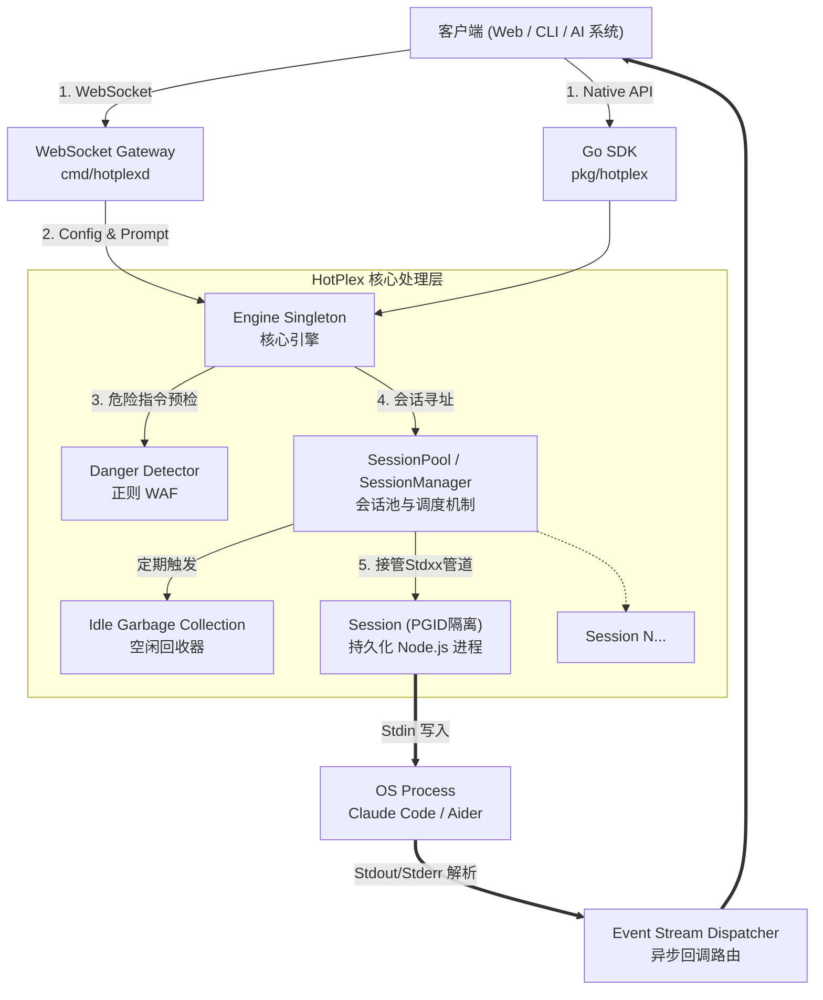
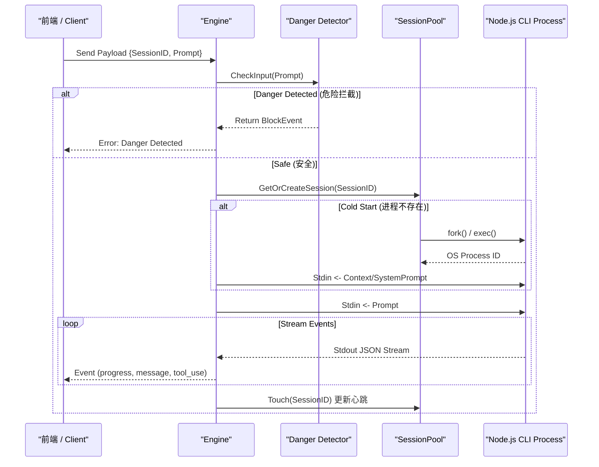

# HotPlex 核心架构设计文档

HotPlex 是一个高性能的进程多路复用器 (Process Multiplexer)，专为解决大模型 CLI 智能体（如 Claude Code, OpenCode）启动缓慢（冷启动）的问题而设计。它通过在后台维护持久化的进程池，实现毫秒级的指令响应与执行结果流式返回。

---

## 1. 架构概览 (Architecture Overview)

HotPlex 采用清晰的分层架构设计，确保核心引擎的纯净与外部接入的灵活性。系统整体分为 **接入层**、**引擎层**、**会话控制层** 与 **底层进程隔离层**。

---

## 2. 核心系统组件

### 2.1 接入层 (Gateway & SDK)
*   **WebSocket Gateway (`internal/server`, `cmd/hotplexd`)**: 提供开箱即用的网络服务器能力，允许跨语言（React/Vue 浏览器前端、Python 脚本等）通过无状态的 WebSocket 连接操控有状态的底层代理进程。 
*   **原生 Go SDK (`pkg/hotplex`)**: 允许将 HotPlex 作为嵌入式引擎直接集成到其他 Golang 编写的服务端模块中，进行内存级的高效协同。

### 2.2 引擎核心 (`hotplex.Engine`)
*   **全局生命周期管理者**: `Engine` 是单例模式的入口点。它负责对外的统一调用接口 (`Execute`, `StopSession`)。
*   **确定性会话路由 (Deterministic Namespace)**:
    在 API (`hotplex.Config`) 设计上，系统使用基于 UUID v5 的确定性命名空间生成算法（`ConversationIDToSessionID`），将上层业务的 `ConversationID` 映射为持久的 `SessionID`，从而保证了相同对话请求永远路由到同一个活跃的 CLI 进程中。

### 2.3 会话控制与调度 (`hotplex.SessionPool` & `hotplex.Session`)
*   **热连结机制 (Hot-Multiplexing)**: `SessionPool` (实现 `SessionManager` 接口) 基于并发安全的 Map 维护全局活跃进程表。对于新的 `SessionID` 执行**冷启动 (Cold Start)**（初始化 OS 进程，注入起始 System Prompt）；对于已存在的 `SessionID`，则跳过启动阶段，直接向 `Stdin` 投递增量指令（**热执行**）。
*   **垃圾回收 (Garbage Collection)**: `SessionPool` 内部运行着独立的协程 `cleanupLoop`，对进程池进行定期巡检。超过预设 `Timeout` 未活跃（无心跳 Touch）的进程将被回收，释放系统内存。
*   **异步流路由 (Asynchronous Stream Dispatch)**: `Session` 组件封装了 `bufio.Scanner` 来异步且非阻塞地读取 `Stdout/Stderr`，实时解析 JSON Stream 协议，并将不同类型的 Event 回调分派给客户端，极大避免管道阻塞造成的底层死锁。

### 2.4 安全沙箱与防御层 (`hotplex.Detector` & POSIX Utils)
HotPlex 让大模型直接接触宿主机 Shell，因此安全性至关重要：
1.  **进程组暴力拔除 (PGID Isolation)**: 为防止流氓智能体 Fork 出难以控制的子孙炸弹进程（Zombie Process），`Session` 会通过 `SysProcAttr{Setpgid: true}` 将其包裹在独立进程组内。终止时对整个 `-PGID` 发送 `SIGKILL`，确保连根拔起。
2.  **危险预检器 (Danger Detector / Regex WAF)**:
    *   在命令落入 `Stdin` 前，自动使用极高效率的正则引擎抓取恶意的破坏性意图。
    *   内置 `DangerLevelCritical` 级别的阻断策略（防御 `rm -rf /`, `mkfs`, fork 炸弹等）。
    *   提供阻断拦截事件 `DangerBlockEvent` 上报，支撑 UI 前端的二次手动覆盖（Evolution/Bypass Mode）。
3.  **目录重写与限制**: 动态设定子进程的环境变量与运行路径 `WorkDir`，将系统级别的操作尽可能限制在指定工作空间内。

---

## 3. 会话生命周期与数据流向阶段

## 4. 关键扩展演进方向 (Future Work)
- **多协议抽象 (Provider Provider Interface)**: 当前深度耦合和优化自 Claude Code，通过引入 `Provider` 接口机制，向下对接 `OpenCode`, `Aider` 甚至自定义的 Python LLM Agent。
- **跨机器/沙盒扩展 (Remote Docker Sandbox)**: `Session` 组件接口化，从单纯对本地 OS 进程的包装，扩展到调用 `Docker SDK` 在远程隔离容器内生成短时会话。
- **治理与可观测性 API**: 热复用器网关层提供标准的 REST API 或者 GraphQL 层，用于实时观测池化率、Token 成本、以及提供管理面板强制释放异常进程。
