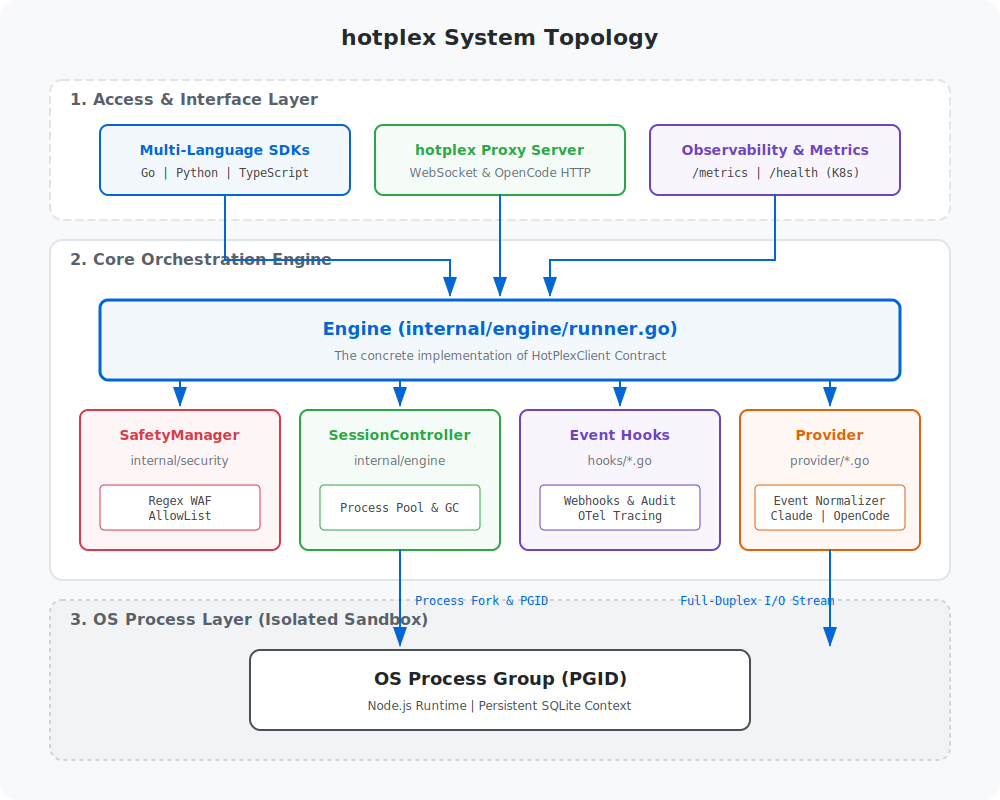
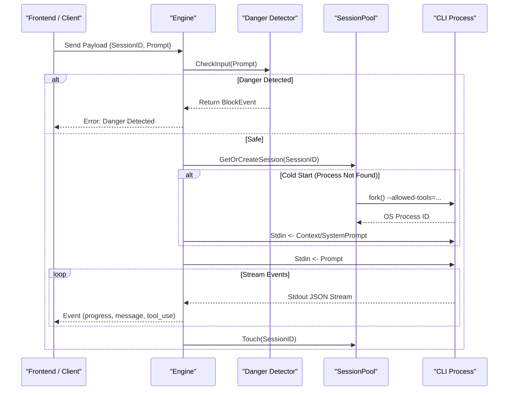

# HotPlex Core Architecture Documentation

*Read this in other languages: [English](architecture.md), [简体中文](architecture_zh.md).*

HotPlex is a high-performance Control Plane for AI CLI Agents, designed to transform elite terminal-based AI tools (like Claude Code, Aider, or OpenCode) into production-ready system services. Its core philosophy is "Don't Reinvent the Wheel"—by maintaining a persistent process pool with hardened security boundaries, HotPlex enables millisecond-level responsiveness and full-duplex streaming integration, bridging the gap between local terminal AI tools and modern backend architectures.

---

## 1. Architecture Overview

HotPlex adopts a clear layered architecture design to ensure the purity of the core engine and the flexibility of external access. The system is divided into **Access Layer**, **Engine Layer**, **Session Control Layer**, and **Bottom Process Isolation Layer**.

---

## 2. Core System Components

### 2.1 Access Layer (Gateway & SDK)
*   **WebSocket Gateway (`internal/server`, `cmd/hotplexd`)**: Provides out-of-the-box network server capabilities, allowing cross-language clients (React/Vue browser front-end, Python scripts, etc.) to control stateful underlying proxy processes through stateless WebSocket connections.
*   **Native Go SDK (`pkg/hotplex`)**: Allows HotPlex to be integrated directly into other Golang server modules as an embedded engine for efficient memory-level collaboration.

### 2.2 Core Engine (`hotplex.Engine`)
*   **Global Lifecycle Manager**: `Engine` is the singleton entry point. It is responsible for unified external calling interfaces (`Execute`, `StopSession`).
*   **Centralized Configuration (EngineOptions)**: 
    Starting from v0.2.0, all core security boundaries (such as `AllowedTools`, `DisallowedTools`) are globally defined by `EngineOptions`. This ensures that sandbox rules are solidified during engine initialization, preventing sandbox escape via individual `Execute` calls.
*   **Deterministic Session Routing (Deterministic Namespace)**:
    The system uses a deterministic namespace generation algorithm based on UUID v5 to map the upper-level business `ConversationID` to a persistent `SessionID`, ensuring that the same conversation requests are always routed to the same active CLI process.

### 2.3 Session Control & Scheduling (`hotplex.SessionPool` & `hotplex.Session`)
*   **Hot-Multiplexing Mechanism**: `SessionPool` maintains a thread-safe active process table. For a new `SessionID`, it performs a **Cold Start**; for an existing `SessionID`, it skips the startup phase and directly injects increment instructions into `Stdin` (**Hot Execution**).
*   **Idle Recovery (GC)**: A background `cleanupLoop` periodically inspects the process pool. Processes that exceed the `IdleTimeout` are reclaimed to release system memory.
*   **Asynchronous Stream Dispatch**: The `Session` component uses `bufio.Scanner` to read `Stdout/Stderr` asynchronously and non-blockingly, parsing the JSON Stream protocol in real-time and dispatching events to the client.

### 2.4 Security Sandbox & Capability Constraints (Security Pivot)
HotPlex's security strategy underwent a major pivot in v0.2.0, shifting from path-based interception to tool-based capability constraints:
1.  **Native Tool Constraints**: 
    Since HotPlex wraps mature CLI agents (like Claude Code), these agents provide robust native tool governance. HotPlex enforces constraints via `AllowedTools` / `DisallowedTools` flags during CLI startup (e.g., `--allowed-tools`). This is more reliable than path interception as it stops harmful capabilities (like `Bash` or `Edit`) at the semantic level.
2.  **Danger Detector (Regex WAF)**:
    Retains regex-based scanning as a final line of defense. Before commands reach `Stdin`, it automatically catches malicious intent (e.g., `rm -rf /`), providing proactive directive-level defense.
3.  **PGID Isolation**: 
    To prevent orphaned child processes, `Session` uses a dedicated Process Group ID. Termination sends `SIGKILL` to the entire `-PGID`, ensuring a clean physical sweep.
4.  **Workspace Locking**: Dynamically sets the `WorkDir` of the child process, which, combined with native tool sandboxing, ensures operations are strictly restricted to the project space.

---

## 3. Session Lifecycle & Data Flow

## 4. Future Evolution
- **Provider Interface Abstraction**: Introduce a `Provider` interface to support agents with different protocols like `OpenCode`, `Aider`, etc.
- **Remote Docker Sandbox**: Extend `Session` to call Docker APIs for creating sessions in fully isolated containers instead of local OS processes.
- **Observability Dashboard**: Provide REST APIs for real-time monitoring of session pool status, token consumption statistics, and forced reclamation of abnormal processes.
