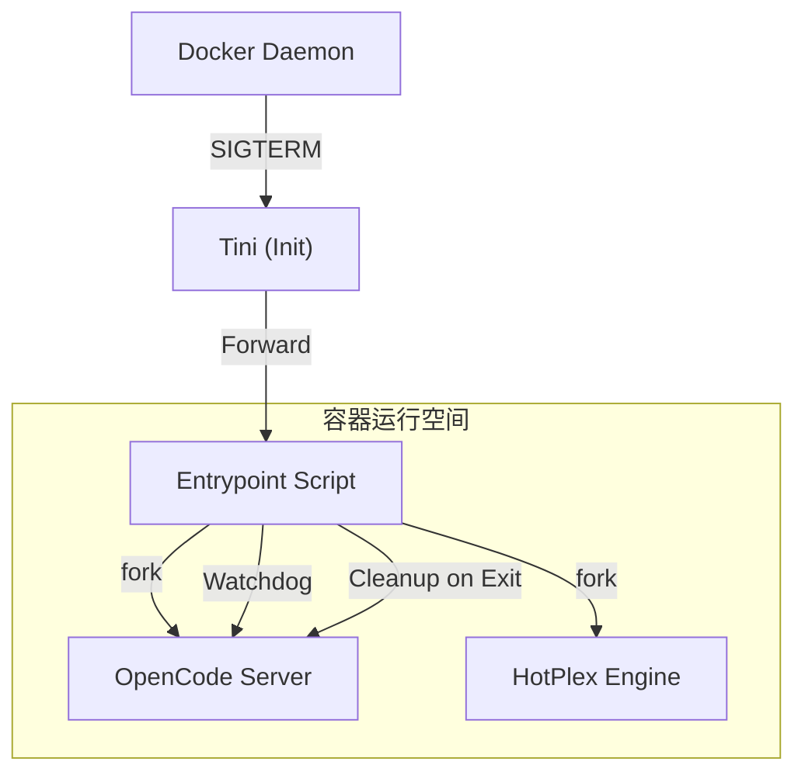

# HotPlex 容器化架构方案 (Containerization Strategy)

## 1. 背景与核心挑战

HotPlex 旨在提供一个工业级的容器化运行环境，支持多 Bot 矩阵。为了平衡“全局一致性”与“实例隔离性”，我们设计了一套复杂的容器启动与运行时管理机制。

核心挑战：
*   **权限冲突**：宿主机挂载目录的 UID/GID 不匹配导致 EACCES 错误。
*   **非持久化配置**：环境变量无法直接注入到只读的 YAML 配置文件中。
*   **交互式工具适配**：如 Claude Code 等依赖本地状态文件的 CLI 工具。
*   **多进程协作**：需要主引擎与 OpenCode Server 副容器（Sidecar）同步生命周期。

---

## 2. 启动三部曲 (Lifecyle Phases)

### 阶段 1：宿主机种子化 (Host Seeding)
**核心脚本**：`scripts/claude-seed-processor.sh`
在容器启动前，宿主机执行该脚本：
1.  **路径转换**：将宿主机路径虚拟化为 `/home/hotplex`。
2.  **配置镜像**：将主人的 `~/.claude/` 镜像到 `.hotplex/claude-seed/`，并剔除敏感字段（如 `userID`）。

### 阶段 2：容器初始化 (Container Entrypoint)
**核心脚本**：`docker/docker-entrypoint.sh` (PID 1)
这是容器最关键的逻辑层。

#### A. 权限治理 (Permission Hardening)
自动识别挂载卷并将其 `chown` 给 `hotplex:hotplex` 用户，覆盖：
*   `.hotplex/` (配置文件)
*   `.claude/` (Claude 运行时)
*   `projects/` (工作项目)
*   `go/pkg/mod` 与 `.cache/go-build` (编译加速)

#### B. 配置变量注入 (Env Expansion)
使用 `envsubst` 扫描 `configs/chatapps/*.yaml`。
*   **逻辑**：只注入以 `HOTPLEX_`, `GIT_`, `GITHUB_` 开头的变量。
*   **目的**：防止环境泄露，同时解决模板中 `${issue_id}` 等非环境占位符被误删的问题。

#### C. Claude 隔离与克隆 (Seed & Clone)
*   **只读种子**：挂载 `/home/hotplex/.claude.json.seed:ro`。
*   **私有持久化**：如果 Bot 的私有卷中没有配置，则从种子克隆一份到 `/home/hotplex/.claude/.claude.json`。
*   **链接对齐**：建立 `~/.claude.json` 软链接，确保软件可见。

#### D. Git 基础设施自动化
*   **身份注入**：根据环境变量自动配置全局 `user.name` 和 `user.email`。
*   **安全路径**：自动将所有子项目目录加入 `safe.directory`，避免 Git 安全性警告导致的工具失效。

#### E. 动态工具安装 (Runtime Pip Tools)
*   **按需加载**：根据 `PIP_TOOLS` 变量实时安装 Python 工具包。
*   **引擎加速**：优先使用 `uv` 极速安装，无 `uv` 时回退至 `pip`。

### 阶段 3：运行期维护与监控 (Runtime Watchdog)

#### A. Sidecar 编排 (OpenCode Server)
*   **生命周期同步**：Entrypoint 负责启动 OpenCode Server，并监控其 PID。
*   **健康自愈**：如果 OpenCode 崩溃，Entrypoint 会尝试重连，支持最大重试次数配置。

#### B. Go 引擎维护循环 (Maintenance Loop)
*   **定时清理**：Go 代码每 10 分钟执行一次 `clearClaudeJSONUserID`。
*   **OAuth 绕过**：持续确保 `userID` 为空，强制 Claude 使用 Proxy 令牌进行认证。

---

## 3. 文件存储架构视图

| 路径 | 存储介质 | 角色 | 读写属性 |
| :--- | :--- | :--- | :--- |
| `/home/hotplex/.hotplex/configs` | 绑定挂载 (Bind Mount) | 全局配置模板 | RO (经 Entrypoint 处理) |
| `/home/hotplex/.claude/` | **具名卷 (Named Volume)** | 插件、设置、Identity | **RW (实例隔离)** |
| `/home/hotplex/projects/` | 绑定挂载/具名卷 | 代码项目 | RW |
| `~/.claude.json` | 软链接 (Symlink) | 兼容性代理 | RW (映射至私有副本) |

---

## 4. 进程拓扑与信号流

## 5. 关键原则总结

1.  **Immutability (不可变性)**：宿主机的配置种子是只读的，防止容器污染宿主机。
2.  **Ephemerality (挥发性平衡)**：主程序是挥发性的，但身份标识（.claude.json）和插件通过具名卷保持持久。
3.  **Automation (高度自动)**：权限、Git、Pip 环境在启动瞬间自动对齐，用户只需维护一套 `.env`。
