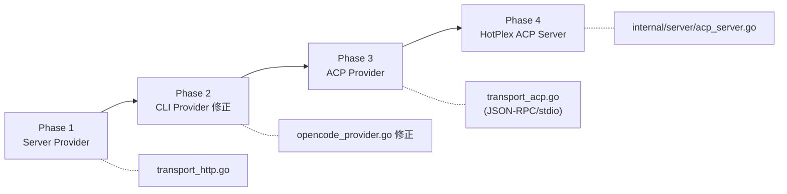

# OpenCode Server Provider — 终版实现规格

> **原则**: 整洁架构 (Clean Architecture) · DRY · SOLID  
> **Issue**: [#356](https://github.com/hrygo/hotplex/issues/356) · **方案 B**: Server Provider  
> **上游**: [anomalyco/opencode](https://github.com/anomalyco/opencode) (740 releases) · [Server API](https://opencode.ai/docs/server) · [SDK Types](https://github.com/anomalyco/opencode/blob/dev/packages/sdk/js/src/gen/types.gen.ts)

---

## 1. 架构审查 · 问题定位

### 1.1 现状：CLI 子进程耦合

当前引擎执行链如下:

```
Engine.Execute()
  → ValidateBinary() → cliPath              ①
  → pool.GetOrCreateSession()
      → BuildCLIArgs() → exec.Command(cliPath, args...)   ②
      → stdout scanner → ParseEvent(line)   ③
      → DetectTurnEnd()                     ④
  → BuildInputMessage() → sess.WriteInput() → stdin       ⑤
```

**问题矩阵**:

| 步骤 | 现状 | Server 模式需求 | 差距 |
|------|------|----------------|------|
| ① ValidateBinary | `exec.LookPath("opencode")` → path | `GET /` 健康检查 → URL | 语义不同 |
| ② BuildCLIArgs | 构造 CLI 参数 | **不适用** | 接口冗余 |
| ③ ParseEvent | 解析 stdout JSON line | 解析 SSE `data:` line | **格式兼容** |
| ④ DetectTurnEnd | 检测 stdout 事件 | 检测 SSE 事件 | **逻辑兼容** |
| ⑤ BuildInputMessage | 构造 stdin JSON | 构造 HTTP POST body | 语义相近 |

> [!IMPORTANT]
> **关键洞察**: ParseEvent 和 DetectTurnEnd 与传输无关——无论是 stdout 还是 SSE，数据格式相同。真正的差异在于**传输层**（子进程 vs HTTP）和**生命周期管理**（进程 vs 连接）。

### 1.2 整洁架构分层

```
┌──────────────────────────────────────────────┐
│  Engine (Application Layer)                   │
│  ┌─────────────────── ─── ─── ───┐           │
│  │  Provider Interface            │           │
│  │  (Domain Contract)             │           │
│  └──────────┬────────────────────┘           │
│             │ DIP                             │
│  ┌──────────┼────────────────────┐           │
│  │  ┌───────┴───────┐  ┌────────┴────────┐  │
│  │  │ CLITransport  │  │ HTTPTransport   │  │
│  │  │ (子进程 stdio)│  │ (HTTP+SSE)      │  │
│  │  └───────────────┘  └─────────────────┘  │
│  │  Infrastructure Layer                     │
│  └───────────────────────────────────────────┘
└──────────────────────────────────────────────┘
```

---

## 2. 接口设计 (SOLID)

### 2.1 Provider 接口 — 保持不变 (OCP)

```go
// Provider 接口不修改 — 后向兼容
type Provider interface {
    Metadata() ProviderMeta
    BuildCLIArgs(providerSessionID string, opts *ProviderSessionOptions) []string
    BuildInputMessage(prompt string, taskInstructions string) (map[string]any, error)
    ParseEvent(line string) ([]*ProviderEvent, error)
    DetectTurnEnd(event *ProviderEvent) bool
    ValidateBinary() (string, error)
    CleanupSession(providerSessionID string, workDir string) error
    VerifySession(providerSessionID string, workDir string) bool
    Name() string
}
```

> 不修改现有接口。Server Provider 对 CLI 方法提供**适配实现** — 这不是"空方法糊弄"，而是**适配器模式** (Adapter Pattern)。

### 2.2 新增 Transport 接口 (SRP + ISP)

```go
// Transport 定义 Provider 与外部 Agent 之间的通信机制。
// CLITransport: 子进程 stdin/stdout
// HTTPTransport: HTTP REST + SSE
type Transport interface {
    // Connect 建立通信通道，返回事件流
    Connect(ctx context.Context, cfg TransportConfig) error

    // Send 发送消息到 Agent
    Send(ctx context.Context, sessionID string, message map[string]any) error

    // Events 返回原始事件行的 channel（与 ParseEvent 对接）
    Events() <-chan string

    // CreateSession 创建 Agent 端会话
    CreateSession(ctx context.Context, title string) (string, error)

    // DeleteSession 删除 Agent 端会话
    DeleteSession(ctx context.Context, sessionID string) error

    // Health 检查通信通道是否可用
    Health(ctx context.Context) error

    // Close 关闭通信通道
    Close() error
}

type TransportConfig struct {
    Endpoint string            // CLI path 或 HTTP URL
    Env      map[string]string // 环境变量
    WorkDir  string
}
```

### 2.3 设计决策记录 (ADR)

| 决策 | 选择 | 理由 |
|------|------|------|
| Provider 接口不改 | ✅ OCP | 避免改动 3 个现有 Provider + Engine + Pool |
| 新增 Transport 接口 | ✅ SRP + DIP | 传输 ≠ 事件解析，职责分离 |
| Server Provider 实现 Provider | ✅ LSP | 引擎无感知，多态透明 |
| 共享类型提取 | ✅ DRY | `opencode_http.go` 与新 Provider 共用 |
| `ParseEvent` 复用 SSE data line | ✅ DRY | SSE `data: {...}` 与 stdout `{...}` 格式一致 |

---

## 3. 类型设计 (DRY)

### 3.1 共享类型 — `provider/opencode_types.go` [NEW]

> `opencode_http.go` (出站) 和 `OpenCodeServerProvider` (入站) 共用

```go
package provider

import "encoding/json"

// ── Part 类型常量 ──

const (
    OCPartText       = "text"
    OCPartReasoning  = "reasoning"
    OCPartTool       = "tool"
    OCPartStepStart  = "step-start"
    OCPartStepFinish = "step-finish"
    OCPartAgent      = "agent"
    OCPartSubtask    = "subtask"
)

// ── SSE Event 类型常量 ──

const (
    OCEventMessagePartUpdated = "message.part.updated"
    OCEventMessageUpdated     = "message.updated"
    OCEventSessionStatus      = "session.status"
    OCEventSessionIdle        = "session.idle"
    OCEventSessionError       = "session.error"
    OCEventPermissionUpdated  = "permission.updated"
)

// ── 数据结构 ──

// OCPart 是 OpenCode Part 的统一 Go 表示。
// 上游定义了 12 种 Part（TypeScript Union Type），
// Go 使用大结构体 + Type 字段判别。
type OCPart struct {
    ID        string `json:"id"`
    SessionID string `json:"sessionID"`
    MessageID string `json:"messageID"`
    Type      string `json:"type"`

    // text / reasoning
    Text string `json:"text,omitempty"`

    // tool
    CallID string       `json:"callID,omitempty"`
    Tool   string       `json:"tool,omitempty"`
    State  *OCToolState `json:"state,omitempty"`

    // step-finish
    Reason string    `json:"reason,omitempty"`
    Cost   float64   `json:"cost,omitempty"`
    Tokens *OCTokens `json:"tokens,omitempty"`
}

type OCToolState struct {
    Status   string         `json:"status"` // pending|running|completed|error
    Input    map[string]any `json:"input,omitempty"`
    Output   string         `json:"output,omitempty"`
    Title    string         `json:"title,omitempty"`
    Error    string         `json:"error,omitempty"`
}

type OCTokens struct {
    Input     int32   `json:"input"`
    Output    int32   `json:"output"`
    Reasoning int32   `json:"reasoning"`
    Cache     OCCache `json:"cache"`
}

type OCCache struct {
    Read  int32 `json:"read"`
    Write int32 `json:"write"`
}

// ── SSE 事件结构 ──

type OCEvent struct {
    Type       string          `json:"type"`
    Properties json.RawMessage `json:"properties"`
}

type OCGlobalEvent struct {
    Directory string  `json:"directory"`
    Payload   OCEvent `json:"payload"`
}

type OCPartUpdateProps struct {
    Part  OCPart `json:"part"`
    Delta string `json:"delta,omitempty"`
}

type OCSessionStatusProps struct {
    SessionID string         `json:"sessionID"`
    Status    OCSessionState `json:"status"`
}

type OCSessionState struct {
    Type string `json:"type"` // idle|busy|retry
}

type OCSessionErrorProps struct {
    SessionID string   `json:"sessionID,omitempty"`
    Error     *OCError `json:"error,omitempty"`
}

type OCError struct {
    Name string         `json:"name"`
    Data map[string]any `json:"data"`
}
```

### 3.2 DRY 改造 — `opencode_http.go`

```diff
-// 删除硬编码类型，引用共享常量
-base["type"] = "text"
+base["type"] = provider.OCPartText
```

---

## 4. HTTPTransport 实现

### 4.1 结构 — `provider/transport_http.go` [NEW]

```go
package provider

type HTTPTransport struct {
    baseURL    string
    client     *http.Client
    password   string
    events     chan string        // 向 Provider 输出原始 SSE data line
    cancel     context.CancelFunc
    logger     *slog.Logger
    mu         sync.Mutex
    connected  bool
}

// Connect 建立到 opencode serve 的 SSE 连接
func (t *HTTPTransport) Connect(ctx context.Context, cfg TransportConfig) error {
    t.baseURL = cfg.Endpoint
    ctx, t.cancel = context.WithCancel(ctx)
    go t.streamSSE(ctx)
    return nil
}

// streamSSE 解析 SSE 流，将 data line 转为 Provider 可消费的 JSON line
func (t *HTTPTransport) streamSSE(ctx context.Context) {
    req, _ := http.NewRequestWithContext(ctx, "GET", t.baseURL+"/event", nil)
    req.Header.Set("Accept", "text/event-stream")
    // ... 逐行解析 "data: {...}" → t.events <- jsonLine
}

// Send 通过 HTTP POST 发送消息
func (t *HTTPTransport) Send(ctx context.Context, sessionID string, message map[string]any) error {
    url := fmt.Sprintf("%s/session/%s/message", t.baseURL, sessionID)
    body, _ := json.Marshal(message)
    req, _ := http.NewRequestWithContext(ctx, "POST", url, bytes.NewReader(body))
    req.Header.Set("Content-Type", "application/json")
    // ... 执行请求
}

// CreateSession POST /session
func (t *HTTPTransport) CreateSession(ctx context.Context, title string) (string, error) {
    // POST /session → {id: "..."}
}

// DeleteSession DELETE /session/:id
func (t *HTTPTransport) DeleteSession(ctx context.Context, sessionID string) error { ... }

// Health GET /
func (t *HTTPTransport) Health(ctx context.Context) error { ... }

// Events 返回事件 channel
func (t *HTTPTransport) Events() <-chan string { return t.events }

// Close 断开 SSE 连接
func (t *HTTPTransport) Close() error { t.cancel(); return nil }
```

---

## 5. OpenCodeServerProvider 实现

### 5.1 结构 — `provider/opencode_server_provider.go` [NEW]

```go
package provider

type OpenCodeServerProvider struct {
    ProviderBase
    transport     *HTTPTransport
    opts          ProviderConfig
    promptBuilder *PromptBuilder
    sessions      sync.Map       // HotPlex SessionID → OC SessionID
}
```

### 5.2 Provider 方法实现

```go
// ── 适配器方法（应对 CLI 语义的 Provider 接口） ──

func (p *OpenCodeServerProvider) ValidateBinary() (string, error) {
    // 适配：健康检查替代二进制查找
    if err := p.transport.Health(context.Background()); err != nil {
        return "", fmt.Errorf("opencode server at %s unreachable: %w",
            p.transport.baseURL, err)
    }
    return p.transport.baseURL, nil
}

func (p *OpenCodeServerProvider) BuildCLIArgs(
    providerSessionID string, opts *ProviderSessionOptions,
) []string {
    // 适配：Server 模式不启动 CLI 子进程
    // Pool 检测到 nil args 时，应跳过 exec.Command 启动
    return nil
}

// ── 核心方法（语义一致） ──

func (p *OpenCodeServerProvider) BuildInputMessage(
    prompt, taskInstructions string,
) (map[string]any, error) {
    finalPrompt := p.promptBuilder.Build(prompt, taskInstructions)
    body := map[string]any{
        "parts": []map[string]any{
            {"type": OCPartText, "text": finalPrompt},
        },
    }
    if cfg := p.opts.OpenCode; cfg != nil {
        if m := cfg.Model; m != "" {
            parts := strings.SplitN(m, "/", 2)
            if len(parts) == 2 {
                body["model"] = map[string]string{
                    "providerID": parts[0],
                    "modelID":    parts[1],
                }
            }
        }
        if a := cfg.Agent; a != "" {
            body["agent"] = a
        }
    }
    return body, nil
}

func (p *OpenCodeServerProvider) ParseEvent(line string) ([]*ProviderEvent, error) {
    // 解析 SSE data line（OCGlobalEvent JSON）→ ProviderEvent
    var global OCGlobalEvent
    if err := json.Unmarshal([]byte(line), &global); err != nil {
        return nil, fmt.Errorf("parse SSE event: %w", err)
    }
    return p.mapOCEventToProviderEvents(global.Payload)
}
```

### 5.3 事件映射 — 核心逻辑

```go
func (p *OpenCodeServerProvider) mapOCEventToProviderEvents(
    evt OCEvent,
) ([]*ProviderEvent, error) {
    switch evt.Type {

    case OCEventMessagePartUpdated:
        var props OCPartUpdateProps
        json.Unmarshal(evt.Properties, &props)
        return p.mapPartToEvents(props.Part, props.Delta)

    case OCEventSessionIdle:
        return []*ProviderEvent{{
            Type:    EventTypeResult,
            RawType: evt.Type,
        }}, nil

    case OCEventSessionError:
        var props OCSessionErrorProps
        json.Unmarshal(evt.Properties, &props)
        errMsg := "unknown error"
        if props.Error != nil {
            errMsg = props.Error.Name
        }
        return []*ProviderEvent{{
            Type:    EventTypeError,
            RawType: evt.Type,
            Error:   errMsg,
            IsError: true,
        }}, nil

    case OCEventPermissionUpdated:
        return []*ProviderEvent{{
            Type:    EventTypePermissionRequest,
            RawType: evt.Type,
        }}, nil

    default:
        return nil, nil // 忽略无关事件
    }
}
```

### 5.4 Part → ProviderEvent 映射矩阵

```go
func (p *OpenCodeServerProvider) mapPartToEvents(
    part OCPart, delta string,
) ([]*ProviderEvent, error) {
    switch part.Type {
    case OCPartText:
        content := delta
        if content == "" { content = part.Text }
        return []*ProviderEvent{{
            Type: EventTypeAnswer, Content: content,
            RawType: part.Type,
        }}, nil

    case OCPartReasoning:
        content := delta
        if content == "" { content = part.Text }
        return []*ProviderEvent{{
            Type: EventTypeThinking, Content: content,
            RawType: part.Type,
        }}, nil

    case OCPartTool:
        return p.mapToolPartToEvents(part)

    case OCPartStepStart:
        return []*ProviderEvent{{
            Type: EventTypeStepStart, RawType: part.Type,
        }}, nil

    case OCPartStepFinish:
        meta := &ProviderEventMeta{
            TotalCostUSD: part.Cost,
        }
        if part.Tokens != nil {
            meta.InputTokens = part.Tokens.Input
            meta.OutputTokens = part.Tokens.Output
            meta.CacheReadTokens = part.Tokens.Cache.Read
            meta.CacheWriteTokens = part.Tokens.Cache.Write
        }
        return []*ProviderEvent{{
            Type: EventTypeStepFinish, RawType: part.Type,
            Metadata: meta,
        }}, nil

    default:
        return nil, nil
    }
}

func (p *OpenCodeServerProvider) mapToolPartToEvents(
    part OCPart,
) ([]*ProviderEvent, error) {
    if part.State == nil {
        return nil, nil
    }
    switch part.State.Status {
    case "pending", "running":
        return []*ProviderEvent{{
            Type:      EventTypeToolUse,
            ToolName:  part.Tool,
            ToolID:    part.CallID,
            ToolInput: part.State.Input,
            Status:    "running",
        }}, nil
    case "completed":
        return []*ProviderEvent{{
            Type:     EventTypeToolResult,
            ToolName: part.Tool,
            ToolID:   part.CallID,
            Content:  part.State.Output,
            Status:   "success",
        }}, nil
    case "error":
        return []*ProviderEvent{{
            Type:     EventTypeToolResult,
            ToolName: part.Tool,
            ToolID:   part.CallID,
            Error:    part.State.Error,
            IsError:  true,
            Status:   "error",
        }}, nil
    }
    return nil, nil
}
```

### 5.5 Turn 结束检测

```go
func (p *OpenCodeServerProvider) DetectTurnEnd(event *ProviderEvent) bool {
    if event == nil { return false }
    return event.Type == EventTypeResult || event.Type == EventTypeError
}
```

### 5.6 Session 管理

```go
func (p *OpenCodeServerProvider) CleanupSession(id string, _ string) error {
    return p.transport.DeleteSession(context.Background(), id)
}

func (p *OpenCodeServerProvider) VerifySession(id string, _ string) bool {
    err := p.transport.Health(context.Background())
    return err == nil
}
```

---

## 6. Engine 集成 — SessionPool 适配

> [!IMPORTANT]
> SessionPool (`pool.go`) 需要识别 Server Provider 的传输语义。  
> `BuildCLIArgs() == nil` 时，Pool 应走 HTTP Transport 路径而非 `exec.Command`。

```go
// pool.go — GetOrCreateSession 扩展
func (sm *SessionPool) createNewSession(ctx context.Context, ...) {
    args := sm.provider.BuildCLIArgs(providerSessionID, opts)
    if args == nil {
        // Server 模式：不启动子进程
        // Transport.Connect() 已在 Provider 初始化时完成
        // 直接标记 session ready
        session.SetStatus(SessionStatusReady)
        return
    }
    // 原有逻辑：exec.Command(sm.cliPath, args...)
}
```

---

## 7. 配置扩展

```go
type OpenCodeConfig struct {
    // 现有字段 ↓（保留后向兼容）
    UseHTTPAPI bool   `json:"use_http_api,omitempty" koanf:"use_http_api"`
    Port       int    `json:"port,omitempty" koanf:"port"`
    PlanMode   bool   `json:"plan_mode,omitempty" koanf:"plan_mode"`
    Provider   string `json:"provider,omitempty" koanf:"provider"`
    Model      string `json:"model,omitempty" koanf:"model"`

    // 新增 ↓
    ServerURL string `json:"server_url,omitempty" koanf:"server_url"` // http://127.0.0.1:4096
    Agent     string `json:"agent,omitempty" koanf:"agent"`           // build|plan
    Password  string `json:"password,omitempty" koanf:"password"`     // HTTP Basic Auth
}
```

YAML 示例:

```yaml
provider:
  type: opencode-server
  opencode:
    server_url: "http://127.0.0.1:4096"
    agent: "build"
    model: "anthropic/claude-sonnet-4-20250514"
```

---

## 8. Docker Sidecar 编排

```bash
# docker-entrypoint.sh — start_opencode_server()
start_opencode_server() {
    command -v opencode &>/dev/null || return 1
    local port="${OPENCODE_SERVER_PORT:-4096}"
    opencode serve --port "$port" --hostname 127.0.0.1 &
    for i in $(seq 1 60); do
        curl -sf "http://127.0.0.1:$port/" >/dev/null 2>&1 && return 0
        sleep 0.5
    done
    return 1
}
```

---

## 9. 文件变更清单

| 操作 | 文件 | 说明 | 原则 |
|------|------|------|------|
| **[NEW]** | `provider/transport.go` | Transport 接口定义 | SRP · ISP · DIP |
| **[NEW]** | `provider/transport_http.go` | HTTPTransport (SSE+REST) | SRP |
| **[NEW]** | `provider/opencode_types.go` | 共享类型 | DRY |
| **[NEW]** | `provider/opencode_server_provider.go` | Server Provider 实现 | OCP · LSP |
| **[NEW]** | `provider/opencode_server_provider_test.go` | 单元测试 | — |
| **[MODIFY]** | `provider/provider.go` | 新增 `ProviderTypeOpenCodeServer` | OCP |
| **[MODIFY]** | `internal/server/opencode_http.go` | 引用共享类型 | DRY |
| **[MODIFY]** | `internal/engine/pool.go` | `BuildCLIArgs==nil` 分支 | OCP |
| **[MODIFY]** | `docker/docker-entrypoint.sh` | sidecar 启动逻辑 | — |

---

## 10. 验证计划

### 单元测试

```bash
# 类型序列化/反序列化
go test ./provider/ -run TestOCPartMarshal -v

# SSE data line → ProviderEvent 映射
go test ./provider/ -run TestServerProviderParseEvent -v

# Part → ProviderEvent 完整矩阵
go test ./provider/ -run TestMapPartToEvents -v

# Transport mock 测试
go test ./provider/ -run TestHTTPTransport -v
```

### 集成测试

```bash
# 需要 opencode serve 运行
opencode serve --port 4096 &

# Session 生命周期
curl -s -X POST http://localhost:4096/session \
  -H 'Content-Type: application/json' \
  -d '{"title":"test"}' | jq .id

# Prompt + SSE 监听
curl -N http://localhost:4096/event &
curl -s -X POST http://localhost:4096/session/{id}/message \
  -H 'Content-Type: application/json' \
  -d '{"parts":[{"type":"text","text":"hello"}]}'
```

---

## 11. 长期演进路径



| Phase | Transport | 工期 | 复用 |
|-------|-----------|------|------|
| 1 Server Provider | `HTTPTransport` | 1-2 周 | opencode_types.go |
| 2 CLI 修正 | 现有 subprocess | 1-2 天 | opencode_types.go |
| 3 ACP Provider | `ACPTransport` (新) | 2-3 周 | Transport 接口 · opencode_types.go |
| 4 ACP Server | — | 4-6 周 | 全部共享类型 |
