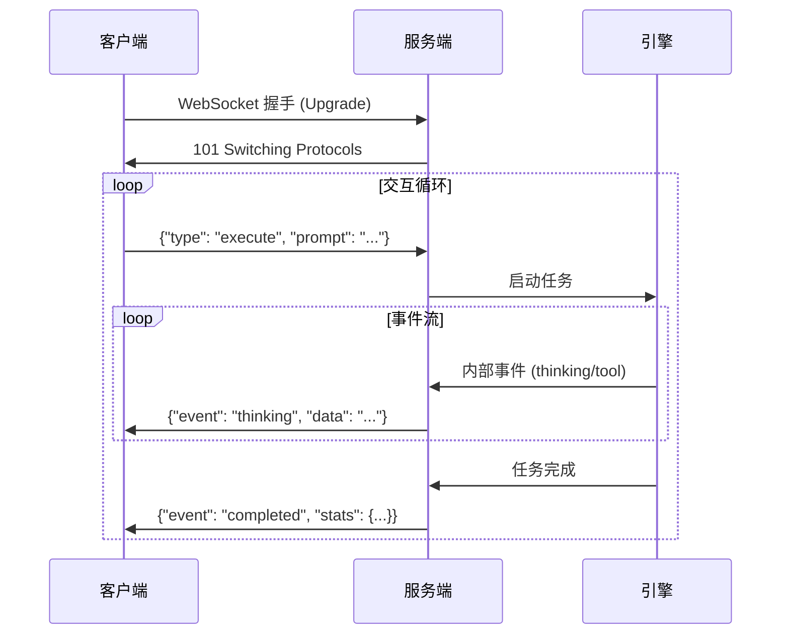

*查看其他语言: [English](api.md), [简体中文](api_zh.md).*

# HotPlex 服务模式开发者手册

HotPlex 支持双协议服务模式，使其能够作为 AI CLI 智能体（Agent）的生产级控制平面。它原生支持标准智能体协议，并为 OpenCode 生态提供兼容层。

## 1. HotPlex 原生协议 (WebSocket)

原生协议提供了一个健壮的全双工通信信道，用于与 AI 智能体进行实时交互。

### 协议流程


### 身份验证
如果已配置，服务器要求通过 Header 或查询参数传递 API Key：
- **Header**: `X-API-Key: <your-key>`
- **Query**: `?api_key=<your-key>`

### 客户端请求 (JSON)
客户端发送 JSON 消息来控制引擎。

| 字段            | 类型    | 描述                                     |
| :-------------- | :------ | :--------------------------------------- |
| `request_id`    | integer | 选填，用于在共享连接上跟踪请求-响应对    |
| `type`          | string  | `execute`, `stop`, `stats`, 或 `version` |
| `session_id`    | string  | 会话的唯一标识符（`execute` 时可选）     |
| `prompt`        | string  | 用户输入（`execute` 时必填）             |
| `instructions`  | string  | 任务特定指令（优先级高于系统提示词）     |
| `system_prompt` | string  | 会话级系统提示词注入                     |
| `work_dir`      | string  | 沙箱工作目录                             |
| `reason`        | string  | 停止原因（仅 `stop` 类型可用）           |

### 服务器事件 (JSON)
服务器实时广播事件。

| 事件                 | 描述                                                       |
| :------------------- | :--------------------------------------------------------- |
| `thinking`           | 模型推理或思维链 (Thinking Process)                        |
| `tool_use`           | 智能体发起工具调用（如 Shell 命令）                        |
| `tool_result`        | 工具执行的输出/响应                                        |
| `answer`             | 智能体的文本响应片段                                       |
| `completed`          | 交互轮次执行完成（包含 `session_id` 和统计摘要）           |
| `session_stats`      | 详细的会话统计信息（Token、耗时、成本等）                  |
| `stopped`            | 任务被手动停止                                             |
| `error`              | 协议、模型或引擎执行错误                                   |
| `permission_request` | 智能体请求操作权限（需客户端确认，通常在 chatapps 层处理） |
| `plan_mode`          | 智能体进入规划模式                                         |
| `exit_plan_mode`     | 智能体退出规划模式（通常伴随权限请求）                     |
| `stats`              | 对 `type: "stats"` 请求的响应                              |
| `version`            | 对 `type: "version"` 请求的响应                            |

### 示例代码 (Python)
```python
import asyncio
import websockets
import json

async def run_agent():
    uri = "ws://localhost:8080/ws/v1/agent"
    async with websockets.connect(uri) as websocket:
        # 执行 Prompt
        req = {
            "type": "execute",
            "prompt": "用 Go 写一个 Hello World 脚本",
            "system_prompt": "You are a senior Gopher. Be concise.",
            "work_dir": "/tmp/demo"
        }
        await websocket.send(json.dumps(req))

        # 监听事件
        async for message in websocket:
            evt = json.loads(message)
            print(f"[{evt['event']}] {evt.get('data', '')}")
            if evt['event'] == 'completed':
                break

asyncio.run(run_agent())
```

### 示例代码 (Node.js)
```javascript
const WebSocket = require('ws');

const ws = new WebSocket('ws://localhost:8080/ws/v1/agent');

ws.on('open', function open() {
  // 执行 Prompt
  ws.send(JSON.stringify({
    type: 'execute',
    prompt: '用 JavaScript 写一个 Hello World 脚本',
    system_prompt: 'You are a Node.js expert.',
    work_dir: '/tmp/demo'
  }));
});

ws.on('message', function incoming(message) {
  const evt = JSON.parse(message);
  console.log(`[${evt.event}]`, evt.data || '');
  if (evt.event === 'completed') {
    ws.close();
  }
});
```

### 示例代码 (Go)
```go
package main

import (
	"context"
	"fmt"
	"github.com/hrygo/hotplex"
)

func main() {
	engine, _ := hotplex.NewEngine(hotplex.EngineOptions{})
	defer engine.Close()

	cfg := &hotplex.Config{
		WorkDir:   "/tmp/demo",
		SessionID: "ws-demo",
	}

	err := engine.Execute(context.Background(), cfg, "用 Go 写一个 Hello World",
		func(eventType string, data any) error {
			if eventType == "answer" {
				fmt.Print(data)
			}
			return nil
		})
	if err != nil {
		fmt.Println("Error:", err)
	}
}
```

---

## 2. OpenCode 兼容层 (HTTP/SSE)

HotPlex 为使用 REST 和服务器发送事件（SSE）的 OpenCode 客户端提供兼容层。

### 端点 (Endpoints)

#### 全局事件流
`GET /global/event`
建立 SSE 信道以接收广播事件。

#### 创建会话
`POST /session`
返回一个新的会话 ID。
**响应**: `{"info": {"id": "uuid-...", "projectID": "default", ...}}`

#### 发送提示词
`POST /session/{id}/message` 或 `POST /session/{id}/prompt_async`
提交提示词进行执行。立即返回 `202 Accepted`；输出通过 SSE 信道流动。

| 字段            | 类型   | 描述                  |
| :-------------- | :----- | :-------------------- |
| `prompt`        | string | 用户查询              |
| `system_prompt` | string | 系统提示词注入 (可选) |

**SSE 事件映射**:
OpenCode SSE 回显的消息格式为 `{"type": "message.part.updated", "properties": {"part": {...}}}`。其中 `part.type` 映射如下：
- `text`: 对应智能体回答 (`answer`)。
- `reasoning`: 对应深度推理 (`thinking`)。
- `tool`: 对应工具调用与结果 (`tool_use`, `tool_result`)。

#### 服务器配置
`GET /config`
返回服务器版本和功能元数据。

### 安全注意
对于生产部署，建议通过 `HOTPLEX_API_KEYS` 环境变量启用访问控制。

## 3. 错误处理与故障排除

| 代码                      | 原因                    | 建议操作                               |
| :------------------------ | :---------------------- | :------------------------------------- |
| `401 Unauthorized`        | API Key 无效或缺失      | 检查 `HOTPLEX_API_KEY` 环境变量        |
| `404 Not Found`           | 会话 ID 不存在          | 请先创建会话                           |
| `503 Service Unavailable` | 引擎负载过高或正在关闭  | 使用指数退避算法进行重试               |
| `WebSocket 1006`          | 连接异常中断 (超时/WAF) | 检查 `HOTPLEX_IDLE_TIMEOUT` 或网络配置 |

### 常见问题
- **跨域被拒绝 (Origin Rejected)**：如果是从浏览器连接，请确保 Origin 已加入 `HOTPLEX_ALLOWED_ORIGINS`。
- **工具调用超时**：如果工具执行超过 10 分钟，连接可能会断开。建议使用心跳机制保持活跃。

## 4. 最佳实践

### 会话管理
- **持久化**：对于长时间运行的任务，建议提供固定的 `session_id`。如果连接中断，重新连接并使用相同的 ID 可以恢复之前的会话上下文。
- **资源释放**：如果需要提前终止智能体并释放服务器资源，请务必发送 `{"type": "stop"}` 请求。
- **并发处理**：HotPlex 支持在单个服务器实例中运行多个并发会话。每个会话都会在独立的进程组（PGID）中隔离运行。

### 性能建议
- **流式输出**：务必使用事件流（Event Stream）进行实时 UI 更新，避免使用轮询方式。
- **沙箱环境**：在一个会话内保持 `work_dir` 的一致性，以便智能体能正确管理项目状态。

---

## 5. Admin API (端口 8081)

Admin API 为 hotplexd 守护进程提供会话管理、诊断检查和配置验证功能。它运行在**独立端口 (8081)**，与主 WebSocket/HTTP 服务器 (8080) 分离。

### 基础 URL
```
http://localhost:8081/admin/v1
```

### 身份验证
设置 `Authorization` 头，使用 Bearer Token：
```
Authorization: Bearer <token>
```
通过 `HOTPLEX_API_KEY` / `HOTPLEX_ADMIN_TOKEN` 环境变量配置 Token。若未配置 Token，则跳过认证（生产环境不推荐）。

### 端点

| Method | 端点 | 描述 |
|--------|------|------|
| `GET` | `/sessions` | 列出所有活跃会话 |
| `GET` | `/sessions/:id` | 获取会话详情 |
| `DELETE` | `/sessions/:id` | 终止会话 |
| `GET` | `/sessions/:id/logs` | 获取会话日志元数据 |
| `GET` | `/stats` | 运行时统计信息 |
| `POST` | `/config/validate` | 验证配置文件 |
| `GET` | `/health/detailed` | 详细健康检查 |

### GET /sessions
列出所有活跃会话。
```json
{
  "sessions": [
    {
      "id": "sess_abc123",
      "status": "ready",
      "created_at": "2025-01-15T10:30:00Z",
      "last_active": "2025-01-15T10:35:00Z",
      "provider": "claude-code"
    }
  ],
  "total": 1
}
```

**会话状态值**: `starting`, `ready`, `busy`, `dead`

### GET /sessions/:id
返回特定会话的详细信息。
```json
{
  "id": "sess_abc123",
  "status": "ready",
  "created_at": "2025-01-15T10:30:00Z",
  "last_active": "2025-01-15T10:35:00Z",
  "config": {
    "provider": "claude-code",
    "work_dir": "/tmp/hotplex/sessions/sess_abc123"
  },
  "stats": {
    "input_tokens": 1500,
    "output_tokens": 3200,
    "duration_seconds": 300
  }
}
```

### DELETE /sessions/:id
终止一个活跃会话。
```json
{
  "success": true,
  "message": "Session sess_abc123 terminated"
}
```

### GET /sessions/:id/logs
返回会话日志文件的元数据。
```json
{
  "session_id": "sess_abc123",
  "log_path": "/home/user/.hotplex/logs/sess_abc123.log",
  "size_bytes": 102400,
  "last_modified": "2025-01-15T10:35:00Z"
}
```

### GET /stats
返回守护进程的运行时统计信息。
```json
{
  "total_sessions": 5,
  "active_sessions": 2,
  "stopped_sessions": 3,
  "uptime": "24h30m",
  "memory_usage_mb": 128.5,
  "cpu_usage_percent": 12.5
}
```

### POST /config/validate
验证配置文件是否符合 HotPlex schema。
```json
// 请求
{ "config_path": "/etc/hotplex/config.yaml" }

// 响应 (有效)
{ "valid": true, "errors": [] }

// 响应 (无效)
{ "valid": false, "errors": ["missing required field: server", "missing required field: engine"] }
```

### GET /health/detailed
返回详细的健康检查结果。
```json
{
  "status": "healthy",
  "checks": {
    "database": true,
    "config": true,
    "cli_available": true,
    "websocket_connections": 2
  },
  "details": {
    "database_latency_ms": 5,
    "cli_version": "1.0.12",
    "config_file": "/etc/hotplex/config.yaml"
  }
}
```

### 错误响应格式
```json
{
  "error": {
    "code": "AUTH_FAILED | FORBIDDEN | NOT_FOUND | INVALID_REQUEST | SERVER_ERROR",
    "message": "错误描述"
  }
}
```

| Code | HTTP 状态码 | 描述 |
|------|-------------|------|
| `AUTH_FAILED` | 401 | Token 缺失或无效 |
| `FORBIDDEN` | 403 | Token 无权限 |
| `NOT_FOUND` | 404 | 资源不存在 |
| `INVALID_REQUEST` | 400 | 请求参数错误 |
| `SERVER_ERROR` | 500 | 服务器内部错误 |

---

## 6. CLI 命令 (hotplexd)

`hotplexd` 二进制文件支持守护进程模式和 CLI 管理命令。

### 守护进程模式
```bash
hotplexd start --config=/path/to/config.yaml --env-file=/path/to/.env
hotplexd start --admin-port=8081  # 自定义 admin 端口
```

### 会话管理
```bash
hotplexd session list                    # 列出所有会话
hotplexd session kill <session-id>       # 终止会话
hotplexd session logs <session-id>       # 查看会话日志元数据
hotplexd session logs <session-id> --stream  # 流式输出日志内容
```

### 诊断命令
```bash
hotplexd status                          # 运行时状态 (通过 Admin API)
hotplexd doctor                          # 全面诊断检查
hotplexd config validate <path>          # 验证配置文件
hotplexd version                         # 显示版本信息
```

### 全局 Flags
```bash
--admin-token=<token>   # Admin API Token (或设置 HOTPLEX_ADMIN_TOKEN)
--server-url=<url>      # Admin API 基础 URL (默认: http://localhost:8081)
```

### 使用示例
```bash
# 指定服务器列出会话
hotplexd --server-url=http://daemon:8081 session list

# 终止会话
hotplexd --admin-token=secret123 session kill sess_abc123

# 验证配置文件 (本地 + 远程)
hotplexd config validate /etc/hotplex/config.yaml

# 运行诊断
hotplexd doctor
```
