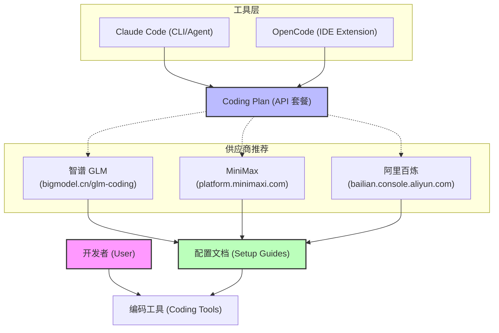

# Coding Plan 与工具选择指南

本指南旨在介绍 Coding Plan（编码套餐）以及如何选择适合您的 AI 编码工具（如 Claude Code、OpenCode）。

## 1. 工具与 Coding Plan 概览

## 2. 什么是 Coding Plan？
**Coding Plan** 是各大模型厂商为开发者提供的“算力套餐”。它与 Claude Code / OpenCode 的关系如下：
- **Claude Code/OpenCode** 是“外壳”和“交互界面”，负责理解您的指令并执行代码修改。
- **Coding Plan** 是背后的“大脑”和“动力源”，提供处理代码逻辑所需的 API 调用次数或 Token。

## 3. 供应商选择
您可以根据价格、模型能力和网络延迟选择以下供应商之一：

| 供应商 | 购买链接 | 特点 |
| :--- | :--- | :--- |
| **智谱 GLM** | [点击购买](https://bigmodel.cn/glm-coding) | 国内技术领先，代码理解能力强 |
| **MiniMax** | [点击购买](https://platform.minimaxi.com/subscribe/token-plan) | 响应速度快，套餐配置灵活 |
| **阿里百炼** | [点击购买](https://bailian.console.aliyun.com/cn-beijing/?tab=coding-plan#/efm/coding-plan-index) | 生态丰富，支持多种主流模型 |

## 4. 如何配置？
各家推荐的供应商页面均提供了详细的**开发工具配置文档**。
1. **购买套餐**：访问上述链接并完成购买。
2. **获取 API Key**：在供应商控制台创建您的 API Key。
3. **按照文档配置**：打开供应商提供的说明文档，按照步骤将 API Key 填入 Claude Code 或 OpenCode 的配置项中即可。

---
*提示：安装完成后，可以通过运行 `claude config` 或在 OpenCode 设置中检查连接状态。*
