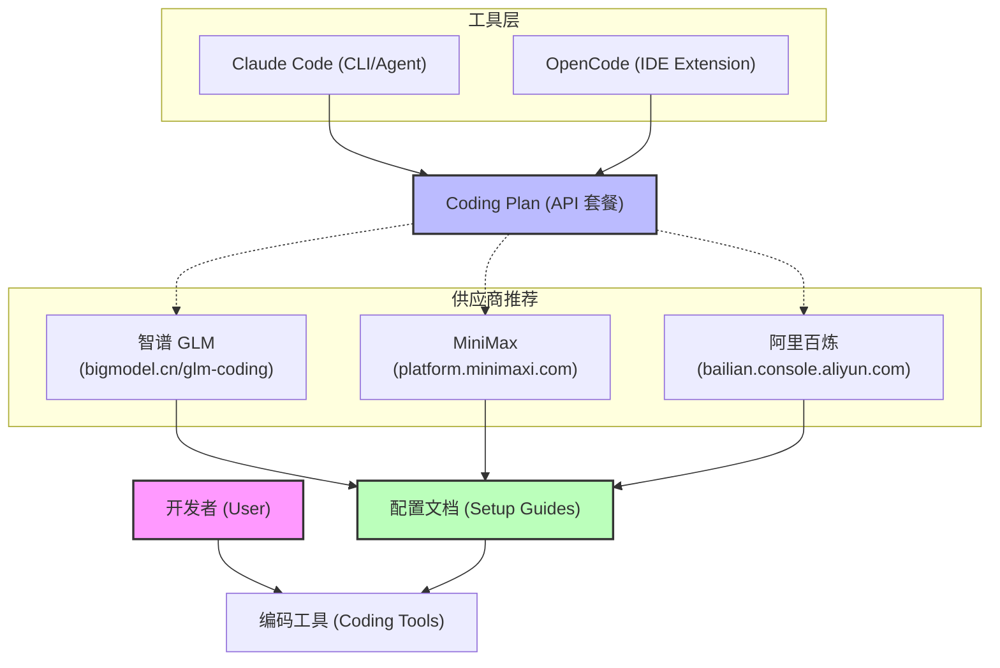

# Claude Code 实践技术交流

> **讲师**：黄仲辉  
> **部门**：软件研发中心  
> **日期**：2026 年 3 月 24 日

构建下一代 AI 增强型研发工作流，系统掌握智能命令、自动化流水线集成以及全地形多代理协同编排技术。


---

## 第一章：Coding Plan 与工具选择指南

本指南旨在介绍 Coding Plan（编码套餐）以及如何选择适合您的 AI 编码工具（如 Claude Code、OpenCode）。

### 1. 工具与 Coding Plan 概览



### 2. 什么是 Coding Plan？
**Coding Plan** 泛指各模型提供商为开发者设立的 API 资源访问配额。其架构关系如下：
- **Claude Code/OpenCode** 作为客户端交互控制层，负责接收终端指令并向底层下发代码变更。
- **Coding Plan** 提供底层语言模型的推理算力，决定了处理大规模代码逻辑所需的上下文窗口与 API 吞吐量 (Token)。

### 3. 供应商选择
您可以根据价格、模型能力和网络延迟选择以下供应商之一：

| 供应商       | 购买链接                                                                                          | 特点                         |
| :----------- | :------------------------------------------------------------------------------------------------ | :--------------------------- |
| **智谱 GLM** | [点击购买](https://bigmodel.cn/glm-coding)                                                        | 国内技术领先，代码理解能力强 |
| **MiniMax**  | [点击购买](https://platform.minimaxi.com/subscribe/token-plan)                                    | 响应速度快，套餐配置灵活     |
| **阿里百炼** | [点击购买](https://bailian.console.aliyun.com/cn-beijing/?tab=coding-plan#/efm/coding-plan-index) | 生态丰富，支持多种主流模型   |

### 4. 如何配置？
各家推荐的供应商页面均提供了详细的**开发工具配置文档**。
1. **购买套餐**：访问上述链接并完成购买。
2. **获取 API Key**：在供应商控制台创建您的 API Key。
3. **按照文档配置**：打开供应商提供的说明文档，按照步骤将 API Key 填入 Claude Code 或 OpenCode 的配置项中即可。

---
*提示：安装完成后，可以通过运行 `claude config` 或在 OpenCode 设置中检查连接状态。*


---

## 第二章：Claude Code 常用指令与技巧 (v2.1.81 官方核实版)

本指南内容已于 2026 年 3 月 23 日通过本地 `claude` CLI (v2.1.81) 及其官方变更日志直接核实，确保所有列出的特性均在该版本中存在并可用。

### 1. 基础 CLI 命令
在终端（Shell）中直接运行的命令：

| 命令                                    | 说明                                                     |
| :-------------------------------------- | :------------------------------------------------------- |
| `claude`                                | 启动交互式会话。支持初始提示词，如 `claude "分析此项目"` |
| `claude doctor`                         | 检查 Claude Code 的运行健康状况和更新程序                |
| `claude mcp`                            | 配置和管理 Model Context Protocol (MCP) 服务器           |
| `claude update`                         | 检查并安装最新版本                                       |
| `claude agents`                         | 列出已配置的子代理 (Subagents)                           |
| `claude --dangerously-skip-permissions` | **（风险建议）** 绕过权限询问，默认同意所有请求          |

> [!WARNING]
> 使用 `--dangerously-skip-permissions` 后，Claude 将不再询问权限。**极度建议仅在虚拟机 (VM) 或容器 (Docker) 等隔离环境中使用此参数**，以确保主机构建环境的安全性，防止意外的破坏性操作。

### 2. 会话内斜杠指令 (Slash Commands)
在 `claude` 交互会话中，输入 `/` 即可使用的内置指令：

#### 核心管理
- **`/help`**：显示当前可用的指令列表及简要说明。
- **`/clear`**：重置当前对话历史，防止上下文干扰。
- **`/compact`**：手动触发上下文压缩，优化长会话的性能和成本。
- **`/model`**：在支持的模型间切换（如 Sonnet, Opus 等）。
- **`/plugins`**：在交互式会话中直接浏览、安装和管理 Claude Code 插件。


#### 项目与工作流
- **`/init`**：在项目根目录初始化 `CLAUDE.md` 文件。
- **`/commit`**：自动生成并执行符合规范的 Git 提交。
  <br>
- `/permissions`: 查看或修改当前会话的权限设置（如读取文件、执行终端指令等）。
- `/insights`: **(v2.1.30 新特性)** 生成个人开发效率报告。该指令会分析过去 30 天的会话记录，生成一个交互式的 HTML 报告（位于 `~/.claude/usage-data/report.html`），涵盖 Token 消耗、工具使用效率及常见误区建议。
  <br>
- `/loop [指令]`: 进入自动化循环模式。
执行的任务序列（包括定时任务）。
- **`/btw [问题]`**：**（2026年3月新增）** 启动一个临时会话回答小问题。其内容**不会计入主会话历史**，也不会增加主会话的 Token 成本。

### 3. 特殊快捷键与实战技巧
- **Esc + Esc (双击 Esc)**：**系统级回滚 (Rewind)**。立即中断正在执行的代理，并呼出控制台撤销代码变更及对话历史，实现状态回溯保护。
- **`! <command>`**：在会话中直接运行 Shell 命令并捕获输出。
- **`Shift + Tab`**：切换 Plan Mode。
- **`@file`**：显式引用文件，精准锁定上下文。

---
*注：本指南内容经 2026-03-23 联网及 CLI 实时核实。*


---

## 第三章：Claude Code /loop 指令深度解析


`/loop` 是 Claude Code 中最强大的自动化指令之一，它允许开发者以自然语言定义的频率循环执行特定的任务。

### 1. 指令语法
在交互式会话中输入：
`/loop [任务描述] [执行频率]`

**示例**：
- `/loop 检查当前分支的编译状态 每 5 分钟`
- `/loop 总结过去一小时的 Git 提交并保存到桌面 每小时`

> **注意**：最小执行频率通常为 1 分钟。Claude 会将您的自然语言描述转换为内部的 Cron 调度任务。

### 2. 核心使用场景

#### 2.1 持续构建与单元测试监控
在进行大规模重构时，可以让 Claude 持续运行测试套件并汇报失败情况。
- **场景**：监控长时间运行的测试。
- **指令**：`/loop 运行 ! pnpm test 并报告任何失败的测试用例 每 10 分钟`

#### 2.2 代审与质量巡检
在团队协作开发期间，定期让 Claude 扫描新增代码是否符合规范。
- **场景**：自动化的周期性代码审查。
- **指令**：`/loop 分析最近 30 分钟的代码更改是否符合 CLAUDE.md 中的架构规范 每小时`

#### 2.3 PR 与 Build 修复自动化
结合级联子代理（Agents），可闭环实现故障隔离与阻断式修复流程。
- **场景**：监听持续集成 (CI) 管道，当构建失败 (Pipeline Failed) 时自动抓取异常调用栈并尝试修复。
- **指令**：`/loop 检查 GitHub PR #123 的集成测试状态，如果失败则尝试修复代码 每 20 分钟`

#### 2.4 信息汇总与汇报
利用 MCP 工具，Claude 可以跨平台汇总信息。
- **场景**：汇总 Slack 或邮件信息，保持上下文同步。
- **指令**：`/loop 汇总 Slack #dev-ops 频道的最新讨论要点，并根据此更新我们的任务清单 每 2 小时`

#### 2.5 部署状态跟踪
在复杂的生产环境下跟踪发布进度。
- **场景**：监控 K8s 部署或云端发布。
- **指令**：`/loop 检查生产环境 Pod 状态，直到所有实例都处于 Running 状态并通知我 每 5 分钟`

### 3. 高级技巧与限制
- **持久性**：`/loop` 任务通常在当前会话结束时终止。如需长期运行，请配合 `tmux` 使用。
- **有效期**：循环任务通常在 3 天后自动过期，以防止无意义的 Token 消耗。
- **成本控制**：频繁的循环会产生持续的 API 调用成本，建议在 `claude config` 中设置合理的限制。
- **查看状态**：可以使用 `/help` 或 `/statusline`（部分版本支持）来观察循环任务的运行情况。

---
*提示：初次尝试时，建议先设置较长的频率，观察 Claude 的处理逻辑是否符合预期。*


---

## 第四章：Claude Code 必备插件安装指南 (2026 官方核实版)

本指南内容已于 2026 年 3 月 23 日针对 Claude Code v2.1.81 进行核实，确保安装指令完全准确。

### 1. 基础安装指令
Claude Code 支持两类扩展方式：**插件 (Plugins)** 和 **MCP 服务器 (MCP Servers)**。

#### 1. 插件市场说明
您的系统中目前已配置以下三个核心市场，用途各异：

1. **`claude-plugins-official` (Anthropic 官方)**
   - **用途**：提供由官方维护、经过安全审计的核心插件（如 `feature-dev`）。建议作为首选。
2. **`superpowers-marketplace` (社区精选)**
   - **用途**：包含大量由社区贡献的高级技能和增强工具，是扩展 AI 编码能力的宝库。
3. **`voltagent-subagents` (子代理专场)**
   - **用途**：专注于 **Subagents (子代理)** 的分发，适合需要多代理协作完成复杂任务的场景。

您可以运行以下命令实时查看：
`claude plugin marketplace list`


#### MCP 服务器添加
语法：`claude mcp add [服务名] --command "[执行命令]"`


---

### 2. 核心插件与服务推荐

#### 2.1 Context7 (实时文档注入)
- **推荐理由**：解决 AI 训练数据过时的问题，实时注入最新 API 文档。
- **安装方法**：
  在终端运行：`npx ctx7 setup`
  根据提示完成 OAuth 认证并选择安装到 Claude。

#### 2.2 GitHub MCP (深度代码库协作)
- **推荐理由**：实现 Issue 搜索、PR 创建、代码仓库深度读取。
- **安装方法**：
  `claude mcp add github --command "npx -y @modelcontextprotocol/server-github"`
  *注：首次运行需按提示配置 GitHub Personal Access Token。*

#### 2.3 Feature-Dev (标准开发流)
- **推荐理由**：官方出品，将复杂需求自动化拆解为 7 个标准开发阶段。
- **安装方法**：
  `claude plugin install feature-dev@claude-plugins-official`

#### 2.4 Playwright (UI 自动化与测试)
- **推荐方案**：使用 **Playwright CLI** (`@playwright/cli`)。
- **推荐理由**：相比 MCP Server，CLI 方案在 2026 年被证实能节省约 4 倍的 Token 消耗。它通过将浏览器状态保存到本地磁盘（YAML/PNG）供 Claude 显式读取，避免了冗余的上下文堆积。
- **安装方法**：
  1. 全局安装：`npm install -g @playwright/cli@latest`
  2. 安装 AI 技能：`playwright-cli install --skills`
  3. 安装浏览器内核：`npx playwright install`
- **MCP 备选方案**：若环境受限无法运行全局命令，可使用：
  `claude mcp add playwright --command "npx -y @modelcontextprotocol/server-playwright"`


#### 2.5 Claude-Mem (持久化记忆与上下文优化)
- **核心作用**：解决 AI 助手“由于会话重启而丢失项目背景”的痛点。它不只是简单的日志记录，而是通过 AI 进行**语义压缩**，建立长效记忆。
- **2026 关键特性**：
  - **极致节省 Token**：通过智能过滤和摘要技术，在处理长任务时可减少约 **90% - 95%** 的 Token 消耗。
  - **智能上下文注入**：自动识别当前任务所需的历史背景（如同行评审意见、旧 Bug 修复逻辑），并进行精准注入，而非全量加载。
  - **可视化管理**：提供本地 Web UI (`localhost:37777`)，让开发者能直观审阅、编辑或删除 AI 的记忆片段。
  - **隐私可见性**：支持 `<private>` 标签，确保敏感代码或私密指令不进入持久化数据库。
- **安装方法**：
  1. 添加市场：`claude plugin marketplace add thedotmack/claude-mem`
  2. 执行安装：`claude plugin install claude-mem`


---
*注：部分插件可能需要环境变量支持，建议在 `~/.claude/settings.json` 中统一管理。*


---

## 第五章：Claude Code Skills 最佳实践

技能（Skills）是 Claude Code 的核心扩展机制。本文将首先介绍通用的高效技能，随后列举 HotPlex 项目专属的技能。

### 1. 通用高效技能 (General Skills)
这些技能是您在任何项目中提高生产力的利器：

- **代码精简与优化 (`/simplify`)**
  - **用途**：审查已更改的代码，检查复用性、质量和效率。
  - **推荐用法**：`/simplify 审查代码并遵循 DRY 与 SOLID`
  - **特点**：通过显式要求遵循架构原则，能更精准地识别重复逻辑并进行结构化重构。

- **技能构建器 (`/skill-creator`)**
  - **用途**：基于自然语言描述自动生成或重构 CLI 技能扩展。
  - **特性**：将高频的重复性杂项操作，固化抽象为支持编排的标准脚手架方案。

- **架构文档同步器 (`/claude-md-improver`)**
  - **用途**：扫描工程拓扑树，生成或持续修正 `CLAUDE.md` 核心指引文件。
  - **运维准则**：在下述生命周期节点中，必须触发此指令以修正底层上下文认知基线：
    1. **排错固化**：排查并修正复杂的边界 Case 后，注入正确范例，防止发生代码能力退化（Regression）。
    2. **拓扑变更**：完成大规模依赖倒置或重构调整后，向系统声明最新的模块依赖视图和项目级约束限界。

- **头脑风暴 (`/brainstorming`)**
  - **用途**：在涉及创意工作（如创建新功能、构建组件）前必须使用的技能。
  - **Superpower 创造性工作流演示**：
    ```text
    [需求意图] 
       ↓
    [/superpowers:brainstorm] ➔ (Socratic Questioning 澄清需求与边界)
       ↓
    [/superpowers:write-plan] ➔ (生成详细的 spec/plan 任务清单)
       ↓
    [/superpowers:execute-plan] ➔ (调用子代理执行具体编码任务)
    ```
  - **特点**：通过苏格拉底式提问深入探索用户意图，将模糊想法固化为可执行的架构方案。

- **功能开发流 (`/feature-dev`)**
  - **用途**：将复杂功能开发拆解为标准流程的官方技能。
  - **7 阶段工作流演示**：
    ```text
    [1. Discovery] ➔ [2. Exploration] ➔ [3. Clarification]
           分析需求            探索代码库            澄清模糊点
                                                     ↓
    [6. Quality Review] ⇠ [5. Implementation] ⇠ [4. Architecture]
         质量审查             编码开发与实现          架构设计与评估
           ↓
    [7. Final Summary] ➔ (完成)
         交付总结
    ```
  - **核心价值**：强制执行“先设计后编码”，通过 7 个阶段确保功能的 predictability (可预测性) 和代码质量。


### 2. Skills 调用最佳实践

#### 2.1 描述需具体
不要模糊地问“帮我看看”，而应使用具体动词：
- **坏例子**：`看看代码`
- **好例子**：`使用 /simplify 检查当前文件的复用性和性能瓶颈`

#### 2.2 组合技能使用
Claude 可以跨技能协作。例如：先用 `/brainstorming` 敲定方案，再用 `/feature-dev` 执行开发。

---

### 3. HotPlex 专属技能
以下是专为 HotPlex 项目定制开发的自动化技能：

- **Docker 容器管理 (`docker-container-ops`)**
  - **用途**：一键重启 hotplex、查看容器状态、启动或停止 Bot。
- **项目诊断大师 (`hotplex-diagnostics`)**
  - **用途**：系统异常时，快速获取健康报告和容器日志分析。
- **PR 与 Issue 管理 (`hotplex-pr-master` & `hotplex-issue-master`)**
  - **用途**：自动化 GitHub 的 PR 审查及 Issue 的生命周期管理。
- **文档防腐同步 (`hotplex-doc-sync`)**
  - **用途**：确保文档与代码实现实时同步，防止文档过期。

### 4. 如何管理技能
- **查看所有可用技能**：在会话中直接问 `有哪些已安装的 skills?`。
- **查看技能详情**：`view_file` 查看 `.agent/skills/` 下的 `SKILL.md`。

---
*提示：建议优先尝试通用技能以建立直觉，再结合 HotPlex 专属技能提升项目效率。*


---

## 第六章：Claude Code Agents Team 最佳实践 (v2.1.32)


在 2026 年的 Claude Code (v2.1.32+) 中，**多代理协作 (Multi-Agent Orchestration)** 已成为处理复杂、跨模块工程任务的标准配置。本文将介绍两种核心协作模式及其开启方式。


### 1. Subagents vs. Agent Teams

| 特性           | Subagents (子级别代理调度)               | Agent Teams (多智能体团队编排)          |
| :------------- | :--------------------------------------- | :-------------------------------------- |
| **设计模式**   | 异步隔离处理 (Fire-and-forget)           | 富通信协同计算 (Collaborative P2P)      |
| **上下文管理** | 每个子代理拥有相互隔离的上下文           | 共享全局任务列表，团队成员可相互通信    |
| **通信流**     | 仅垂直通信 (父 -> 子 -> 父)              | 支持水平通信 (Teammate <-> Teammate)    |
| **适用场景**   | 独立调研、代码路径探索、文档查阅         | 跨层开发 (BFF+Web)、复杂 Debug、大重构  |
| **资源效率**   | 极高 (由于上下文隔离，减少了 Token 消耗) | 较低 (由于协调开销，Token 消耗显著增加) |


### 2. 如何开启与使用

#### 2.1 启用 Agent Team
Agent Team 为实验性功能 (Experimental)，开启需要满足以下条件：

1. **版本要求**：Claude Code v2.1.32 或更高版本。
2. **环境变量**：需要设置 `export CLAUDE_CODE_EXPERIMENTAL_AGENT_TEAMS=1`。
3. **配置文件**：也可以在 `~/.claude/settings.json` 中配置：
   ```json
   {
     "CLAUDE_CODE_EXPERIMENTAL_AGENT_TEAMS": "1",
     "teammateMode": "auto"
   }
   ```

- **快速拉起集群**：
  在控制台分配指令：`claude "拉起协作多智能体，设计并实现统一鉴权 Authentication 层。"`
- **指定角色**：
  `claude agents create --team --roles "lead,backend,qa"`

> [!TIP]
> **视觉增强**：建议在 `tmux` 或 `iTerm2` 环境下使用。设置 `teammateMode: "tmux"` 后，每个 Teammate 会在独立的窗格 (Pane) 中运行，方便实时观察协作过程。

#### 2.2 启动 Subagent
通常用于临时性的、不需要持久上下文的任务。
- **命令行调用**：
  `claude agents create --subagent "调研 API 网关最近的变更。"`


### 3. 2026 编排最佳实践

#### 3.1 意图显式化 (Explicit Intent)
在召唤 Agent Team 时，务必明确 **Team Lead** 的职责：
> *“启动一个代理团队，由 Team Lead 负责任务拆解和最后的质量评估。”*

#### 3.2 下游任务隔离与权限
- **Subagents**：利用 Subagents 进行重复性的扫描或探索任务，避免主进程的上下文窗口被冗余信息填满。
- **权限继承**：Teammates 默认继承 Team Lead 的权限设置。如果 Lead 开启了 `--dangerously-skip-permissions`，团队成员也将自动获得该授权。

---
*注：本指南内容基于 2026 年 3 月发布的 v2.1.32 版本，部分编排指令可能因安装的 Marketplace 插件而异。*


---

## 第七章：无头模式与热多路复用 (Headless Mode & Hot Multiplexing)


在 AI 编程工具的进阶使用中，**无头模式 (Headless Mode)** 是实现自动化、集成化和高性能交互的核心。本篇将详细介绍无头模式的概念、价值，以及 HotPlex 如何利用这一特性实现毫秒级响应的 **热多路复用 (Hot Multiplexing)** 技术。

---

### 1. 什么是无头模式？

#### 1.1 定义
无头模式是指在没有图形用户界面 (GUI) 或标准终端交互界面 (TTY) 的情况下运行程序。对于 Claude Code CLI 而言，这意味着它不再通过彩色的 TTY 输出、动画转轮或实时交互输入来与“人类”对话，而是通过**结构化的数据流**与“程序”对话。

#### 1.2 核心价值
- **程序化调用 (Programmatic Access)**：允许将 Claude 的能力嵌入到 IDE 插件、Slack 机器人、CI/CD 流水线或自定义 Web 应用中。
- **自动化流 (Automation)**：无需人工干预即可完成复杂的代码审查、重构或测试任务。
- **结构化通信**：通过 JSON 等格式进行通信，避免了复杂的字符串解析和正则表达式匹配，极大提升了通信的可靠性。

#### 1.3 通用使用方式
Claude Code CLI 提供了专门的参数来开启无头模式：

```bash
## 以 JSON 流模式启动
claude --output-format stream-json --input-format stream-json
```

在该模式下：
- **输出**：每一行都是一个独立的 JSON 对象，包含了 `thinking` (思考过程)、`tool_use` (工具调用)、`answer` (最终回答) 等事件。
- **输入**：通过标准输入推送 JSON 消息，例如 `{"type": "user", "message": "Fix this bug"}`。

#### 1.4 非交互式快捷调用：使用 `-p` 标志
除了完全的 JSON 流模式，最常见的“无头”或“非交互式”用法是使用 `-p` (Prompt) 标志。这适用于脚本自动化或简单的命令行触发。

**实际用例 1：代码分析与解释**
如果你只想快速得到一个问题的答案，而不需要进入交互式会话：
```bash
claude -p "分析 main.go 的并发逻辑并指出潜在风险"
```

**实际用例 2：管道集成 (Pipeline)**
将其他命令的输出作为上下文传递给 Claude：
```bash
cat error.log | claude -p "根据以下错误日志，修复 main.go 中的相关 bug"
```

**实际用例 3：全自动执行任务**
结合 `--dangerously-skip-permissions`，Claude 可以完全自主地运行测试并修复问题：
```bash
claude -p "运行 go test ./...，如果失败则尝试修复代码直到测试通过" --dangerously-skip-permissions
```

> [!WARNING]
> 使用 `--dangerously-skip-permissions` 时请务必小心，因为它允许 Claude 在无需你确认的情况下执行任意 shell 命令。建议在受隔离的开发环境或 Docker 容器中使用。

---

### 2. 高级玩法：HotPlex 的热多路复用 (Hot Multiplexing)


在普通的无头模式调用中，每次请求都会面临 **“冷启动” (Cold Start)** 问题：Node.js 运行时启动、CLI 初始化、身份验证检查合起来通常需要 2-5 秒。这对于实时聊天或高频交互来说是不可接受的。

**HotPlex** 通过独创的“热多路复用”技术彻底解决了这一问题。

#### 2.1 核心原理：维护热预载控制池
HotPlex 放弃了冷加载的传统做法。内部构建了一个底层级的 **预热进程池 (Warm Process Pool)**：
1. **常驻实例**：HotPlex 级联托管了处于 Warm 阈值待命状态的原生运行时实例。
2. **状态感知**：HotPlex 追踪每个进程的活跃状态（Starting, Ready, Busy, Dead）。
3. **即时分发**：当用户的请求到来时，HotPlex 会在毫秒内将其路由到已经 Ready 的空闲进程中。

#### 2.2 关键技术点

##### A. 会话持久化与 Marker Files
HotPlex 使用 **Marker Files (标记文件)** 来实现跨重启的会话恢复。
- 每个会话通过确定性的 SHA1 算法（基于 Namespace 和 Session ID）生成唯一的 `ProviderSessionID`。
- 即使 HotPlex 服务重启，它也能通过读取 Marker 文件定位到原有的 Claude 会话文件（通常位于 `~/.claude/projects/`），并使用 `--resume <session-id>` 实现无缝续接。

##### B. 全双工 JSON 事件流映射
HotPlex 将 Claude 复杂的原始输出实时映射为标准化的事件：
- **`thinking` 事件**：提取 Claude 的推理过程，实现“思考可见化”。
- **`tool_use` 事件**：在工具执行前拦截，应用安全规则（WAF）或自动授权模式（bypass-permissions）。
- **`result` 事件**：自动提取 Token 消耗（input/output tokens）和成本数据。

##### C. 环境隔离与安全
虽然多个进程在运行，但 HotPlex 确保了严格的隔离：
- **CWD 虚拟隔离**：各个调度线程的上下文严格映射至相互独立的 `Workspace Directory`。
- **进程树守护 (PGID Tracking)**：在会话安全销毁时，利用系统信号阻断所有进程组派生的子资源（如 Dev Servers），实现极其稳固的生命线清理，根绝僵尸进程泄漏风险。

#### 2.3 性能对比

| 指标                | 普通 CLI (冷启动) | HotPlex (热多路复用) | 提升        |
| :------------------ | :---------------- | :------------------- | :---------- |
| **首字响应 (TTFT)** | 3s - 8s           | **50ms - 200ms**     | **~20x**    |
| **进程开销**        | 每次重建          | 进程复用             | 显著降低 IO |
| **会话恢复**        | 手动操作          | 自动持久化           | 无缝体验    |

---

### 3. 总结

无头模式让 Claude 从一个“工具”变成了“引擎”，而 HotPlex 的热多路复用技术则是这个引擎的“增压加速器”。通过预热进程、状态管理和结构化流转，HotPlex 实现了像调用 API 一样快速、又像使用 CLI 一样全能的极致体验。

---

### 4. 相关资源

- **HotPlex 官方文档**：[https://hrygo.github.io/hotplex/](https://hrygo.github.io/hotplex/)
- **Claude Code 官方介绍**：[https://www.anthropic.com/claude/code](https://www.anthropic.com/claude/code)
- **项目源码**：
  - [internal/engine/pool.go](https://github.com/hrygo/hotplex/blob/main/internal/engine/pool.go)
  - [provider/claude_provider.go](https://github.com/hrygo/hotplex/blob/main/provider/claude_provider.go)
