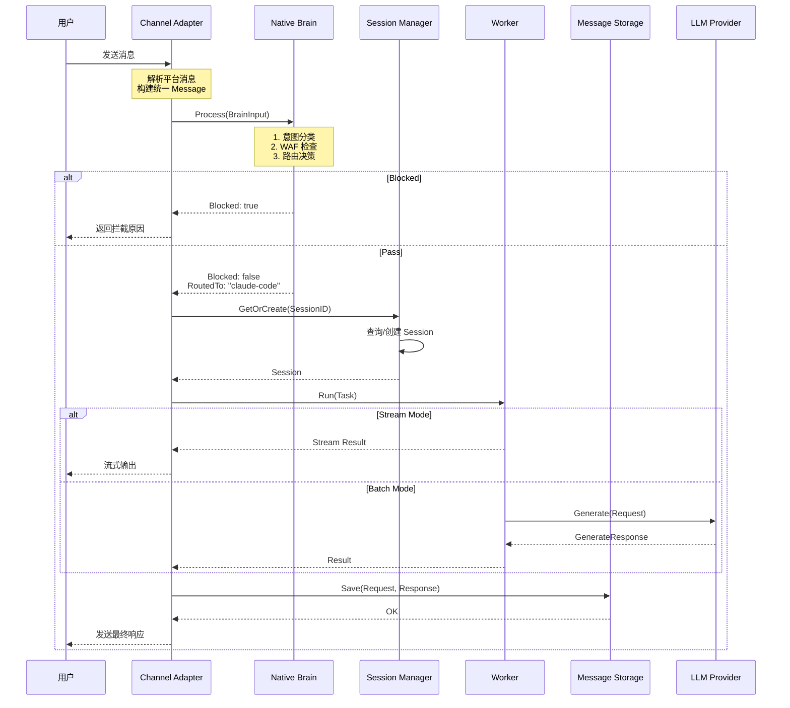
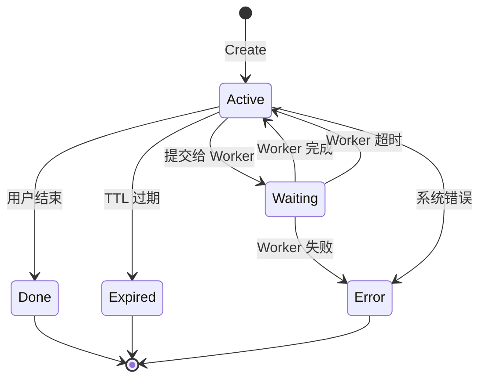
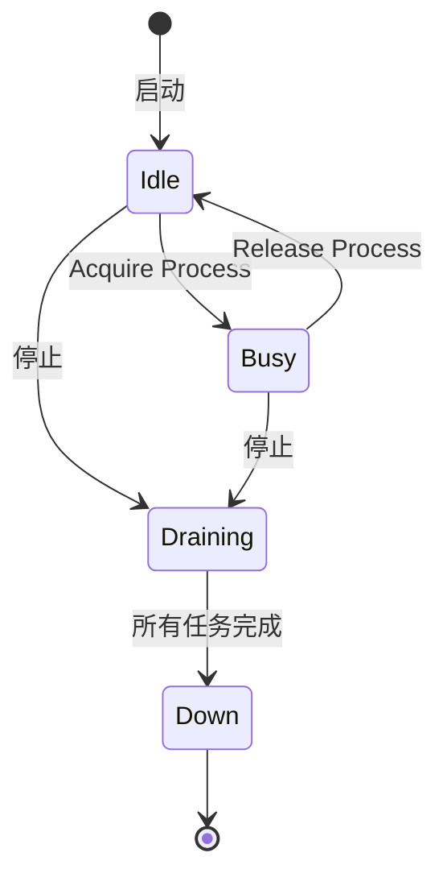

# HotPlex v1.0.0 消息流设计

> 版本：v1.0  
> 日期：2026-03-29  
> 状态：完整消息流描述

---

## 1. 概述

本文档描述 HotPlex v1.0.0 中消息从用户发送到最终响应的完整流程，包括：
- 正常路径
- 异常路径（Brain 拦截、Worker 超时、Storage 失败）
- 并发处理
- 消息流图（Mermaid）

---

## 2. 核心消息流

### 2.1 正常路径

```
┌─────────────────────────────────────────────────────────────────────────────┐
│                              用户消息                                        │
│                         (Feishu/Slack/WS)                                   │
└─────────────────────────────────────────────────────────────────────────────┘
                                    │
                                    ▼
┌─────────────────────────────────────────────────────────────────────────────┐
│                         Channel Adapter                                      │
│  ┌─────────────────────────────────────────────────────────────────────┐   │
│  │ 1. 接收平台消息 (event)                                                │   │
│  │ 2. 解析为统一 Message 结构                                             │   │
│  │ 3. 提取用户/会话信息                                                   │   │
│  │ 4. 调用 EventHandler.OnMessage()                                       │   │
│  └─────────────────────────────────────────────────────────────────────┘   │
└─────────────────────────────────────────────────────────────────────────────┘
                                    │
                                    ▼
┌─────────────────────────────────────────────────────────────────────────────┐
│                           Native Brain                                       │
│  ┌─────────────────────────────────────────────────────────────────────┐   │
│  │ 1. Intent Classification (意图分类)                                   │   │
│  │    - LLM Brain: 调用 LLM 进行分类                                     │   │
│  │    - Rule Brain: 正则匹配                                             │   │
│  │                                                                       │   │
│  │ 2. Guard/WAF Check (安全检查)                                         │   │
│  │    - Pattern matching                                                │   │
│  │    - Profanity filter                                                 │   │
│  │    - Rate limiting                                                    │   │
│  │                                                                       │   │
│  │ 3. Routing Decision (路由决策)                                        │   │
│  │    - code_gen → claude-code                                          │   │
│  │    - chat → open-code                                                │   │
│  │    - admin → builtin command                                          │   │
│  │                                                                       │   │
│  │ 4. Context Enrichment (上下文增强，可选)                                │   │
│  │    - 历史消息摘要                                                     │   │
│  │    - 用户画像注入                                                     │   │
│  └─────────────────────────────────────────────────────────────────────┘   │
│                                                                             │
│  Output: BrainOutput { Intent, Guard, RoutedTo, Enhanced?, Blocked? }       │
└─────────────────────────────────────────────────────────────────────────────┘
                                    │
                    ┌───────────────┴───────────────┐
                    │                               │
               Blocked                          Pass
                    │                               │
                    ▼                               ▼
┌────────────────────────┐        ┌─────────────────────────────────────────┐
│   返回拦截原因          │        │          Session Manager                 │
│   给用户 (Channel.Send) │        │  ┌───────────────────────────────────┐  │
│                         │        │  │ 1. GetOrCreate Session            │  │
│   BrainOutput:          │        │  │    - 检查是否存在活跃 Session      │  │
│   - Blocked: true      │        │  │    - 不存在则创建新 Session        │  │
│   - BlockReason: "..."  │        │  │                                   │  │
└────────────────────────┘        │  │ 2. 更新 Session 状态                │  │
                                   │  │    - State: Active → Waiting       │  │
                                   │  │    - BrainCtx 注入                  │  │
                                   │  └───────────────────────────────────┘  │
                                   └─────────────────────────────────────────┘
                                                        │
                                                        ▼
                                   ┌─────────────────────────────────────────┐
                                   │              Worker                     │
                                   │  ┌───────────────────────────────────┐  │
                                   │  │ 1. Acquire Process from Pool       │  │
                                   │  │    - 等待可用进程                  │  │
                                   │  │    - 超时则返回 PoolExhausted      │  │
                                   │  │                                    │  │
                                   │  │ 2. Build Task                      │  │
                                   │  │    - Prompt: 增强后的消息          │  │
                                   │  │    - SystemPrompt: 用户配置        │  │
                                   │  │    - Model: 路由指定               │  │
                                   │  │                                    │  │
                                   │  │ 3. Execute                         │  │
                                   │  │    - Run() 或 Stream()             │  │
                                   │  │    - 捕获 stdout/stderr            │  │
                                   │  │                                    │  │
                                   │  │ 4. Release Process                  │  │
                                   │  │    - 归还到进程池                  │  │
                                   │  │    - 空闲超时则终止                │  │
                                   │  └───────────────────────────────────┘  │
                                   └─────────────────────────────────────────┘
                                                        │
                                                        ▼
                                   ┌─────────────────────────────────────────┐
                                   │          Message Storage                │
                                   │  ┌───────────────────────────────────┐  │
                                   │  │ Save(RequestRecord, ResponseRecord)│  │
                                   │  │                                   │  │
                                   │  │ - User message                    │  │
                                   │  │ - Worker output                   │  │
                                   │  │ - Metadata (latency, tokens, etc) │  │
                                   │  └───────────────────────────────────┘  │
                                   └─────────────────────────────────────────┘
                                                        │
                                                        ▼
                                   ┌─────────────────────────────────────────┐
                                   │          Response                       │
                                   │  ┌───────────────────────────────────┐  │
                                   │  │ 1. 格式化输出                     │  │
                                   │  │    - Markdown → 平台格式          │  │
                                   │  │    - 流式输出: 分块发送           │  │
                                   │  │                                   │  │
                                   │  │ 2. 发送响应                       │  │
                                   │  │    - Channel.Send()              │  │
                                   │  │    - 或 Stream via WS             │  │
                                   │  └───────────────────────────────────┘  │
                                   └─────────────────────────────────────────┘
                                                        │
                                                        ▼
┌─────────────────────────────────────────────────────────────────────────────┐
│                              用户收到响应                                      │
│                         (Feishu 卡片/Slack 消息/WS)                           │
└─────────────────────────────────────────────────────────────────────────────┘
```

### 2.2 时序图



---

## 3. 异常路径

### 3.1 Brain 拦截

```
用户消息 → Channel → Brain → [BLOCKED] → 返回拦截原因
                                    │
                                    ├── Pattern Match (管理员命令)
                                    ├── Profanity Filter (敏感词)
                                    ├── Rate Limit (限流)
                                    └── Custom Rule (自定义规则)
```

**实现代码：**

```go
// Brain 处理拦截
func (b *LLMBrain) Process(ctx context.Context, input BrainInput) (BrainOutput, error) {
    // 1. WAF 检查
    guard, err := b.waf.Check(ctx, input.Message.Content)
    if err != nil {
        return BrainOutput{}, err
    }
    
    // 2. 判断拦截
    if guard.Level == GuardBlock {
        return BrainOutput{
            Blocked:     true,
            BlockReason: formatBlockReason(guard.Violations),
            BlockCode:   "WAF_BLOCKED",
            Guard:       *guard,
        }, nil
    }
    
    // 3. 继续处理...
}
```

**响应示例：**

```json
{
  "error": {
    "code": "WAF_BLOCKED",
    "message": "消息包含敏感内容已被拦截",
    "violations": [
      {"rule": "profanity", "matched": "***"}
    ]
  }
}
```

### 3.2 Worker 超时

```
Worker → [超时] → 返回超时错误 → 可选重试
```

**实现代码：**

```go
func (w *ClaudeCodeWorker) Run(ctx context.Context, task Task) (Result, error) {
    // 创建带超时的上下文
    taskCtx, cancel := context.WithTimeout(ctx, task.Timeout)
    defer cancel()
    
    // 执行
    result, err := w.runner.Run(taskCtx, proc, task)
    
    // 处理超时
    if errors.Is(err, context.DeadlineExceeded) {
        // 终止进程
        proc.Kill()
        
        return Result{
            Status: ResultStatusTimeout,
            Error: &TaskError{
                Code:    "TIMEOUT",
                Message: fmt.Sprintf("task exceeded timeout of %v", task.Timeout),
            },
        }, nil
    }
    
    return result, err
}
```

**错误响应：**

```json
{
  "error": {
    "code": "TIMEOUT",
    "message": "任务执行超时 (300s)",
    "retryable": true
  }
}
```

### 3.3 Worker 失败

```
Worker → [执行失败] → Supervisor 检测 → 重启 Worker 或 返回错误
```

**重启策略：**

```go
// Supervisor 重启逻辑
func (s *Supervisor) handleWorkerFailure(kind string, err error) {
    handle := s.workers[kind]
    
    switch s.policy.Mode {
    case RestartModeNever:
        return
        
    case RestartModeOnFailure:
        s.restartWorker(handle)
        
    case RestartModeBackoff:
        if handle.restarts < s.policy.MaxRestarts {
            delay := s.calculateBackoff(handle.restarts)
            time.Sleep(delay)
            s.restartWorker(handle)
        }
    }
}
```

### 3.4 Storage 失败

```
Storage → [Save 失败] → 降级处理 → 继续流程（不阻塞用户）
                     │
                     ├── 记录日志
                     ├── 内存缓冲
                     └── 重试队列
```

**降级实现：**

```go
func (s *StorageWithFallback) Save(ctx context.Context, records ...*MessageRecord) error {
    // 优先 Primary
    if err := s.primary.Save(ctx, records...); err == nil {
        return nil
    }
    
    // Primary 失败，降级到 Secondary
    s.logger.Warn("primary storage failed, falling back", "error", err)
    
    if err := s.secondary.Save(ctx, records...); err != nil {
        return err
    }
    
    return nil
}

// StorageWithFallback 带降级的 Storage
type StorageWithFallback struct {
    primary   Storage
    secondary Storage
    logger    *slog.Logger
    buffer    *ringbuffer.RingBuffer // 内存缓冲
}
```

### 3.5 Channel 发送失败

```
Response → Channel.Send() → [失败] → 重试 / 降级 / 告警
```

**重试策略：**

```go
func (c *FeishuChannel) SendWithRetry(ctx context.Context, resp Response) error {
    var lastErr error
    
    for attempt := 0; attempt <= c.config.Retry.MaxAttempts; attempt++ {
        if attempt > 0 {
            delay := c.config.Retry.NextDelay()
            time.Sleep(delay)
        }
        
        if err := c.Send(ctx, resp); err != nil {
            lastErr = err
            
            // 非重试错误直接返回
            var sendErr *SendError
            if errors.As(err, &sendErr) && !sendErr.Retryable {
                return err
            }
            
            continue
        }
        
        return nil
    }
    
    // 告警
    c.alerts.Notify("channel_send_failed", lastErr)
    
    return lastErr
}
```

---

## 4. 并发处理

### 4.1 请求并发模型

```
                    ┌─────────────────────────────────────────┐
                    │            Goroutine Per Request        │
                    │                                         │
    Channel.Event ──┼──> Handler ──> Brain ──> Session ──> Worker
                    │                                         │
                    │  每个请求独立 goroutine                   │
                    │  共享资源通过 mutex 保护                   │
                    └─────────────────────────────────────────┘
```

### 4.2 Worker 并发控制

```go
// WorkerConfig 并发配置
type WorkerConfig struct {
    MaxConcurrent int // 最大并发数
    MaxQueueSize  int // 队列长度
}

// TaskQueue 带缓冲的请求队列
type TaskQueue struct {
    tasks   chan *Task
    results chan Result
    workers int
}

// 提交任务
func (q *TaskQueue) Submit(ctx context.Context, task *Task) error {
    select {
    case q.tasks <- task:
        return nil
    case <-ctx.Done():
        return ctx.Err()
    default:
        // 队列满
        return ErrQueueFull
    }
}

// 消费任务
func (q *TaskQueue) worker() {
    for task := range q.tasks {
        result, err := q.worker.Run(context.Background(), *task)
        q.results <- result
    }
}
```

### 4.3 流式输出并发

```go
// Stream 处理并发
func (w *ClaudeCodeWorker) Stream(ctx context.Context, task Task) (<-chan Result, error) {
    outputCh := make(chan Result) // 带缓冲的 channel
    
    go func() {
        defer close(outputCh)
        
        // 获取进程
        proc, err := w.pool.Acquire(ctx)
        if err != nil {
            outputCh <- Result{Error: err}
            return
        }
        defer w.pool.Release(proc)
        
        // 启动流式执行
        streamCh, err := w.runner.RunStream(ctx, proc, task)
        if err != nil {
            outputCh <- Result{Error: err}
            return
        }
        
        // 转发流式输出
        for chunk := range streamCh {
            select {
            case outputCh <- Result{Output: chunk, Status: ResultStatusSuccess}:
            case <-ctx.Done():
                return
            }
        }
    }()
    
    return outputCh, nil
}
```

---

## 5. 状态机

### 5.1 Session 状态机



### 5.2 Worker 状态机



---

## 6. 消息格式

### 6.1 内部 Message 结构

```go
type Message struct {
    ID          string                  // 全局唯一 ID
    SessionID   string                  // 会话 ID
    ChannelID   string                  // 渠道 ID
    UserID      string                  // 用户 ID
    Content     string                  // 消息内容
    RawContent  map[string]interface{}  // 平台原生消息
    Timestamp   time.Time               // 时间戳
    Metadata    map[string]string       // 扩展元数据
}
```

### 6.2 平台消息映射

| 平台 | 事件类型 | 映射 |
|------|----------|------|
| Feishu | `im.message.receive_v1` | Message |
| Slack | `message` (events) | Message |
| WS | WebSocket frame | Message |

**Feishu 消息解析：**

```go
func parseFeishuMessage(event *feishu.MessageEvent) *Message {
    return &Message{
        ID:         event.Message.MessageID,
        SessionID:  buildSessionID(event.Sender.SenderID, event.Chat.ChatID),
        ChannelID:  "feishu",
        UserID:     event.Sender.SenderID,
        Content:    extractTextContent(event.Message),
        RawContent: event.Message,
        Timestamp:  time.UnixMilli(event.Message.CreateTime),
    }
}
```

---

## 7. 性能考虑

### 7.1 延迟预算

| 阶段 | P50 | P95 | P99 |
|------|-----|-----|-----|
| Channel 接收 | 5ms | 15ms | 30ms |
| Brain 处理 | 100ms | 300ms | 500ms |
| Session 查询 | 2ms | 5ms | 10ms |
| Worker 执行 | 1s | 5s | 30s |
| Storage 保存 | 5ms | 20ms | 50ms |
| Channel 发送 | 10ms | 50ms | 100ms |

### 7.2 反压机制

```go
// 背压控制
type BackPressure struct {
    maxInflight int
    inflight    atomic.Int64
}

func (bp *BackPressure) Allow() bool {
    return bp.inflight.Load() < int64(bp.maxInflight)
}

func (bp *BackPressure) Acquire() {
    bp.inflight.Inc()
}

func (bp *BackPressure) Release() {
    bp.inflight.Dec()
}

// 使用
func HandleMessage(msg *Message) error {
    if !bp.Allow() {
        return ErrOverloaded
    }
    bp.Acquire()
    defer bp.Release()
    
    // 处理消息...
}
```

---

*文档版本：v1.0 | 最后更新：2026-03-29*
