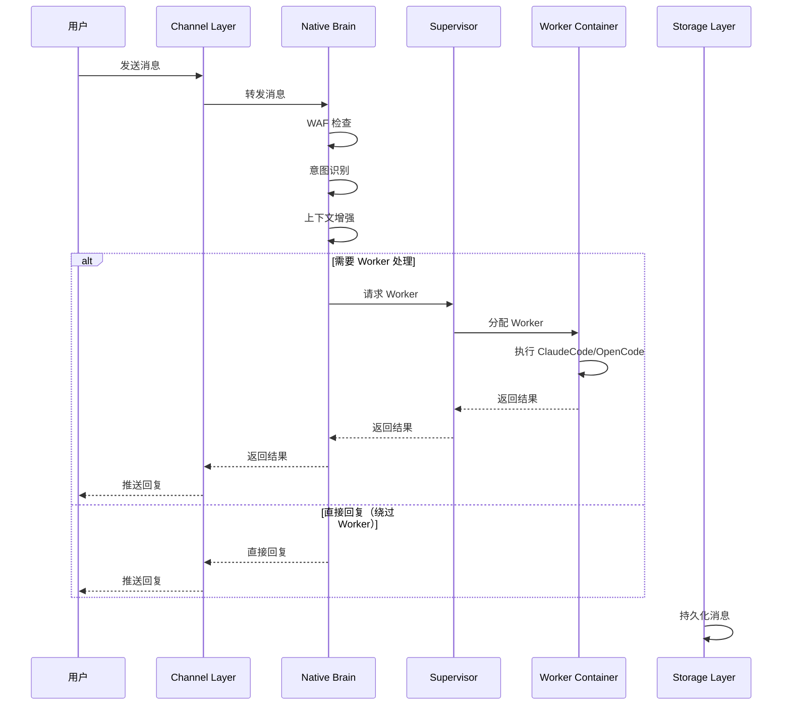
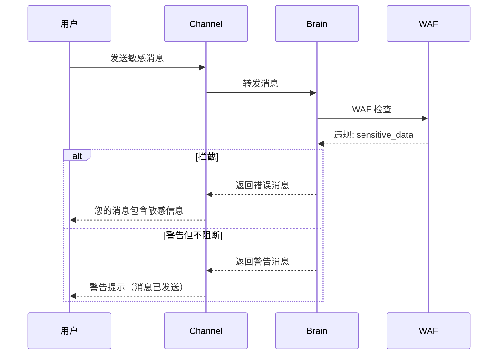
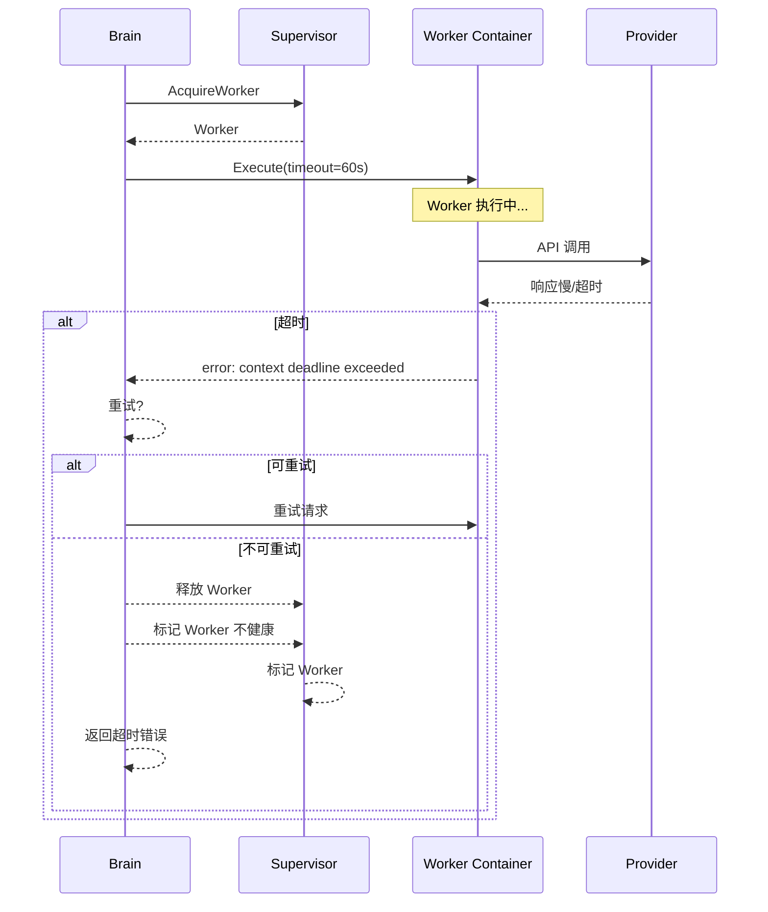
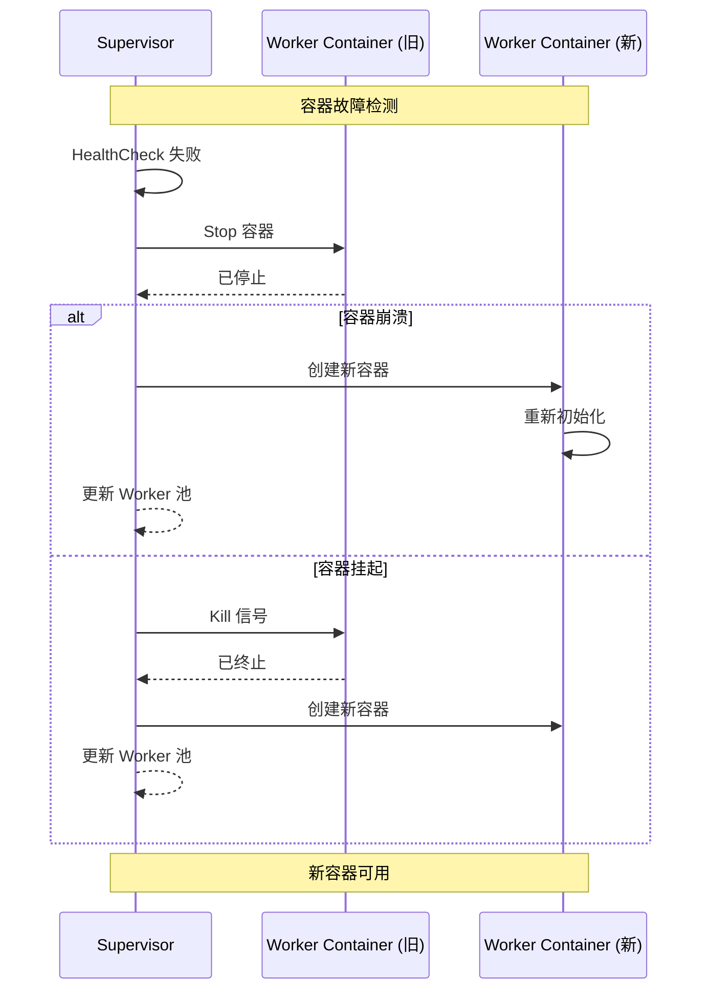
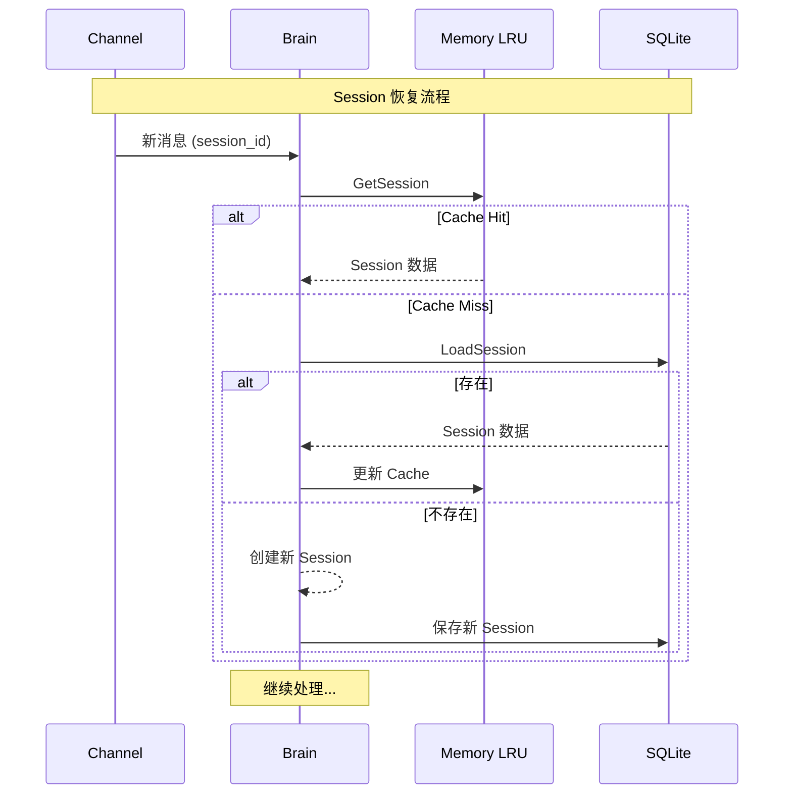
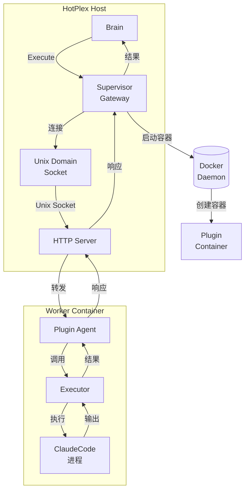
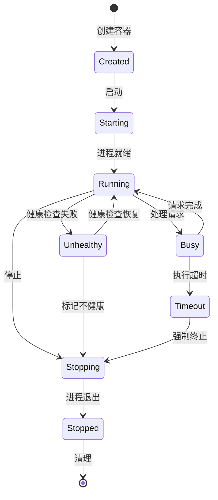
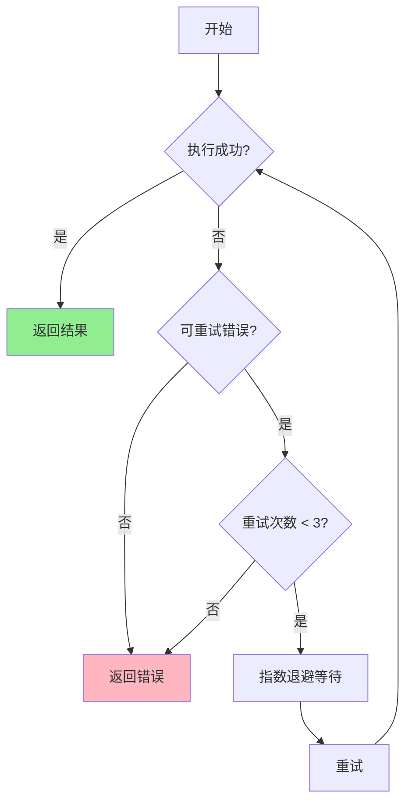

# HotPlex v1.0.0 消息流

> 版本：v1.0-final  
> 日期：2026-03-29  
> 状态：**已确认**

---

## 一、正常消息流

### 1.1 端到端消息流



### 1.2 详细时序图

```mermaid
sequenceDiagram
    participant U as 用户
    participant F as Feishu Channel
    participant B as Brain
    participant S as Supervisor
    participant W as Worker Container
    participant P as Provider
    participant DB as SQLite
    participant Redis as Redis Cache

    Note over U,Redis: 消息接收阶段

    U->>F: 用户发送消息
    F->>B: 接收并解析消息

    Note over B: 安全检查阶段

    B->>B: WAF 检查
    alt WAF 拦截
        B-->>F: 拦截响应
        F-->>U: 返回拦截提示
        return
    end

    Note over B: 意图识别阶段

    B->>B: 意图分类
    alt 闲聊/管理命令
        B-->>F: 直接回复
        F-->>U: 返回回复
    else 需要 Worker 处理
        Note over B,S: 请求 Worker 阶段

        B->>S: AcquireWorker(claude_code)
        S->>S: 检查 Worker 池
        alt Worker 可用
            S-->>B: 返回 Worker
        else 需要创建新容器
            S->>W: 启动容器
            W->>W: 拉取镜像
            W->>W: 创建容器
            W->>W: 启动进程
            S-->>B: 返回 Worker
        end

        Note over B,W: 任务执行阶段

        B->>W: Execute(user_message, context)
        W->>P: 调用 Provider API
        P->>P: Claude API / OpenAI API
        P-->>W: 返回响应
        W-->>B: 返回执行结果

        S->>S: ReleaseWorker(W)

        Note over B,F: 结果处理阶段

        B->>B: 上下文增强
        B->>B: 更新记忆
        B-->>F: 返回回复

        F-->>U: 推送消息
    end

    Note over DB,Redis: 持久化阶段

    B->>DB: 保存 Session
    B->>Redis: 更新 Cache
    B->>DB: 保存 Memory
```

---

## 二、异常路径

### 2.1 Brain 拦截（WAF 阻断）



**WAF 拦截场景：**

| 场景 | 违规类型 | 处置 |
|------|----------|------|
| 发送密码/API Key | sensitive_data | Block |
| SQL 注入尝试 | sql_injection | Block |
| 命令注入尝试 | command_injection | Block |
| 频繁无效请求 | rate_limit | Warn |

### 2.2 Worker 超时



**超时处理策略：**

| 超时类型 | 处理策略 | 重试 |
|----------|----------|------|
| Worker 执行超时 | 终止容器，重新分配 | 是（最多 3 次）|
| Provider API 超时 | 切换 Provider 或重试 | 是（指数退避）|
| 容器启动超时 | 检查镜像，预拉取 | 是（最多 2 次）|

### 2.3 容器重启



**健康检查策略：**

```yaml
healthcheck:
  interval: 30s       # 检查间隔
  timeout: 10s        # 超时时间
  retries: 3          # 失败重试次数
  start_period: 60s   # 启动等待期

# 检查项：
# 1. 容器进程存活
# 2. 容器响应健康检查命令
# 3. 资源使用正常（CPU/内存）
```

### 2.4 Session 故障恢复



---

## 三、Docker 插件调用路径

### 3.1 插件调用完整路径



### 3.2 Unix Domain Socket 通信

```
┌─────────────────────────────────────────────────────────────────┐
│                    Unix Domain Socket 通信                        │
├─────────────────────────────────────────────────────────────────┤
│                                                                  │
│  Host Process                                                    │
│  ┌─────────────────────────────────────────────────────────┐    │
│  │  Supervisor                                              │    │
│  │  ┌─────────────┐    ┌─────────────┐    ┌─────────────┐ │    │
│  │  │ PluginGateway│───▶│   UDS Client │───▶│   UDS Server│ │    │
│  │  └─────────────┘    └─────────────┘    └──────┬──────┘ │    │
│  └─────────────────────────────────────────────────────────┘    │
│                                                            │    │
│                     /var/run/hotplex/plugins/              │    │
│                     └─────────────────────────▶│◀─────────┘    │
│                                                      │            │
│  Container Process                                    │            │
│  ┌─────────────────────────────────────────────────────────┐    │
│  │  Plugin Agent                                            │    │
│  │  ┌─────────────┐    ┌─────────────┐                     │    │
│  │  │ UDS Server  │◀───│  Executor   │                     │    │
│  │  └─────────────┘    └─────────────┘                     │    │
│  └─────────────────────────────────────────────────────────┘    │
│                                                                  │
└─────────────────────────────────────────────────────────────────┘
```

### 3.3 容器生命周期



---

## 四、并发控制

### 4.1 Worker 池模型

```
┌────────────────────────────────────────────────────────────┐
│                    Worker Pool                              │
├────────────────────────────────────────────────────────────┤
│                                                             │
│   ┌────────────────────────────────────────────────────┐   │
│   │              Available Queue (空闲 Worker)          │   │
│   │   [W1] [W2] [W3] [W4] ...                         │   │
│   └────────────────────────────────────────────────────┘   │
│                          │                                  │
│                          ▼                                  │
│   ┌────────────────────────────────────────────────────┐   │
│   │              Busy Set (忙碌 Worker)                  │   │
│   │   {W5, W6, W7}                                    │   │
│   └────────────────────────────────────────────────────┘   │
│                                                             │
│   ┌────────────────────────────────────────────────────┐   │
│   │              Pending Queue (等待请求)                │   │
│   │   [Req1] [Req2] [Req3] ...                         │   │
│   └────────────────────────────────────────────────────┘   │
│                                                             │
└────────────────────────────────────────────────────────────┘
```

### 4.2 限流策略

```yaml
# 全局限流
global:
  max_concurrent_workers: 10
  max_pending_requests: 100
  rate_limit:
    requests_per_minute: 60
    burst: 10

# 每个用户限流
per_user:
  max_concurrent_workers: 2
  max_pending_requests: 5
  rate_limit:
    requests_per_minute: 20
```

---

## 五、消息重试机制

### 5.1 重试策略



### 5.2 错误分类

| 错误类型 | 可重试 | 重试策略 |
|----------|--------|----------|
| 网络超时 | ✅ | 指数退避 (1s, 2s, 4s) |
| Provider API 限流 | ✅ | 指数退避 (5s, 10s, 20s) |
| Worker 容器崩溃 | ✅ | 重新分配 Worker |
| 容器启动超时 | ✅ | 重新启动 (最多 2 次) |
| 权限不足 | ❌ | 返回错误 |
| WAF 拦截 | ❌ | 返回错误 |
| 语法错误 | ❌ | 返回错误 |

---

_最后更新：2026-03-29_
