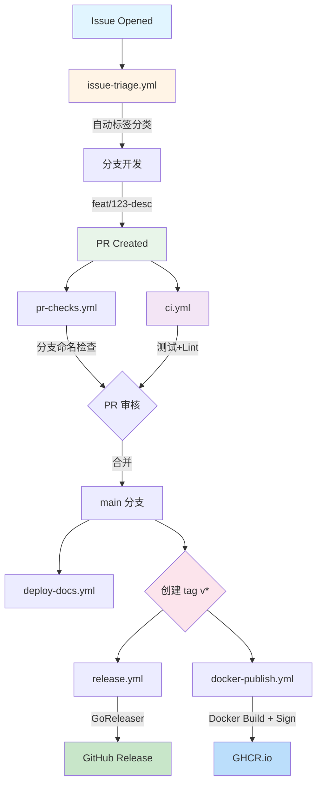

# GitHub Workflows 文档

## 概览

本项目使用 GitHub Actions 实现自动化 CI/CD 流程。本文档描述所有 workflow 的职责、触发条件和使用方法。

---

## Workflow 依赖关系图



---

## Workflow 详细说明

### 1. **issue-triage.yml** - Issue 自动分类

**触发条件**:
- Issue 创建或编辑时

**职责**:
- 自动添加 priority 标签（P0/P1/P2/P3）
- 自动添加 type 标签（bug/feature/enhancement/docs/test/question）
- 自动添加 area 标签（engine/chatapps/provider/security/infrastructure）
- 自动添加 size 标签（small/medium/large）
- 添加 status/needs-triage 标签

**关键逻辑**:
```javascript
// Priority 分析
if (/\b(p0|critical|hotfix|security)\b/.test(title)) {
  labels.add('priority/critical');
}
// Type 分析
if (/\b(fix|bug|broken)\b/.test(title)) {
  labels.add('type/bug');
}
```

---

### 2. **pr-checks.yml** - PR 规范检查

**触发条件**:
- PR 创建、编辑、同步或重新打开时

**职责**:
- 验证分支命名格式：`<type>/[<id>-]<desc>`
  - ✅ 有效示例：`feat/96-login`, `fix/123-bug`, `refactor/optimize-engine`
  - ❌ 无效示例：`feature-login`, `bugfix-123`, `main`
- 验证 PR body 包含 issue 链接：
  - ✅ 有效：`Resolves #123`, `Fixes #456`, `Refs #789`
  - ❌ 无效：无 issue 引用的 PR

**并发控制**:
```yaml
concurrency:
  group: ${{ github.workflow }}-${{ github.event.pull_request.number }}
  cancel-in-progress: true
```

---

### 3. **ci.yml** - 持续集成（代码质量）

**触发条件**:
- Push 到 main 分支
- Pull Request 到 main 分支

**职责**:
1. **检测变更**: 使用 `dorny/paths-filter` 检测 .go 文件变化
2. **单元测试**: 运行 `make test-ci`（短测试）
3. **集成测试**: 运行 `make test-integration`
4. **代码检查**: golangci-lint
5. **覆盖率报告**: 上传到 Codecov

**权限**:
```yaml
permissions:
  contents: read
  pull-requests: write  # Required for Codecov PR comments
```

**超时保护**:
- Unit Tests: 10 分钟
- Integration Tests: 15 分钟
- Lint: 15 分钟

**依赖**:
- Mock CLI Setup: `./.github/actions/setup-mock-cli`

---

### 4. **docker-publish.yml** - Docker 镜像构建与发布

**触发条件**:
- Push tag `v*`
- GitHub Release 发布
- 手动触发（workflow_dispatch）

**职责**:
1. **版本提取**: 从 tag/release/手动指定获取版本
2. **镜像构建**: 6 个变体（go/node/python/java/rust/full）
3. **多架构支持**: linux/amd64, linux/arm64
4. **镜像签名**: 使用 cosign 进行 OIDC 签名
5. **缓存优化**: GitHub Actions cache

**权限**:
```yaml
permissions:
  contents: read
  packages: write
  id-token: write  # Required for cosign OIDC token
```

**构建流程**:
```
prepare
  ↓
build-base ──────┐
build-artifacts ─┤
                 ↓
         build-variants (6个并行)
                 ↓
         cosign sign (签名验证)
```

**镜像标签**:
- `ghcr.io/hrygo/hotplex:0.35.4-go`
- `ghcr.io/hrygo/hotplex:0.35.4-node`
- `ghcr.io/hrygo/hotplex:0.35.4-python`
- ... (6个变体)

**安全特性**:
- ✅ cosign 签名（OIDC token）
- ✅ SBOM 生成（未来）
- ✅ Provenance attestation（未来）

---

### 5. **release.yml** - 发布自动化

**触发条件**:
- Push tag `v*`

**职责**:
1. **提取 Release Notes**: 从 CHANGELOG.md 提取最新版本说明
2. **GoReleaser 构建**:
   - 二进制文件（多平台）
   - Archives（tar.gz/zip）
   - Checksums
   - RPM/DEB packages
3. **创建 GitHub Release**:
   - 上传 artifacts
   - 发布 release notes

**权限**:
```yaml
permissions:
  contents: write
  packages: write
  id-token: write  # Required for SBOM/Provenance
```

**GoReleaser 配置**:
```yaml
distribution: goreleaser
version: "~> v2"
args: release --clean --release-notes=RELEASE_NOTES.md
```

---

### 6. **deploy-docs.yml** - 文档自动部署

**触发条件**:
- Push 到 main 分支（paths: docs-site/**）
- Push tag `v*`
- 手动触发

**职责**:
1. **构建 VitePress 文档**:
   - Asset 生成（SVG/PNG）
   - 依赖缓存
   - Build artifacts
2. **部署到 GitHub Pages**:
   - 环境：github-pages
   - URL: https://hrygo.github.io/hotplex/

**权限**:
```yaml
permissions:
  contents: read
  pages: write
  id-token: write
```

**部署策略**:
- Main 分支：自动部署最新文档
- Tag：构建但不部署（GitHub Pages 限制）

**缓存优化**:
```yaml
cache:
  path: docs-site/.vitepress/cache
  key: ${{ runner.os }}-vitepress-${{ hashFiles('**/package-lock.json') }}
```

---

## 发布流程（完整）

### 方式 1: Tag 发布（推荐）

```bash
# 1. 确保 main 分支最新
git checkout main
git pull origin main

# 2. 更新版本号
# - 修改 internal/version.go
# - 更新 CHANGELOG.md

# 3. 创建 tag
git tag -a v0.35.5 -m "Release v0.35.5"

# 4. 推送 tag
git push origin v0.35.5

# 5. 等待自动化流程
# - release.yml: GoReleaser 构建
# - docker-publish.yml: Docker 镜像构建 + cosign 签名
```

### 方式 2: GitHub Release 发布

```bash
# 1-3 步同上

# 4. 在 GitHub UI 创建 Release
# - 访问 https://github.com/hrygo/hotplex/releases/new
# - 选择 tag v0.35.5
# - 填写 Release Notes
# - 点击 "Publish release"

# 5. 自动触发构建流程
```

---

## 最佳实践

### 1. **分支命名规范**

| 类型 | 格式 | 示例 |
|------|------|------|
| Feature | `feat/[id-]desc` | `feat/96-login`, `feat/add-webhook` |
| Bug Fix | `fix/[id-]desc` | `fix/123-crash`, `fix/memory-leak` |
| Refactor | `refactor/[id-]desc` | `refactor/engine-optimize` |
| Docs | `docs/[id-]desc` | `docs/api-reference` |
| Chore | `chore/[id-]desc` | `chore/update-deps` |
| Test | `test/[id-]desc` | `test/engine-unit` |

### 2. **PR 规范**

**必须包含**:
- Issue 链接（Resolves #N / Fixes #N / Refs #N）
- 清晰的描述（What/Why/How）
- 测试计划（如何验证）

**示例**:
```markdown
## What
添加 Webhook 支持到 ChatApps 层

## Why
用户需要实时接收 AI 回复的推送通知

## How
- 新增 `WebhookProvider` interface
- 实现 `SendWebhook()` 方法
- 添加单元测试和集成测试

## Test Plan
1. 运行单元测试: `make test`
2. 手动测试:
   - 配置 webhook URL
   - 发送消息
   - 验证 webhook 调用

Resolves #96
```

### 3. **Issue 规范**

**标题格式**:
```
[<type>] <description>
```

**示例**:
- `[feat] Add Slack webhook support`
- `[fix] Memory leak in session pool`
- `[docs] Update API reference for v0.35`
- `[bug] Crash when processing large messages`

**优先级关键词**:
- P0/Critical: `hotfix`, `security`, `blocking`
- P1/High: `high`, `important`
- P3/Low: `low`, `nice-to-have`

### 4. **Commit 规范**

遵循 Conventional Commits:
```
<type>(<scope>): <subject>

<body>

<footer>
```

**示例**:
```bash
feat(chatapps): add Slack webhook support

- Implement WebhookProvider interface
- Add HTTP POST with retry logic
- Include signature verification

Resolves #96
Co-Authored-By: Claude Sonnet 4.6 <noreply@anthropic.com>
```

---

## 权限说明

### 最小权限原则

所有 workflow 遵循最小权限原则:

| Workflow | 权限 | 原因 |
|----------|------|------|
| ci.yml | `contents: read`<br>`pull-requests: write` | 读取代码<br>Codecov 评论 |
| docker-publish.yml | `contents: read`<br>`packages: write`<br>`id-token: write` | 读取代码<br>推送镜像<br>cosign OIDC |
| release.yml | `contents: write`<br>`packages: write`<br>`id-token: write` | 创建 Release<br>上传 artifacts<br>SBOM |
| deploy-docs.yml | `contents: read`<br>`pages: write`<br>`id-token: write` | 读取文档<br>部署 Pages<br>Pages deploy |
| pr-checks.yml | 默认（只读） | 仅检查，无写操作 |
| issue-triage.yml | 默认（只读）+ issues: write | 添加标签/评论 |

---

## 故障排查

### CI 失败

**症状**: Tests 失败
```bash
# 本地复现
make test
make test-race
```

**症状**: Lint 失败
```bash
# 本地检查
make lint
golangci-lint run --fix
```

### Docker 构建失败

**症状**: 镜像推送失败
- 检查 GITHUB_TOKEN 权限
- 检查 packages: write 是否设置
- 查看 Actions logs

**症状**: cosign 签名失败
- 检查 id-token: write 权限
- 验证 OIDC token 生成

### Release 失败

**症状**: GoReleaser 失败
- 检查 tag 格式（必须 v 开头）
- 验证 CHANGELOG.md 格式
- 查看 `.goreleaser.yml` 配置

---

## 监控与徽章

在 README.md 添加 badges 快速查看状态:

```markdown
[](https://github.com/hrygo/hotplex/actions/workflows/ci.yml)
[](https://github.com/hrygo/hotplex/actions/workflows/release.yml)
[](https://github.com/hrygo/hotplex/actions/workflows/deploy-docs.yml)
[](https://github.com/hrygo/hotplex/actions/workflows/docker-publish.yml)
```

---

## 相关链接

- [GitHub Actions 文档](https://docs.github.com/en/actions)
- [GoReleaser 官方文档](https://goreleaser.com/)
- [Docker Build Push Action](https://github.com/docker/build-push-action)
- [cosign 签名指南](https://docs.sigstore.dev/cosign/signing/signing_with_containers/)
- [GitHub Pages 部署](https://docs.github.com/en/pages)

---

**最后更新**: 2026-03-25
**维护者**: HotPlex Team
