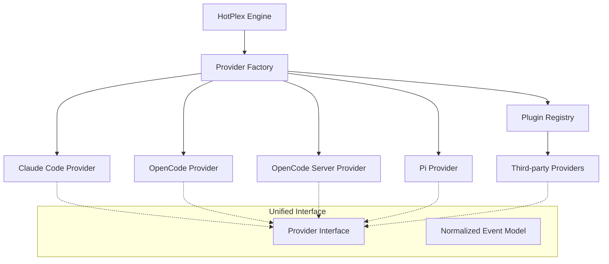

# HotPlex Providers: AI Agent Abstraction Layer

The `provider` package defines the bridge between HotPlex and various AI CLI agents (e.g., Claude Code, OpenCode). It abstracts platform-specific CLI protocols, event formats, and execution models into a unified interface.

## 🏛 Architecture Overview

The Providers act as **Strategy Adapters** in the HotPlex ecosystem. They handle the low-level details of interacting with different AI agents while exposing a consistent API to the Engine.



### Key Architectural Concepts

- **`Provider` (Interface)**: The core contract that defines how to start a CLI, send user input, and parse the resulting stream of events.
- **Normalized Event Model**: Regardless of the provider's native output (JSON, SSE, plain text), this package converts it into a standard `ProviderEvent` stream (e.g., `thinking`, `tool_use`, `answer`, `error`).
- **Factory Pattern**: The `ProviderFactory` allows for dynamic registration and creation of providers based on configuration.
- **Plugin System**: Third-party providers can be registered via `RegisterPlugin()` without modifying core code.
- **Protocol Translation**: Each provider implementation handles the specific "dialect" of its underlying CLI.
- **Transport Layer**: HTTP transport (`transport_http.go`) for server-based providers (e.g., OpenCode Server) vs CLI subprocess for local providers (e.g., Claude Code, Pi).

---

## 🔌 Plugin System (RFC #216)

The plugin system enables third-party extensions without modifying HotPlex core.

### Plugin Interface

```go
type ProviderPlugin interface {
    Type() ProviderType
    New(cfg ProviderConfig, logger *slog.Logger) (Provider, error)
    Meta() ProviderMeta
}
```

### Registration

```go
// external/myprovider/plugin.go
import "github.com/hrygo/hotplex/provider"

type myPlugin struct{}

func (p *myPlugin) Type() provider.ProviderType { return "my-ai" }
func (p *myPlugin) New(cfg provider.ProviderConfig, logger *slog.Logger) (provider.Provider, error) {
    return &myProviderImpl{cfg: cfg, logger: logger}, nil
}
func (p *myPlugin) Meta() provider.ProviderMeta {
    return provider.ProviderMeta{
        Type:        "my-ai",
        DisplayName: "My AI Provider",
        BinaryName:  "my-ai-cli",
        Features: provider.ProviderFeatures{
            SupportsResume:     true,
            SupportsStreamJSON: true,
        },
    }
}

func init() {
    provider.RegisterPlugin(&myPlugin{})
}
```

### Type Checking

```go
// Built-in types
provider.ProviderTypeClaudeCode.IsRegistered() // true
provider.ProviderTypeOpenCode.IsRegistered()   // true

// Plugin types
provider.ProviderType("my-ai").IsRegistered()  // true after plugin registration
```

See `docs/provider-extension-guide.md` for detailed extension guide.

---

## 🛠 Developer Guide

### 1. Implementing a New Provider

To support a new AI CLI tool, implement the `Provider` interface (defined in `provider.go`):

```go
type Provider interface {
    Name() string
    Metadata() ProviderMeta
    BuildCLIArgs(sessionID string, opts *ProviderSessionOptions) []string
    BuildInputMessage(prompt string, taskInstructions string) (map[string]any, error)
    ParseEvent(line string) ([]*ProviderEvent, error)
    DetectTurnEnd(event *ProviderEvent) bool
    ValidateBinary() (string, error)
    CleanupSession(sessionID string, workDir string) error
}
```

### 2. Registering with the Factory

Option A - Using Plugin System (Recommended):

```go
func init() {
    provider.RegisterPlugin(&myPlugin{})
}
```

Option B - Direct Factory Registration:

```go
provider.GlobalProviderFactory.Register("my-new-ai", func(cfg ProviderConfig, logger *slog.Logger) (Provider, error) {
    return &MyNewProvider{...}, nil
})
```

### 3. Using the Provider

```go
pCfg := provider.ProviderConfig{Type: "claude-code", Enabled: true}
prv, err := provider.CreateProvider(pCfg)
if err != nil {
    // handle error
}
```

---

## 🏗 Event Normalization Mapping

Each provider must map its internal events to these standard types:

| Standard Type        | Description                                        |
| :------------------- | :------------------------------------------------- |
| `thinking`           | AI is reasoning (e.g., Claude's `thinking` block). |
| `tool_use`           | AI is about to execute a local tool.               |
| `tool_result`        | The result of a tool execution.                    |
| `answer`             | Final or streaming text response.                  |
| `permission_request` | AI needs user approval for a sensitive action.     |
| `error`              | A provider-level or tool-level error.              |

---

## 📊 Token Usage & Context Window Management

HotPlex provides deep integration with Claude Code's `stream-json` mode to track costs and monitor context window limits in real-time.

### 1. Claude Code `modelUsage` Structure

In `stream-json` mode, the `result` event contains a `modelUsage` map. HotPlex maps this to `ModelUsageStats` in `types.go`:

| Field | Description |
| :--- | :--- |
| `inputTokens` | Cumulative input tokens (not including cache hits). |
| `outputTokens` | Cumulative output tokens (including thinking blocks). |
| `cacheReadInputTokens` | Tokens retrieved from Anthropic's prompt cache (90% discount). |
| `cacheCreationInputTokens` | Tokens written to cache (ephemeral 5m or 1h). |
| `contextWindow` | The model's total context capacity (e.g., 200,000 or 1,000,000). |
| `maxOutputTokens` | The model's maximum output limit. |
| `webSearchRequests` | Count of tool-level web search operations. |

### 2. Multi-Model Context Strategy

Claude Code supports switching models mid-session (via `/model`). In such cases, `modelUsage` may contain multiple entries. HotPlex applies the following logic:

- **Token Aggregation**: `InputTokens`, `OutputTokens`, and `Cost` are summed across all models for total session reporting.
- **Primary Model Selection**: The model with the highest `inputTokens` is considered the **Primary Model**.
- **Context Reporting**: The `ContextWindow` and `MaxOutputTokens` of the **Primary Model** are propagated in `ProviderEventMeta` to drive UI usage indicators.

### 3. Context Window Calculation

The HotPlex Engine calculates context utilization percentage using the normalized metadata:

```text
Total Context Used = inputTokens + cacheReadInputTokens + cacheCreationInputTokens
Usage % = (Total Context Used / ContextWindow) * 100
```

---

## ⚙️ Configuration

Providers are configured via the `ProviderConfig` struct, which can be loaded from YAML/JSON:

```yaml
provider:
  type: "claude-code"
  enabled: true
  default_model: "claude-3-5-sonnet"
  allowed_tools: ["ls", "cat"]
  extra_args: ["--verbose"]
```

---

## 📁 File Structure

```
provider/
├── provider.go                 # Core interfaces and types
├── types.go                    # Configuration and constant definitions
├── plugin.go                   # Plugin system (RFC #216)
├── factory.go                  # Provider factory and registry
├── event.go                    # Event types and normalization
├── permission.go               # Permission handling
├── transport.go                # Transport interface
├── transport_http.go           # HTTP transport implementation
├── claude_provider.go          # Claude Code implementation
├── opencode_server_provider.go # OpenCode Server implementation (HTTP transport)
├── opencode_types.go           # OpenCode type definitions
├── pi_provider.go              # Pi implementation
└── README.md                   # This file
```

---

**Package Path**: `github.com/hrygo/hotplex/provider`
**Core Components**: `Provider`, `ProviderPlugin`, `ProviderFactory`, `ProviderEvent`
