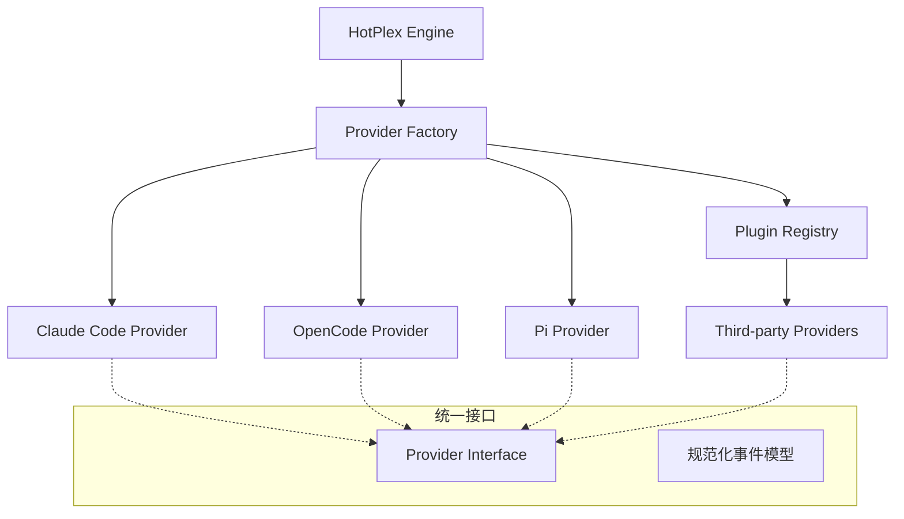

# HotPlex Provider: AI Agent 适配层

`provider` 包定义了 HotPlex 与各种 AI CLI Agent（如 Claude Code, OpenCode）之间的桥梁。它将平台特定的 CLI 协议、事件格式和执行模型抽象为统一的接口。

## 🏛 架构概述

Provider 在 HotPlex 生态系统中充当 **策略适配器 (Strategy Adapters)**。它们处理与不同 AI Agent 交互的底层细节，同时向引擎暴露一致的 API。



### 核心架构概念

- **`Provider` (接口)**: 定义了如何启动 CLI、发送用户输入以及解析产生的事件流的核心契约。
- **规范化事件模型**: 无论 Provider 原生的输出是什么（JSON, SSE, 纯文本），该包都会将其转换为标准的 `ProviderEvent` 流（例如 `thinking`, `tool_use`, `answer`, `error`）。
- **工厂模式**: `ProviderFactory` 允许根据配置动态注册和创建 Provider。
- **插件系统**: 第三方 Provider 可以通过 `RegisterPlugin()` 注册，无需修改核心代码。
- **协议转换**: 每个 Provider 实现处理其底层 CLI 的特定“方言”。

---

## 🔌 插件系统 (RFC #216)

插件系统支持第三方扩展，无需修改 HotPlex 核心。

### 插件接口

```go
type ProviderPlugin interface {
    Type() ProviderType
    New(cfg ProviderConfig, logger *slog.Logger) (Provider, error)
    Meta() ProviderMeta
}
```

### 注册示例

```go
func init() {
    provider.RegisterPlugin(&myPlugin{})
}
```

---

## 📊 Token 使用与上下文窗口管理

HotPlex 深度集成了 Claude Code 的 `stream-json` 模式，实现实时的成本追踪和上下文窗口监控。

### 1. Claude Code `modelUsage` 结构

在 `stream-json` 模式下，`result` 事件包含 `modelUsage` 映射。HotPlex 将其映射到 `types.go` 中的 `ModelUsageStats`：

| 字段 | 描述 |
| :--- | :--- |
| `inputTokens` | 累计输入 Token（不含缓存命中）。 |
| `outputTokens` | 累计输出 Token（含 Thinking 块）。 |
| `cacheReadInputTokens` | 从 Anthropic 提示词缓存检索的 Token（享受 9折）。 |
| `cacheCreationInputTokens` | 写入缓存的 Token。 |
| `contextWindow` | 模型总上下文容量（如 200,000 或 1,000,000）。 |
| `maxOutputTokens` | 模型最大输出限制。 |
| `webSearchRequests` | 工具层的联网搜索操作计数。 |

### 2. 多模型上下文策略

Claude Code 支持在会话中切换模型（通过 `/model`）。在此类场景下，`modelUsage` 可能包含多个条目。HotPlex 采用以下逻辑：

- **Token 聚合**: `InputTokens`, `OutputTokens` 和 `Cost` 在所有模型间累加，用于总会话报告。
- **主活跃模型选择**: `inputTokens` 最高的模型被视为**主活跃模型**。
- **上下文报告**: 主活跃模型的 `ContextWindow` 和 `MaxOutputTokens` 会通过 `ProviderEventMeta` 传播，驱动 UI 的使用率显示。

### 3. 上下文窗口计算公式

HotPlex 引擎使用规范化的元数据计算上下文占用百分比：

```text
总上下文已用 = inputTokens + cacheReadInputTokens + cacheCreationInputTokens
占用率 % = (总上下文已用 / ContextWindow) * 100
```

---

## 🛠 开发指南

### 1. 实现新 Provider

要支持新的 AI CLI 工具，需实现 `Provider` 接口：

```go
// 核心接口定义在 provider.go
type Provider interface {
    Name() string
    Metadata() ProviderMeta
    BuildCLIArgs(sessionID string, opts *ProviderSessionOptions) []string
    BuildInputMessage(prompt string, taskInstructions string) (map[string]any, error)
    ParseEvent(line string) ([]*ProviderEvent, error)
    DetectTurnEnd(event *ProviderEvent) bool
    ValidateBinary() (string, error)
    CleanupSession(sessionID string, workDir string) error
}
```

---

## ⚙️ 配置

Provider 通过 `ProviderConfig` 结构进行配置：

```yaml
provider:
  type: "claude-code"
  enabled: true
  default_model: "claude-3-5-sonnet"
  allowed_tools: ["ls", "cat"]
  extra_args: ["--verbose"]
```

---

## 📁 文件结构

```
provider/
├── provider.go        # 核心接口与类型
├── types.go           # 配置与常量定义
├── plugin.go          # 插件系统 (RFC #216)
├── factory.go         # Provider 工厂与注册表
├── event.go           # 事件类型与规范化
├── claude_provider.go # Claude Code 实现
├── opencode_provider.go # OpenCode 实现
└── README_zh.md       # 当前文件
```
